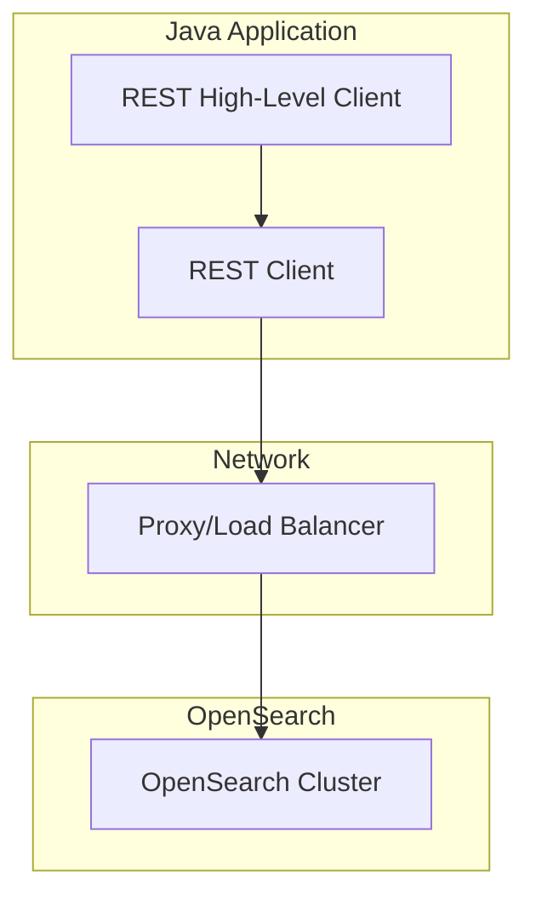

---
tags:
  - opensearch
---
# REST High-Level Client

## Summary

The OpenSearch Java REST High-Level Client (RHLC) provides a high-level Java API for interacting with OpenSearch clusters. It offers strongly-typed requests and responses, making it easier to work with OpenSearch from Java applications compared to raw HTTP requests.

**Note:** This client is deprecated and will be removed in OpenSearch 3.0.0. Users should migrate to the [Java client](https://opensearch.org/docs/latest/clients/java/).

## Details

### Architecture



### Components

| Component | Description |
|-----------|-------------|
| `RestHighLevelClient` | Main client class providing high-level API methods |
| `RequestConverters` | Converts high-level requests to low-level HTTP requests |
| `RestClient` | Low-level HTTP client for actual network communication |

### Configuration

Maven dependency:
```xml
<dependency>
  <groupId>org.opensearch.client</groupId>
  <artifactId>opensearch-rest-high-level-client</artifactId>
  <version>2.16.0</version>
</dependency>
```

### Usage Example

```java
// Create client
RestHighLevelClient client = new RestHighLevelClient(
    RestClient.builder(new HttpHost("localhost", 9200, "https"))
);

// Search template (uses /_render/template endpoint)
SearchTemplateRequest request = new SearchTemplateRequest();
request.setSimulate(true);
request.setScript("{ \"query\": { \"match\": { \"{{field}}\": \"{{value}}\" } } }");
SearchTemplateResponse response = client.searchTemplate(request, RequestOptions.DEFAULT);

// Multi term vectors (uses /_mtermvectors endpoint)
MultiTermVectorsRequest mtvRequest = new MultiTermVectorsRequest();
mtvRequest.add(new TermVectorsRequest("index", "1"));
MultiTermVectorsResponse mtvResponse = client.mtermVectors(mtvRequest, RequestOptions.DEFAULT);

client.close();
```

## Limitations

- Deprecated: Will be removed in OpenSearch 3.0.0
- Users should migrate to the Java client
- Some endpoint paths historically lacked leading slashes, causing issues with strict HTTP intermediaries

## Change History

- **v2.16.0** (2024-08-06): Fixed `searchTemplate` and `mtermVectors` endpoints to include leading slashes for HTTP compliance

## References

### Documentation
- [Java high-level REST client](https://docs.opensearch.org/latest/clients/java-rest-high-level/)
- [Java client (recommended)](https://docs.opensearch.org/latest/clients/java/)

### Pull Requests
| Version | PR | Description |
|---------|-----|-------------|
| v2.16.0 | [#14465](https://github.com/opensearch-project/OpenSearch/pull/14465) | Fixed searchTemplate & mtermVectors endpoint paths |
