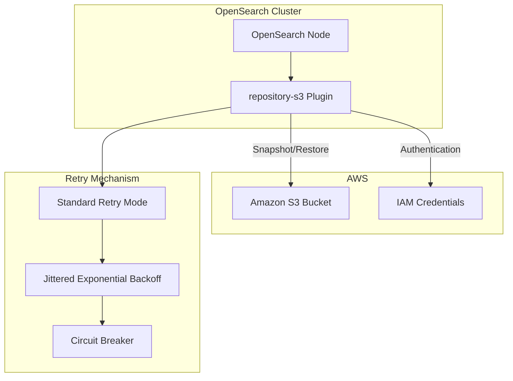
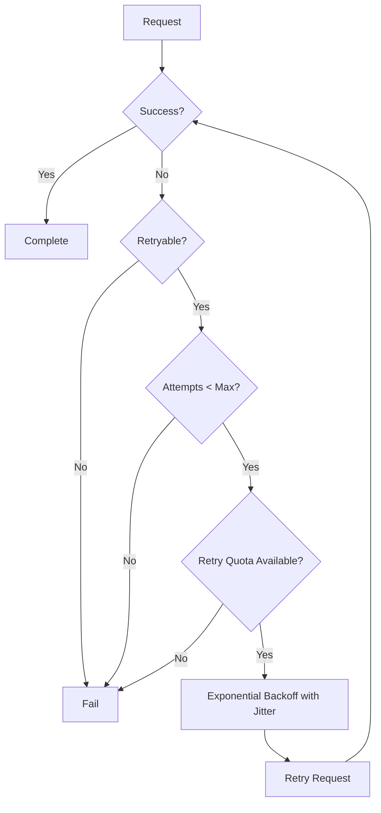
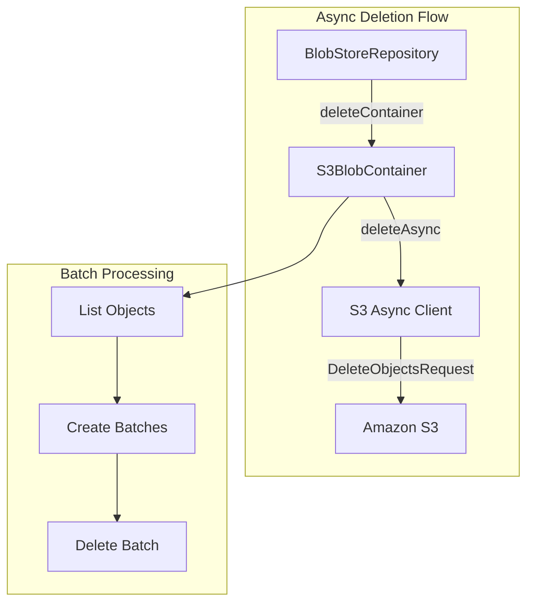

---
tags:
  - opensearch
---
# S3 Repository

## Summary

The S3 Repository plugin (`repository-s3`) enables OpenSearch to store snapshots in Amazon S3 buckets. It provides a reliable, scalable, and cost-effective solution for backing up and restoring OpenSearch indices using AWS cloud storage. The plugin supports advanced security features including AWS KMS server-side encryption (SSE-KMS) and bucket owner verification for compliance requirements.

## Details

### Architecture



### Components

| Component | Description |
|-----------|-------------|
| `S3Service` | Manages synchronous S3 client operations |
| `S3AsyncService` | Manages asynchronous S3 client operations with configurable HTTP client |
| `S3Repository` | Implements the repository interface for S3 storage |
| `S3BlobStore` | Handles blob storage operations in S3 |
| `S3BlobContainer` | Manages blob containers within S3 |
| `AwsCrtAsyncHttpClient` | AWS CRT-based async HTTP client for improved throughput (v3.3.0+) |

### Configuration

#### Repository Settings

| Setting | Description | Default |
|---------|-------------|---------|
| `bucket` | Name of the S3 bucket | Required |
| `base_path` | Path within the bucket for snapshots | Root |
| `client` | Named client configuration to use | `default` |
| `compress` | Whether to compress metadata files | `false` |
| `chunk_size` | Size of file chunks for uploads | `1gb` |
| `max_retries` | Maximum number of retry attempts | `3` |
| `throttle_retries` | Use throttling backoff strategy | `true` |
| `canned_acl` | S3 canned ACL for created objects | `private` |
| `storage_class` | S3 storage class for snapshot files | `standard` |
| `server_side_encryption_type` | Encryption type: `AES256`, `aws:kms`, or `bucket_default` | `bucket_default` |
| `server_side_encryption_kms_key_id` | KMS key ARN for SSE-KMS encryption | None |
| `server_side_encryption_bucket_key_enabled` | Enable S3 Bucket Keys to reduce KMS costs | `true` |
| `server_side_encryption_encryption_context` | JSON key-value pairs for KMS encryption context | None |
| `expected_bucket_owner` | 12-digit AWS account ID for bucket ownership verification | None |
| `buffer_size` | Buffer size for multipart uploads | `5mb`-`5gb` |
| `max_restore_bytes_per_sec` | Maximum restore rate | `40mb` |
| `max_snapshot_bytes_per_sec` | Maximum snapshot rate | `40mb` |
| `readonly` | Whether repository is read-only | `false` |
| `s3_async_client_type` | Async HTTP client type: `crt` (default) or `netty` | `crt` (v3.3.0+) |

#### Client Settings

Configure in `opensearch.yml`:

| Setting | Description |
|---------|-------------|
| `s3.client.default.access_key` | AWS access key |
| `s3.client.default.secret_key` | AWS secret key |
| `s3.client.default.endpoint` | Custom S3 endpoint |
| `s3.client.default.region` | AWS region |
| `s3.client.default.protocol` | HTTP or HTTPS |
| `s3.client.default.legacy_md5_checksum_calculation` | Enable legacy MD5 checksum for S3-compatible storage (v3.4.0+) |

### Usage Example

#### Register S3 Repository

```json
PUT _snapshot/my-s3-repo
{
  "type": "s3",
  "settings": {
    "bucket": "my-opensearch-snapshots",
    "base_path": "snapshots/production",
    "compress": true
  }
}
```

#### Register Repository with SSE-KMS (v3.1.0+)

```json
PUT _snapshot/my-secure-repo
{
  "type": "s3",
  "settings": {
    "bucket": "my-snapshot-bucket",
    "base_path": "snapshots",
    "region": "us-east-1",
    "server_side_encryption_type": "aws:kms",
    "server_side_encryption_kms_key_id": "arn:aws:kms:us-east-1:123456789012:key/my-key-id",
    "server_side_encryption_bucket_key_enabled": true,
    "expected_bucket_owner": "123456789012"
  }
}
```

#### Create Snapshot

```json
PUT _snapshot/my-s3-repo/snapshot-1
{
  "indices": "my-index-*",
  "ignore_unavailable": true,
  "include_global_state": false
}
```

#### Restore Snapshot

```json
POST _snapshot/my-s3-repo/snapshot-1/_restore
{
  "indices": "my-index-*",
  "rename_pattern": "(.+)",
  "rename_replacement": "restored-$1"
}
```

### Retry Behavior

The plugin uses AWS SDK's Standard retry mode (since v2.18.0):

- **Maximum Attempts**: 3 by default
- **Backoff Strategy**: Jittered exponential backoff
- **Circuit Breaker**: Prevents retries during outages
- **Throttling**: Automatic handling of S3 throttling responses



### Async Deletion (v2.18.0+)

The S3 repository supports asynchronous deletion operations for improved performance during snapshot deletion:



#### Async Deletion Configuration

| Setting | Description | Default |
|---------|-------------|---------|
| `cluster.snapshot.async-deletion.enable` | Enable/disable async deletion for S3 repositories | `true` |

## Limitations

- Glacier and Deep Archive storage classes are not supported
- Maximum chunk size is limited by S3 multipart upload limits
- IAM credentials must have appropriate S3 permissions
- Cross-region snapshot restore may incur data transfer costs
- Async deletion is only available for S3 repositories

## Change History

- **v3.4.0** (2025-10): Added `legacy_md5_checksum_calculation` to opensearch.yml settings for S3-compatible storage configuration
- **v3.3.0** (2025-09): Switched default async HTTP client to AWS CRT for ~5-7% throughput improvement; added `s3_async_client_type` setting
- **v3.3.0** (2025-09): Fixed S3-compatible repository compatibility by making checksum trailing headers conditional
- **v3.1.0** (2025-07): Added SSE-KMS support, bucket owner verification, removed legacy server_side_encryption setting
- **v2.18.0** (2024-10-22): Added async deletion support, changed default retry mechanism to Standard Mode, fixed SLF4J warnings


## References

### Documentation
- [Register Snapshot Repository](https://docs.opensearch.org/3.0/api-reference/snapshots/create-repository/): OpenSearch documentation
- [AWS SDK Retry Behavior](https://docs.aws.amazon.com/sdkref/latest/guide/feature-retry-behavior.html): AWS retry modes documentation
- [AWS SSE-KMS Documentation](https://docs.aws.amazon.com/AmazonS3/latest/userguide/UsingKMSEncryption.html): AWS KMS encryption guide
- [PR #19788](https://github.com/opensearch-project/OpenSearch/pull/19788): Add LEGACY_MD5_CHECKSUM_CALCULATION to settings list
- [PR #18800](https://github.com/opensearch-project/OpenSearch/pull/18800): AWS CRT async HTTP client implementation
- [PR #19220](https://github.com/opensearch-project/OpenSearch/pull/19220): S3-compatible repository checksum fix
- [PR #18312](https://github.com/opensearch-project/OpenSearch/pull/18312): SSE-KMS and bucket owner verification
- [PR #15621](https://github.com/opensearch-project/OpenSearch/pull/15621): Async deletion implementation

### Pull Requests
| Version | PR | Description | Related Issue |
|---------|-----|-------------|---------------|
| v3.4.0 | [#19788](https://github.com/opensearch-project/OpenSearch/pull/19788) | Add LEGACY_MD5_CHECKSUM_CALCULATION to repository-s3 settings list | [#18240](https://github.com/opensearch-project/OpenSearch/issues/18240) |
| v3.3.0 | [#18800](https://github.com/opensearch-project/OpenSearch/pull/18800) | Switch default async HTTP client to AWS CRT for improved throughput | [#18535](https://github.com/opensearch-project/OpenSearch/issues/18535) |
| v3.3.0 | [#19220](https://github.com/opensearch-project/OpenSearch/pull/19220) | Fix S3-compatible repository checksum trailing headers issue | [#18240](https://github.com/opensearch-project/OpenSearch/issues/18240) |
| v3.1.0 | [#18312](https://github.com/opensearch-project/OpenSearch/pull/18312) | Add support for SSE-KMS and S3 bucket owner verification | [#14606](https://github.com/opensearch-project/OpenSearch/issues/14606) |
| v2.18.0 | [#15621](https://github.com/opensearch-project/OpenSearch/pull/15621) | Add support for async deletion in S3BlobContainer |   |
| v2.18.0 | [#15978](https://github.com/opensearch-project/OpenSearch/pull/15978) | Change default retry mechanism to Standard Mode | [#15397](https://github.com/opensearch-project/OpenSearch/issues/15397) |
| v2.18.0 | [#16194](https://github.com/opensearch-project/OpenSearch/pull/16194) | Fix SLF4J warnings on startup | [#16152](https://github.com/opensearch-project/OpenSearch/issues/16152) |

### Issues (Design / RFC)
- [Issue #18535](https://github.com/opensearch-project/OpenSearch/issues/18535): Feature request for S3CrtClient support
- [Issue #18240](https://github.com/opensearch-project/OpenSearch/issues/18240): S3 compatible storage broken in 3.0.0
- [Issue #19124](https://github.com/opensearch-project/OpenSearch/issues/19124): repository-s3 x-amz-trailer error
- [Issue #14606](https://github.com/opensearch-project/OpenSearch/issues/14606): Feature request for SSE-KMS support
- [Issue #15397](https://github.com/opensearch-project/OpenSearch/issues/15397): Add jitter to downloads from remote store
- [Issue #16152](https://github.com/opensearch-project/OpenSearch/issues/16152): SLF4J warnings when adding repository-s3
