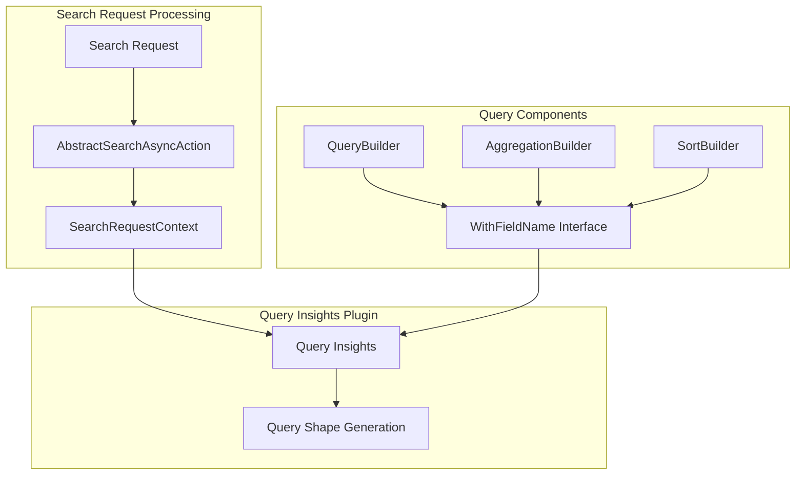
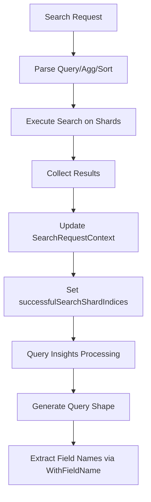

---
tags:
  - domain/core
  - component/server
  - search
---
# Search API Enhancements

## Summary

Search API Enhancements provide internal infrastructure improvements to OpenSearch's search components, enabling better introspection and analysis of search queries. The `WithFieldName` interface standardizes field name retrieval across query builders, aggregation builders, and sort builders, while `SearchRequestContext` enhancements expose additional metadata about search execution.

These enhancements primarily support the Query Insights plugin's ability to generate query shapes with field name and field type information.

## Details

### Architecture



### Data Flow



### Components

| Component | Description |
|-----------|-------------|
| `WithFieldName` | Interface providing `fieldName()` method for uniform field name access |
| `ValuesSourceAggregationBuilder` | Base class for aggregations that now implements `WithFieldName` |
| `FieldSortBuilder` | Sort builder that now implements `WithFieldName` |
| `SearchRequestContext` | Context object enhanced with `successfulSearchShardIndices` |

### Configuration

No configuration is required. These are internal API enhancements.

### Usage Example

**Checking for field name support:**
```java
// Uniform way to get field name from any supporting builder
if (builder instanceof WithFieldName) {
    String fieldName = ((WithFieldName) builder).fieldName();
    // Can now look up field type from index mappings
    MappedFieldType fieldType = context.fieldMapper(fieldName);
}
```

**Accessing successful shard indices:**
```java
// In search request listener or processor
SearchRequestContext context = ...;
Set<String> successfulIndices = context.getSuccessfulSearchShardIndices();
// Use for query shape generation or analysis
```

**Query shape with field data (Query Insights use case):**
```
bool
  filter:
    terms [field1:text]
  must:
    range [field2:date]
    term [field3:keyword]
sort:
  asc [field6:number]
aggregation:
  terms [field3:keyword]
    avg [field6:number]
```

## Limitations

- `WithFieldName` interface only supports single-field queries; multi-field queries are not covered
- Field type lookup requires access to index mappings via `QueryShardContext`
- `successfulSearchShardIndices` is only available after search completion
- Not all query types implement `WithFieldName` (only those with a single field)

## Change History

- **v2.18.0** (2024-11-12): Extended `WithFieldName` to `ValuesSourceAggregationBuilder` and `FieldSortBuilder`; added `successfulSearchShardIndices` to `SearchRequestContext`
- **v2.17.0** (2024-09-17): Initial `WithFieldName` interface added for QueryBuilder classes

## Related Features
- [OpenSearch Dashboards](../opensearch-dashboards/opensearch-dashboards-ai-chat.md)

## References

### Documentation
- [Query Insights Documentation](https://docs.opensearch.org/2.18/observing-your-data/query-insights/index/)
- [Grouping Top N Queries](https://docs.opensearch.org/2.18/observing-your-data/query-insights/grouping-top-n-queries/)

### Pull Requests
| Version | PR | Description | Related Issue |
|---------|-----|-------------|---------------|
| v2.18.0 | [#15916](https://github.com/opensearch-project/OpenSearch/pull/15916) | Implement WithFieldName in ValuesSourceAggregationBuilder & FieldSortBuilder |   |
| v2.18.0 | [#15967](https://github.com/opensearch-project/OpenSearch/pull/15967) | Add successfulSearchShardIndices in SearchRequestContext | [#69](https://github.com/opensearch-project/query-insights/issues/69) |
| v2.17.0 | [#15705](https://github.com/opensearch-project/OpenSearch/pull/15705) | Adding WithFieldName interface for QueryBuilders | [#69](https://github.com/opensearch-project/query-insights/issues/69) |

### Issues (Design / RFC)
- [Issue #69](https://github.com/opensearch-project/query-insights/issues/69): Query Shape Field Data Type RFC
