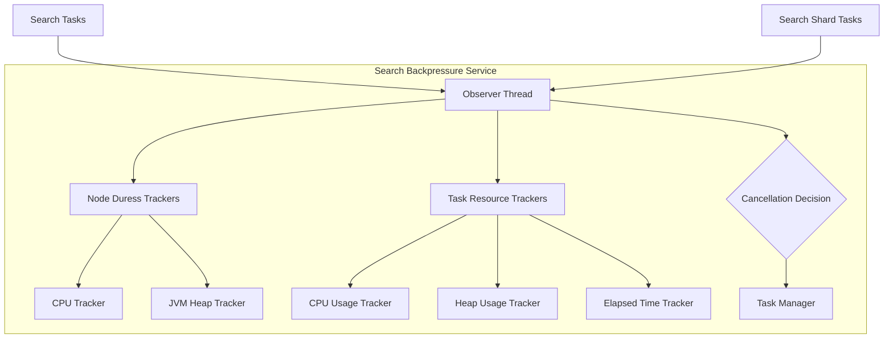

---
tags:
  - opensearch
---
# Search Backpressure

## Summary

Search Backpressure is a mechanism in OpenSearch that identifies resource-intensive search requests and cancels them when the node is under duress. It monitors CPU usage, heap usage, and elapsed time for each search request, and applies configurable thresholds to protect cluster stability during high load conditions.

## Details

### Architecture



### Components

| Component | Description |
|-----------|-------------|
| `SearchBackpressureService` | Main service that orchestrates monitoring and cancellation |
| `NodeDuressTrackers` | Tracks node-level resource usage (CPU, JVM heap) |
| `TaskResourceUsageTrackers` | Tracks task-level resource consumption |
| `CpuUsageTracker` | Monitors CPU time consumed by tasks |
| `HeapUsageTracker` | Monitors heap memory usage with moving average |
| `ElapsedTimeTracker` | Monitors task execution duration |

### Configuration

| Setting | Description | Default |
|---------|-------------|---------|
| `search_backpressure.mode` | Operating mode: `monitor_only`, `enforced`, `disabled` | `monitor_only` |
| `search_backpressure.node_duress.num_successive_breaches` | Consecutive breaches before node is considered in duress | 3 |
| `search_backpressure.node_duress.cpu_threshold` | CPU usage threshold (percentage) | 90% |
| `search_backpressure.node_duress.heap_threshold` | Heap usage threshold (percentage) | 70% |
| `search_backpressure.search_task.elapsed_time_millis_threshold` | Elapsed time threshold for search tasks | 45,000 ms |
| `search_backpressure.search_task.heap_percent_threshold` | Heap usage threshold for search tasks | 2% |
| `search_backpressure.search_task.cpu_time_millis_threshold` | CPU time threshold for search tasks | 30,000 ms |
| `search_backpressure.search_shard_task.elapsed_time_millis_threshold` | Elapsed time threshold for shard tasks | 30,000 ms |
| `search_backpressure.search_shard_task.heap_percent_threshold` | Heap usage threshold for shard tasks | 0.5% |
| `search_backpressure.search_shard_task.cpu_time_millis_threshold` | CPU time threshold for shard tasks | 15,000 ms |

### Usage Example

Enable Search Backpressure in enforced mode:

```json
PUT /_cluster/settings
{
  "persistent": {
    "search_backpressure": {
      "mode": "enforced"
    }
  }
}
```

Monitor Search Backpressure statistics:

```bash
GET _nodes/stats/search_backpressure
```

### Cancellation Logic

The cancellation decision follows this flow:

1. Observer thread periodically checks if node is in duress
2. If node is in duress, identifies which resource (CPU or JVM) is causing it
3. Evaluates tasks against thresholds for the specific resource in duress
4. Assigns cancellation scores to eligible tasks
5. Cancels tasks with highest scores, respecting rate limits

## Limitations

- Search Backpressure runs in `monitor_only` mode by default and must be explicitly enabled
- Heap tracking may not be supported on all JVM configurations
- Cancellation is rate-limited to prevent excessive task termination
- Partial results may be returned when some shards fail due to cancellation

## Change History

- **v2.16.0** (2024-08-06): Fixed bug in cancellation logic - tasks are now cancelled based on the specific resource causing node duress rather than all thresholds ([#13474](https://github.com/opensearch-project/OpenSearch/pull/13474))
- **v2.11.0**: Added completion count to search_backpressure stats ([#10028](https://github.com/opensearch-project/OpenSearch/pull/10028))
- **v2.6.0**: Added search task level cancellation support
- **v2.4.0**: Initial implementation with search shard task support

## References

### Documentation

- [Search Backpressure - OpenSearch Documentation](https://docs.opensearch.org/latest/tuning-your-cluster/availability-and-recovery/search-backpressure/)
- [Availability and Recovery Settings](https://docs.opensearch.org/latest/install-and-configure/configuring-opensearch/availability-recovery/)

### Pull Requests

| Version | PR | Description |
|---------|-----|-------------|
| v2.16.0 | [#13474](https://github.com/opensearch-project/OpenSearch/pull/13474) | Fix bug in SBP cancellation logic |
| v2.16.0 | [#14502](https://github.com/opensearch-project/OpenSearch/pull/14502) | Backport SBP fix to 2.x |
| v2.11.0 | [#10028](https://github.com/opensearch-project/OpenSearch/pull/10028) | Add taskCompletionCount in search_backpressure stats |
