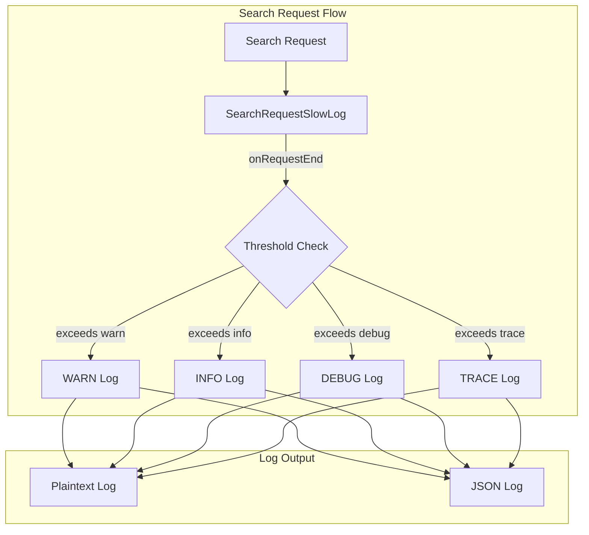

---
tags:
  - opensearch
---
# Search Observability

## Summary

Search Observability encompasses the logging and monitoring capabilities for search requests in OpenSearch. The primary component is the Search Request Slow Log, which records search requests that exceed configurable time thresholds at the cluster level. This feature helps operators identify and troubleshoot slow search queries.

## Details

### Architecture



### Components

| Component | Description |
|-----------|-------------|
| `SearchRequestSlowLog` | Listener that evaluates search request duration against thresholds |
| `SearchRequestSlowLogMessage` | Formats log messages with request details for both JSON and plaintext output |

### Configuration

Search request slow logs are configured dynamically via the Cluster Settings API.

| Setting | Description | Default |
|---------|-------------|---------|
| `cluster.search.request.slowlog.level` | Minimum log level | `TRACE` |
| `cluster.search.request.slowlog.threshold.warn` | Warn threshold | `-1` (disabled) |
| `cluster.search.request.slowlog.threshold.info` | Info threshold | `-1` (disabled) |
| `cluster.search.request.slowlog.threshold.debug` | Debug threshold | `-1` (disabled) |
| `cluster.search.request.slowlog.threshold.trace` | Trace threshold | `-1` (disabled) |
| `http.request_id.max_length` | Maximum allowed length for `X-Request-Id` header (since v3.6.0) | `128` |

#### Enable Search Request Slow Log

```json
PUT /_cluster/settings
{
  "persistent": {
    "cluster.search.request.slowlog.level": "TRACE",
    "cluster.search.request.slowlog.threshold.warn": "10s",
    "cluster.search.request.slowlog.threshold.info": "5s",
    "cluster.search.request.slowlog.threshold.debug": "2s",
    "cluster.search.request.slowlog.threshold.trace": "10ms"
  }
}
```

### Log Fields

| Field | Description | Since |
|-------|-------------|-------|
| `took` | Total request duration | v2.12.0 |
| `took_millis` | Duration in milliseconds | v2.12.0 |
| `phase_took_millis` | Per-phase timing breakdown (expand, query, fetch) | v2.12.0 |
| `total_hits` | Total hit count | v2.12.0 |
| `search_type` | Search type (e.g., QUERY_THEN_FETCH) | v2.12.0 |
| `shards` | Shard statistics (total, successful, skipped, failed) | v2.12.0 |
| `indices` | Target index names/patterns | v3.6.0 |
| `source` | Query source body | v2.12.0 |
| `id` | X-Opaque-Id header value | v2.12.0 |
| `request_id` | X-Request-Id header value | v2.12.0 |

### Usage Example

```bash
# Search specific indices
curl -X GET "http://localhost:9200/index_1,index_2,my_index_*/_search" -H 'Content-Type: application/json' -d'
{
  "query": {
    "match_all": {}
  }
}'
```

Resulting slow log entry:
```
[WARN ][o.o.a.s.SearchRequestSlowLog] [node-0] took[32.1ms], took_millis[32], phase_took_millis[{expand=0, query=25, fetch=1}], total_hits[0 hits], search_type[QUERY_THEN_FETCH], shards[{total:2, successful:2, skipped:0, failed:0}], indices[index_1, index_2, my_index_*], source[{"query":{"match_all":{"boost":1.0}}}], id[], request_id[]
```

## Limitations

- Search request slow logs operate at the cluster level, unlike shard slow logs which are per-index
- The `indices` field shows raw index names/patterns as provided, not resolved concrete indices
- Low threshold values can generate significant disk I/O and affect performance

## Change History

- **v3.6.0**: Added `indices` field to search request slow log; relaxed `X-Request-Id` validation to accept any format up to configurable max length (`http.request_id.max_length`, default 128)
- **v3.5.0**: Added `X-Request-Id` header support for request tracing (strict 32-char hex format)
- **v2.12.0**: Initial implementation of request-level search slow logs

## References

### Documentation
- https://docs.opensearch.org/latest/install-and-configure/configuring-opensearch/logs/

### Pull Requests
| Version | PR | Description |
|---------|-----|-------------|
| v3.6.0 | `https://github.com/opensearch-project/OpenSearch/pull/21048` | Remove X-Request-Id format restrictions and make max length configurable |
| v3.6.0 | `https://github.com/opensearch-project/OpenSearch/pull/20588` | Add indices to search request slowlog |
| v3.5.0 | `https://github.com/opensearch-project/OpenSearch/pull/19798` | Add X-Request-Id header for request tracing |
