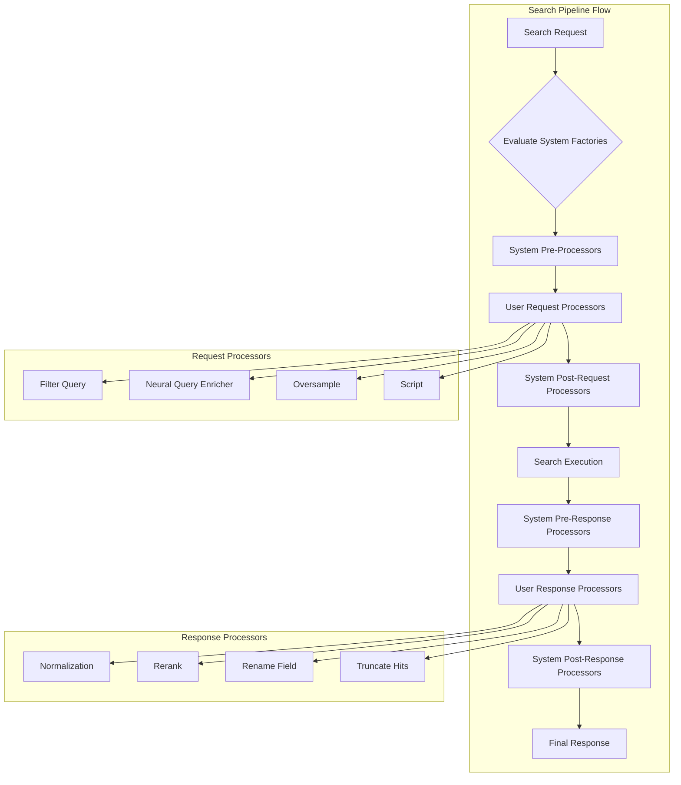
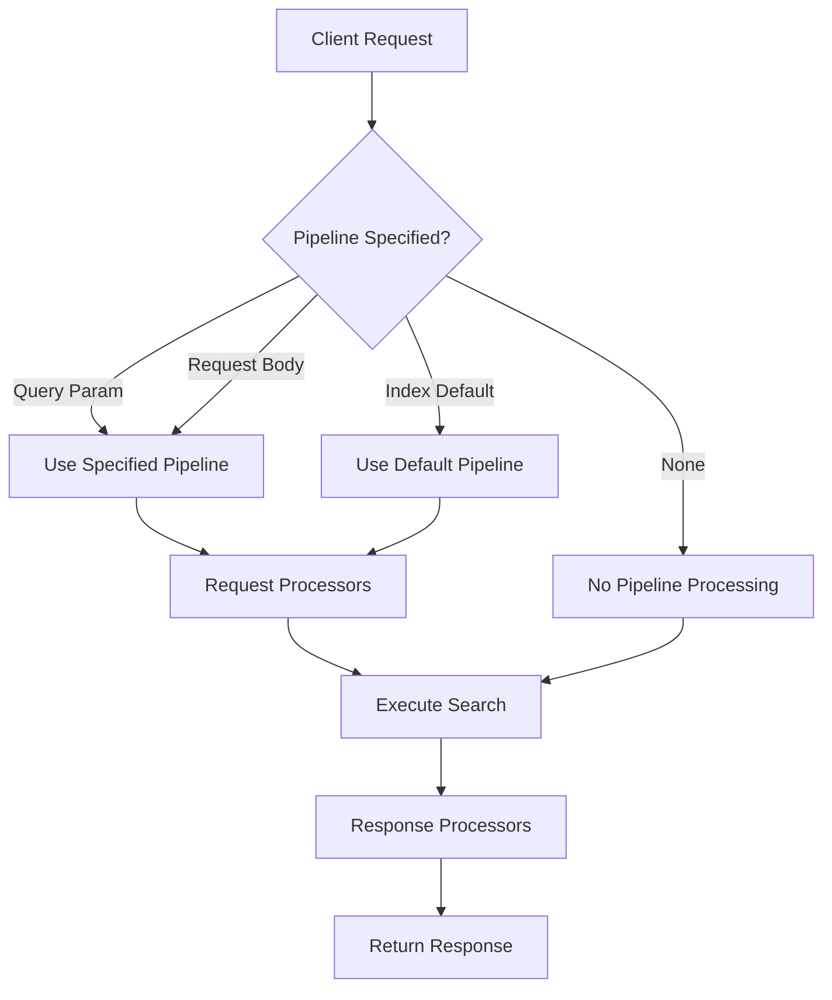

---
tags:
  - domain/core
  - component/server
  - indexing
  - ml
  - neural-search
  - search
---
# Search Pipeline

## Summary

Search pipelines in OpenSearch provide a mechanism to preprocess search requests and postprocess search responses. They enable powerful search customization including query enrichment, result normalization for hybrid search, field renaming, and ML-based reranking. Search pipelines can be applied per-request, set as index defaults, defined inline for ad-hoc use, or automatically generated by the system based on request context (v3.3.0+).

## Details

### Architecture



### Data Flow



### Components

| Component | Description |
|-----------|-------------|
| `SearchPipelineService` | Core service managing pipeline lifecycle and execution |
| `SearchPipeline` | Container for request and response processors |
| `SearchRequestProcessor` | Interface for request transformation processors |
| `SearchResponseProcessor` | Interface for response transformation processors |
| `SearchPhaseResultsProcessor` | Interface for processing results between search phases |
| `SystemGeneratedProcessor` | Interface for system-generated processors (v3.3.0+) |
| `SystemGeneratedFactory` | Factory interface to evaluate and create system processors (v3.3.0+) |
| `SystemGeneratedPipelineHolder` | Holder for pre and post user-defined system pipelines (v3.3.0+) |

### Configuration

| Setting | Description | Default |
|---------|-------------|---------|
| `index.search.default_pipeline` | Default search pipeline for an index | None |
| `search_pipeline` (query param) | Pipeline to use for a specific request | None |
| `search_pipeline` (request body) | Pipeline name in search source (v2.18.0+) | None |
| `cluster.search.enabled_system_generated_factories` | List of enabled system-generated factory types (v3.3.0+) | `[]` (empty) |

### Usage Examples

#### Creating a Search Pipeline

```json
PUT /_search/pipeline/my_pipeline
{
  "description": "A search pipeline with normalization",
  "request_processors": [
    {
      "filter_query": {
        "query": {
          "term": { "status": "published" }
        }
      }
    }
  ],
  "response_processors": [
    {
      "rename_field": {
        "field": "message",
        "target_field": "notification"
      }
    }
  ]
}
```

#### Using Pipeline with Single Search

```json
GET /my-index/_search?search_pipeline=my_pipeline
{
  "query": { "match_all": {} }
}
```

#### Using Pipeline with msearch (v2.18.0+)

```json
GET /_msearch
{ "index": "test"}
{ "query": { "match_all": {} }, "search_pipeline": "hybrid_pipeline"}
{ "index": "test-2"}
{ "query": { "match": { "title": "opensearch" }}, "search_pipeline": "rerank_pipeline"}
```

#### Using Pipeline with Search Template (v3.2.0+)

```json
POST /my-index/_search/template
{
  "id": "my_search_template",
  "params": {
    "query_string": "opensearch"
  },
  "search_pipeline": "my_pipeline"
}
```

#### Using Pipeline with Multi-Search Template (v3.2.0+)

```
GET /_msearch/template
{"index":"my-nlp-index1"}
{"id":"search_template_1","params":{"play_name":"hello"}, "search_pipeline": "my_pipeline2"}
{"index":"my-nlp-index1"}
{"id":"search_template_2","params":{"play_name":"zoo"}, "search_pipeline": "my_pipeline1"}
```

#### Setting Default Pipeline

```json
PUT /my_index/_settings
{
  "index.search.default_pipeline": "my_pipeline"
}
```

#### Temporary Inline Pipeline

```json
POST /my-index/_search
{
  "query": { "match": { "text_field": "search text" }},
  "search_pipeline": {
    "request_processors": [
      {
        "filter_query": {
          "query": { "term": { "visibility": "public" }}
        }
      }
    ]
  }
}
```

#### Using System-Generated Pipelines (v3.3.0+)

Enable system-generated factories:

```json
PUT /_cluster/settings
{
  "persistent": {
    "cluster.search.enabled_system_generated_factories": ["*"]
  }
}
```

With system-generated processors enabled, features like MMR work automatically without manual pipeline configuration:

```json
POST /my-index/_search
{
  "query": {
    "neural": {
      "product_description": {
        "query_text": "Red apple"
      }
    }
  },
  "ext": {
    "mmr": {
      "candidates": 10,
      "diversity": 0.5
    }
  }
}
```

#### Monitoring System-Generated Processors (v3.3.0+)

```
GET /_nodes/stats/search_pipeline
```

Response includes system-generated processor and factory statistics:

```json
{
  "system_generated_processors": {
    "request_processors": [...],
    "response_processors": [...]
  },
  "system_generated_factories": {
    "request_processor_factories": [
      {
        "factory-type": {
          "evaluation_stats": { "count": 37, "time_in_microseconds": 185, "failed": 0 },
          "generation_stats": { "count": 13, "time_in_microseconds": 1, "failed": 0 }
        }
      }
    ]
  }
}
```

## Limitations

- Search pipelines add processing overhead to search requests
- Complex pipelines with ML inference can significantly increase latency
- Pipeline errors can cause search failures if not handled properly
- msearch pipeline support requires OpenSearch 2.18.0 or later
- Search template pipeline support requires OpenSearch 3.2.0 or later
- System-generated factories are disabled by default and must be explicitly enabled (v3.3.0+)
- Only one system-generated processor per type and stage is allowed per request (v3.3.0+)

## Change History

- **v3.3.0** (2026-01-14): Added system-generated search pipeline support for automatic processor generation
- **v3.2.0** (2026-01-14): Added support for specifying search pipeline in search template and msearch template APIs
- **v2.18.0** (2024-11-05): Added support for specifying search pipeline in msearch API request body

## Related Features
- [OpenSearch Dashboards](../opensearch-dashboards/opensearch-dashboards-ai-chat.md)

## References

### Documentation
- [Search Pipelines Documentation](https://docs.opensearch.org/latest/search-plugins/search-pipelines/index/): Official documentation
- [Using a Search Pipeline](https://docs.opensearch.org/latest/search-plugins/search-pipelines/using-search-pipeline/): Usage guide
- [Creating a Search Pipeline](https://docs.opensearch.org/latest/search-plugins/search-pipelines/creating-search-pipeline/): Creation guide
- [Search Templates Documentation](https://docs.opensearch.org/latest/api-reference/search-apis/search-template/): Search template API
- [Multi-Search Template Documentation](https://docs.opensearch.org/latest/api-reference/search-apis/msearch-template/): Msearch template API

### Blog Posts
- [Hybrid Search Blog](https://opensearch.org/blog/hybrid-search/): Hybrid search with normalization processor
- [Optimizing Hybrid Search Blog](https://opensearch.org/blog/hybrid-search-optimization/): Performance optimization
- [System-Generated Search Pipelines Blog](https://opensearch.org/blog/making-search-smarter-with-system-generated-search-pipelines/): System-generated pipelines explanation

### Pull Requests
| Version | PR | Description | Related Issue |
|---------|-----|-------------|---------------|
| v3.3.0 | [#19128](https://github.com/opensearch-project/OpenSearch/pull/19128) | Added system-generated search pipeline support | [#18731](https://github.com/opensearch-project/OpenSearch/issues/18731) |
| v3.2.0 | [#18564](https://github.com/opensearch-project/OpenSearch/pull/18564) | Added search pipeline support in search and msearch template | [#18508](https://github.com/opensearch-project/OpenSearch/issues/18508) |
| v2.18.0 | [#15923](https://github.com/opensearch-project/OpenSearch/pull/15923) | Added msearch API support for search pipeline name | [#15748](https://github.com/opensearch-project/OpenSearch/issues/15748) |

### Issues (Design / RFC)
- [Issue #18731](https://github.com/opensearch-project/OpenSearch/issues/18731): Feature request for system-generated search pipeline
- [Issue #18508](https://github.com/opensearch-project/OpenSearch/issues/18508): Feature request for search pipeline support in msearch template
- [Issue #15748](https://github.com/opensearch-project/OpenSearch/issues/15748): Feature request for msearch pipeline support
