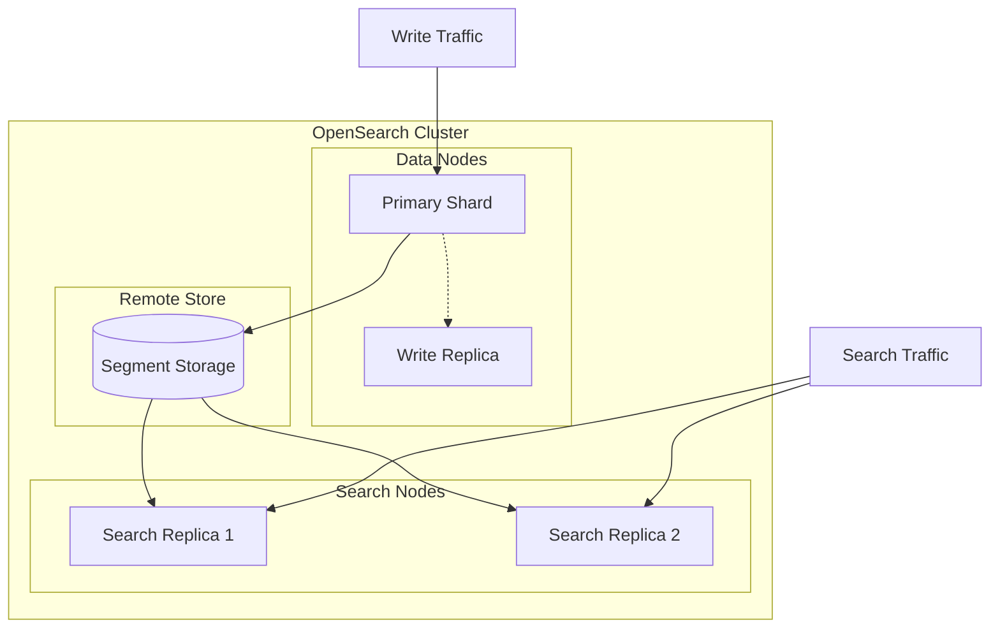
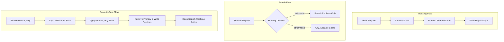

---
tags:
  - opensearch
---
# Search Replica & Reader-Writer Separation

## Summary

Search Replica and Reader-Writer Separation is an OpenSearch feature that enables independent scaling of indexing and search workloads within remote-store-enabled clusters. By introducing dedicated search replicas that are separate from write replicas, this feature provides workload isolation, failure resilience, and cost optimization through specialized hardware utilization.

## Details

### Architecture



### Data Flow



### Components

| Component | Description |
|-----------|-------------|
| Search Replica | Read-only replica dedicated to search queries, cannot be promoted to primary |
| Write Replica | Traditional replica that can be promoted to primary for high availability |
| Search Node | Node with `search` role that hosts search replicas |
| Scale API | REST API to enable/disable search-only mode |
| Remote Store | Centralized storage for segment data enabling replica synchronization |

### Configuration

| Setting | Description | Default | Scope |
|---------|-------------|---------|-------|
| `index.number_of_search_replicas` | Number of search replicas for an index | `0` | Index |
| `index.auto_expand_search_replicas` | Auto-expand search replicas (e.g., `0-3`, `0-all`) | `false` | Index |
| `cluster.routing.search_only.strict` | Route search only to search replicas when enabled | `true` | Cluster |
| `cluster.remote_store.state.enabled` | Enable remote cluster state for recovery | `false` | Cluster |

### Usage Example

#### Setting Up Workload Separation

```yaml
# opensearch.yml - Configure search node
node.name: searcher-node1
node.roles: [ search ]

# Enable remote store
node.attr.remote_store.segment.repository: "my-repository"
node.attr.remote_store.translog.repository: "my-repository"
node.attr.remote_store.state.repository: "my-repository"
```

#### Creating Index with Search Replicas

```bash
PUT /my-index
{
  "settings": {
    "index": {
      "number_of_shards": 1,
      "number_of_replicas": 1,
      "number_of_search_replicas": 2,
      "auto_expand_search_replicas": "0-3"
    }
  }
}
```

#### Enabling Search-Only Mode

```bash
# Scale down to search-only (remove primary and write replicas)
POST /my-index/_scale
{
  "search_only": true
}

# Restore normal operations
POST /my-index/_scale
{
  "search_only": false
}
```

## Limitations

- Requires remote store to be enabled
- Search replicas cannot be promoted to primary shards
- Auto-expand only considers nodes with the `search` role
- Search-only mode blocks all write operations on the index
- Recovery behavior depends on remote store state configuration

## Change History

- **v3.0.0** (2025-04-08): Added scale-to-zero support, auto-expand search replicas, and strict routing setting
- **v2.17.0** (2024-09): Initial experimental implementation with search replicas and pull-based replication


## References

### Documentation
- [Documentation: Scale API](https://docs.opensearch.org/3.0/api-reference/index-apis/scale/)
- [Documentation: Separate Index and Search Workloads](https://docs.opensearch.org/3.0/tuning-your-cluster/separate-index-and-search-workloads/)
- [Documentation: Index Settings](https://docs.opensearch.org/3.0/install-and-configure/configuring-opensearch/index-settings/)

### Blog Posts
- [Blog: Improve OpenSearch cluster performance by separating search and indexing workloads](https://opensearch.org/blog/improve-opensearch-cluster-performance-by-separating-search-and-indexing-workloads/)

### Pull Requests
| Version | PR | Description | Related Issue |
|---------|-----|-------------|---------------|
| v3.0.0 | [#17299](https://github.com/opensearch-project/OpenSearch/pull/17299) | Scale-to-zero (search_only mode) support | [#15306](https://github.com/opensearch-project/OpenSearch/issues/15306) |
| v3.0.0 | [#17741](https://github.com/opensearch-project/OpenSearch/pull/17741) | AutoExpand for SearchReplica | [#17310](https://github.com/opensearch-project/OpenSearch/issues/17310) |
| v3.0.0 | [#17803](https://github.com/opensearch-project/OpenSearch/pull/17803) | Search Only strict routing setting | [#17424](https://github.com/opensearch-project/OpenSearch/issues/17424) |
| v2.17.0 | [#15368](https://github.com/opensearch-project/OpenSearch/pull/15368) | Initial search replica implementation |   |
| v2.17.0 | [#15445](https://github.com/opensearch-project/OpenSearch/pull/15445) | Pull-based replica support |   |

### Issues (Design / RFC)
- [Issue #15306](https://github.com/opensearch-project/OpenSearch/issues/15306): META - Reader/Writer Separation
- [Issue #16720](https://github.com/opensearch-project/OpenSearch/issues/16720): Scale to Zero feature request
- [Issue #17310](https://github.com/opensearch-project/OpenSearch/issues/17310): Auto-expand-replica for search replicas
- [Issue #17424](https://github.com/opensearch-project/OpenSearch/issues/17424): Strict routing for search replicas
