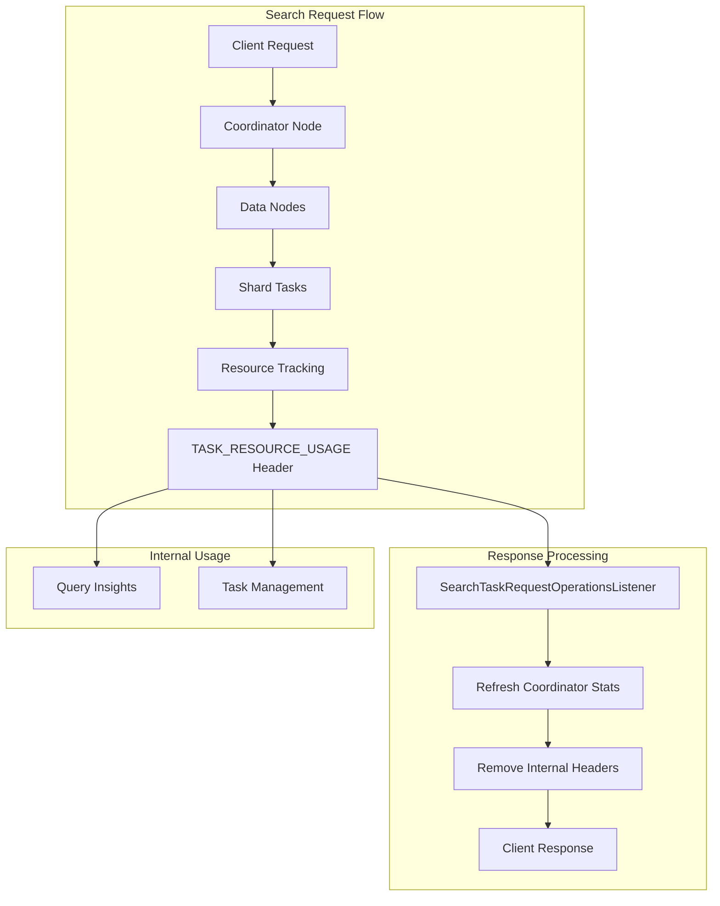

---
tags:
  - opensearch
---
# Search Response Headers

## Summary

OpenSearch manages HTTP response headers for search requests to balance internal resource tracking needs with client-facing response efficiency. The `TASK_RESOURCE_USAGE` header, introduced for shard-level resource tracking, is now filtered from client responses to prevent excessive header overhead while maintaining internal monitoring capabilities.

## Details

### Architecture



### Components

| Component | Description |
|-----------|-------------|
| `SearchTaskRequestOperationsListener` | Listener that handles search request lifecycle events and header cleanup |
| `TaskResourceTrackingService` | Service that tracks task resource usage and manages the `TASK_RESOURCE_USAGE` header |
| `ThreadContext` | Thread-local context that stores request/response headers |
| `DefaultRestChannel` | REST channel that copies thread context headers to HTTP response |

### Header Format

The `TASK_RESOURCE_USAGE` header (when present internally) contains:

```json
{
  "action": "indices:data/read/search[phase/query]",
  "taskId": 898,
  "parentTaskId": 865,
  "nodeId": "Ld-7uLOxQPOnDjnCnSuFRQ",
  "taskResourceUsage": {
    "cpu_time_in_nanos": 22979000,
    "memory_in_bytes": 2000624
  }
}
```

| Field | Description |
|-------|-------------|
| `action` | The search action being performed |
| `taskId` | Unique identifier for the task |
| `parentTaskId` | ID of the parent task (coordinator) |
| `nodeId` | Node where the task executed |
| `cpu_time_in_nanos` | CPU time consumed by the task |
| `memory_in_bytes` | Memory used by the task |

### Usage

Resource usage data is available through:

1. **Query Insights Plugin**: Aggregates resource usage for top N queries monitoring
2. **Task Management API**: Shows resource stats for running tasks
3. **Search Backpressure**: Uses resource tracking for admission control

## Limitations

- The `TASK_RESOURCE_USAGE` header is not exposed to clients (removed in v2.19.0)
- Resource tracking adds minimal overhead to search operations
- Resource stats are only available for tasks that support resource tracking

## Change History

- **v2.19.0** (2024-11-01): Removed `TASK_RESOURCE_USAGE` header from client-facing search responses to reduce header overhead and improve latency
- **v2.15.0** (2024-06-07): Introduced shard-level resource usage tracking with `TASK_RESOURCE_USAGE` header for query-level resource monitoring

## References

### Pull Requests
| Version | PR | Description | Related Issue |
|---------|-----|-------------|---------------|
| v2.19.0 | [#16532](https://github.com/opensearch-project/OpenSearch/pull/16532) | Remove resource usages object from search response headers | - |
| v2.15.0 | [#13172](https://github.com/opensearch-project/OpenSearch/pull/13172) | Query-level resource usages tracking | [#12399](https://github.com/opensearch-project/OpenSearch/issues/12399) |
