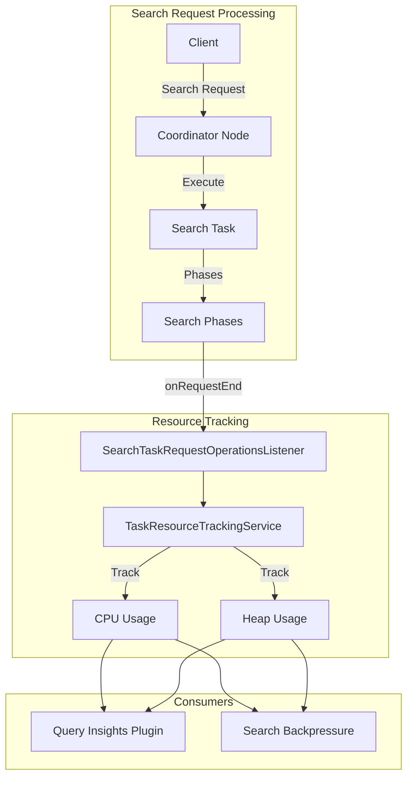

---
tags:
  - opensearch
---
# Search Thread Resource Usage

## Summary

Search Thread Resource Usage is a feature that provides accurate resource tracking for search tasks in OpenSearch. It enables plugins and internal components to access CPU and memory usage statistics for search operations at the coordinator node level, supporting features like Query Insights and Search Backpressure.

## Details

### Architecture



### Components

| Component | Description |
|-----------|-------------|
| `SearchTaskRequestOperationsListener` | Listener that subscribes to search task operations and refreshes resource stats on completion |
| `TaskResourceTrackingService` | Core service that tracks and manages resource statistics for tasks |
| `SearchRequestOperationsListener` | Base interface for listeners that respond to search request lifecycle events |
| `SearchRequestOperationsCompositeListenerFactory` | Factory that manages registration of multiple search request listeners |

### How It Works

1. When a search request is received, OpenSearch creates a `SearchTask` to track the operation
2. The `SearchTaskRequestOperationsListener` is registered as part of the composite listener factory
3. During search execution, the `TaskResourceTrackingService` tracks resource consumption
4. On request completion (`onRequestEnd`), the listener:
   - Calls `refreshResourceStats()` to capture final resource usage
   - Calls `removeTaskResourceUsage()` to clean up thread context
5. On request failure (`onRequestFailure`), only cleanup is performed

### Configuration

This feature is enabled by default and requires no additional configuration. It works in conjunction with task resource tracking settings:

| Setting | Description | Default |
|---------|-------------|---------|
| `task_resource_tracking.enabled` | Enable/disable task resource tracking | `true` |

### Usage Example

Plugins can implement `SearchRequestOperationsListener` to access resource statistics:

```java
public class MyResourceListener extends SearchRequestOperationsListener {
    private final TaskResourceTrackingService trackingService;
    
    @Override
    public void onRequestEnd(SearchPhaseContext context, SearchRequestContext searchRequestContext) {
        Task task = context.getTask();
        // Access resource stats after refresh
        TaskResourceInfo resourceInfo = task.getResourceStats();
        long cpuTimeNanos = resourceInfo.getCpuTimeInNanos();
        long memoryInBytes = resourceInfo.getMemoryInBytes();
        // Process resource information
    }
}
```

## Limitations

- Resource tracking adds minimal overhead to search request processing
- Statistics are captured at request completion, not during individual execution phases
- Accuracy depends on the underlying JVM's ability to report thread CPU time

## Change History

- **v2.16.0** (2024-08-06): Initial implementation of `SearchTaskRequestOperationsListener` for accurate search task resource tracking

## References

### Documentation

- [Query Insights](https://docs.opensearch.org/latest/observing-your-data/query-insights/index/)
- [Search Backpressure](https://docs.opensearch.org/latest/tuning-your-cluster/availability-and-recovery/search-backpressure/)
- [Tasks API](https://docs.opensearch.org/latest/api-reference/tasks/)

### Pull Requests

| Version | PR | Description |
|---------|-----|-------------|
| v2.16.0 | [#14832](https://github.com/opensearch-project/OpenSearch/pull/14832) | Create listener to refresh search thread resource usage |

### Related Projects

- [Query Insights Plugin](https://github.com/opensearch-project/query-insights)
