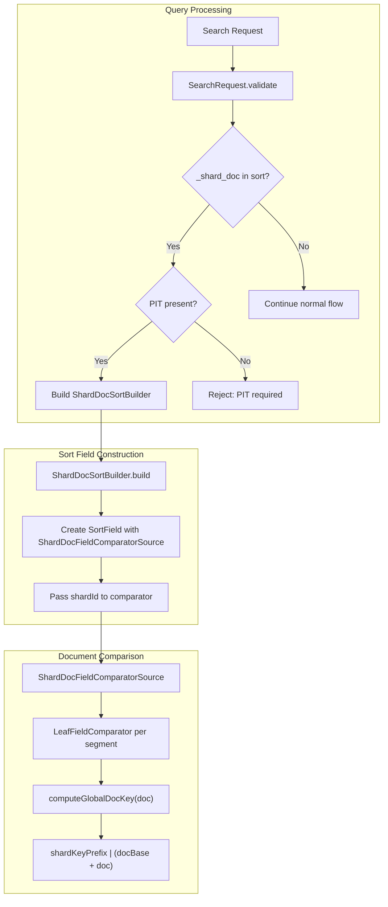
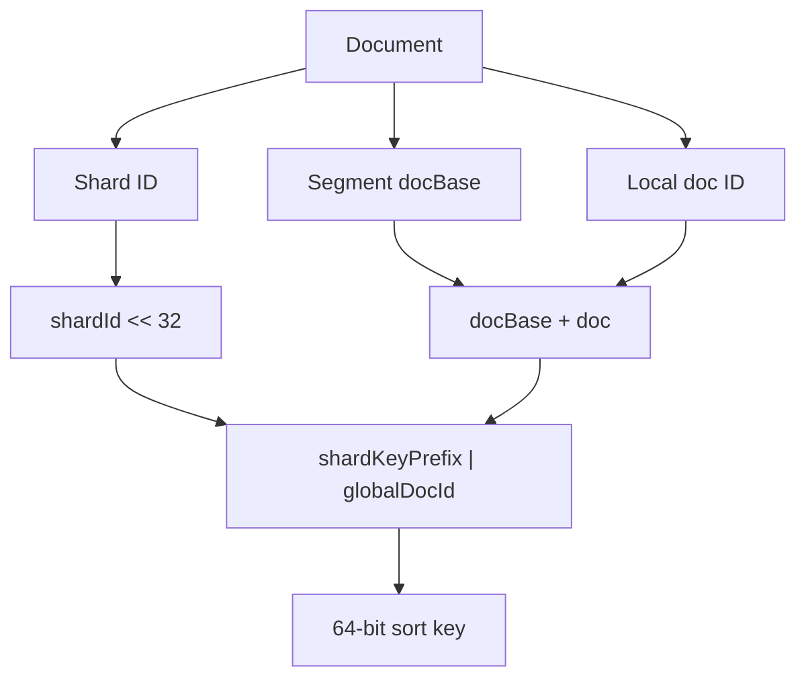

---
tags:
  - opensearch
---
# Search Tie-breaking (_shard_doc)

## Summary

The `_shard_doc` pseudo-field provides deterministic tie-breaking for search result pagination in OpenSearch. When paginating through search results using `search_after` with Point in Time (PIT), documents with identical sort values can appear in inconsistent order across pages, leading to duplicates or missing results. The `_shard_doc` field solves this by providing a unique sort key for every document, computed as a composite of the shard ID and global document ID.

## Details

### Architecture



### Data Flow



### Components

| Component | Description |
|-----------|-------------|
| `ShardDocSortBuilder` | Parses `_shard_doc` from JSON/XContent and builds the Lucene `SortField` |
| `ShardDocFieldComparatorSource` | Custom `FieldComparatorSource` that computes composite keys for comparison |
| `SearchRequest.validate` | Validates that `_shard_doc` is only used with PIT and not with scroll |
| `SortBuilders.shardDocSort()` | Factory method for creating `ShardDocSortBuilder` programmatically |

### Configuration

| Setting | Description | Default |
|---------|-------------|---------|
| `sort._shard_doc.order` | Sort order for _shard_doc | `asc` |

### Usage Example

#### Basic Usage with PIT

```json
// Create PIT
POST /my-index/_search/point_in_time?keep_alive=5m

// First page
GET /_search
{
  "size": 10,
  "pit": { "id": "<pit_id>", "keep_alive": "5m" },
  "sort": [
    { "score": "desc" },
    { "_shard_doc": "asc" }
  ]
}

// Response includes sort values
{
  "hits": {
    "hits": [
      {
        "_id": "doc1",
        "sort": [0.95, 4294967296]
      }
    ]
  }
}

// Next page using search_after
GET /_search
{
  "size": 10,
  "pit": { "id": "<pit_id>", "keep_alive": "5m" },
  "sort": [
    { "score": "desc" },
    { "_shard_doc": "asc" }
  ],
  "search_after": [0.95, 4294967296]
}
```

#### Java API Usage

```java
// Create _shard_doc sort
ShardDocSortBuilder shardDocSort = SortBuilders.shardDocSort()
    .order(SortOrder.ASC);

// Build search request with PIT
SearchSourceBuilder sourceBuilder = new SearchSourceBuilder()
    .size(100)
    .pointInTimeBuilder(new PointInTimeBuilder(pitId))
    .sort(SortBuilders.fieldSort("timestamp").order(SortOrder.DESC))
    .sort(shardDocSort);
```

## Limitations

- **PIT Required**: `_shard_doc` can only be used with Point in Time (PIT). Attempting to use it without PIT results in a validation error.
- **No Scroll Support**: Cannot be combined with the scroll API. Use PIT + `search_after` instead.
- **Single Instance**: Only one `_shard_doc` sort field is allowed per query.
- **No Bucketed Sort**: Bucketed sort operations are not supported for `_shard_doc`.

## Change History

- **v3.3.0** (2025-09-30): Initial implementation - Added `_shard_doc` pseudo-field for deterministic tie-breaking with PIT pagination


## References

### Documentation
- [Point in Time Documentation](https://docs.opensearch.org/3.0/search-plugins/searching-data/point-in-time/): PIT usage guide
- [Paginate Results](https://docs.opensearch.org/3.0/search-plugins/searching-data/paginate/): Pagination methods comparison

### Pull Requests
| Version | PR | Description | Related Issue |
|---------|-----|-------------|---------------|
| v3.3.0 | [#18924](https://github.com/opensearch-project/OpenSearch/pull/18924) | Initial implementation of _shard_doc sort | [#17064](https://github.com/opensearch-project/OpenSearch/issues/17064) |

### Issues (Design / RFC)
- [Issue #17064](https://github.com/opensearch-project/OpenSearch/issues/17064): Original feature request
