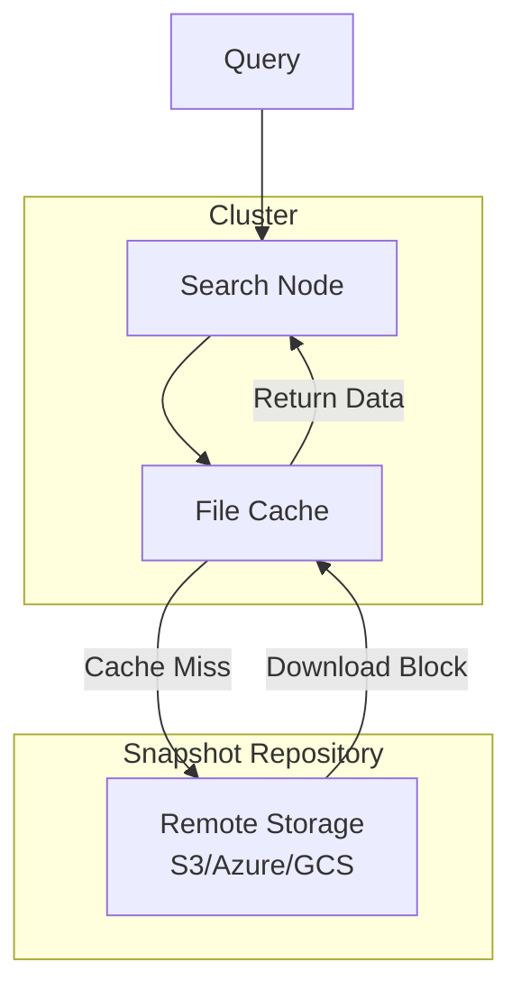

---
tags:
  - opensearch
---
# Searchable Snapshots

## Summary

Searchable Snapshots allow querying data directly from snapshot repositories without fully restoring indexes to cluster storage. Data is fetched on-demand at search time, enabling cost-effective access to historical data stored in lower-cost object storage like Amazon S3.

## Details

### Architecture



### Components

| Component | Description |
|-----------|-------------|
| Search Node | Node with `search` role that handles searchable snapshot queries |
| File Cache | Local cache for frequently accessed data segments |
| Transfer Manager | Manages blob fetching from remote snapshot repository |
| Remote Segment Store | Remote storage for segment data (S3, Azure, GCS) |

### Configuration

| Setting | Description | Default |
|---------|-------------|---------|
| `node.roles` | Must include `search` for searchable snapshot support | - |
| `node.search.cache.size` | Size of local cache for snapshot data | 80% of available storage (dedicated search node) |
| `cluster.filecache.remote_data_ratio` | Maximum ratio of remote data to local cache | Recommended: 5 |

### Usage Example

#### Configure a Search Node

```yaml
node.name: snapshots-node
node.roles: [ search ]
node.search.cache.size: 50gb
```

#### Restore as Searchable Snapshot

```json
POST /_snapshot/my-repository/my-snapshot/_restore
{
  "storage_type": "remote_snapshot",
  "indices": "my-index"
}
```

#### Verify Index Type

```json
GET /my-index/_settings?pretty
```

Response shows `"store": { "type": "remote_snapshot" }` for searchable snapshot indexes.

## Limitations

- Searchable snapshot indexes are read-only
- Higher search latency compared to local indexes due to remote data fetching
- Remote object stores may charge per-request fees
- Searching remote data impacts performance of other queries on the same node
- k-NN indexes support searchable snapshots only for NMSLIB and Faiss engines (v2.18+)
- Searchable snapshots are not supported inside shallow copy snapshots

## Change History

- **v2.19.0** (2025-01-14): Bug fixes for alias rollover, scripted query permissions, and shallow copy snapshots on closed indexes
- **v2.18.0**: Added k-NN index support for NMSLIB and Faiss engines
- **v2.7.0**: Initial searchable snapshots feature

## References

### Documentation
- [Searchable Snapshots](https://docs.opensearch.org/latest/tuning-your-cluster/availability-and-recovery/snapshots/searchable_snapshot/)
- [Shallow Snapshots](https://docs.opensearch.org/latest/tuning-your-cluster/availability-and-recovery/remote-store/snapshot-interoperability/)

### Pull Requests
| Version | PR | Description |
|---------|-----|-------------|
| v2.19.0 | [#16483](https://github.com/opensearch-project/OpenSearch/pull/16483) | Rollover alias supports restored searchable snapshot index |
| v2.19.0 | [#16544](https://github.com/opensearch-project/OpenSearch/pull/16544) | Fix scripted query permissions for remote snapshots |
| v2.19.0 | [#16868](https://github.com/opensearch-project/OpenSearch/pull/16868) | Fix shallow copy snapshot failures on closed index |
