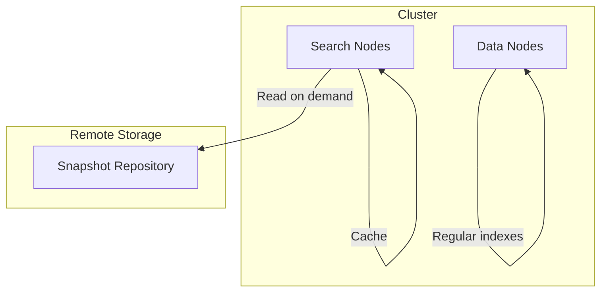

---
tags:
  - opensearch
---
# Searchable Snapshots

## Summary

Searchable snapshots allow querying data directly from snapshot repositories without fully restoring indexes to cluster storage. This feature enables cost-effective access to historical data by keeping index data in remote storage while maintaining search capability.

## Details

### Architecture



### Components

| Component | Description |
|-----------|-------------|
| Search Nodes | Nodes with `search` role that handle searchable snapshot queries |
| RemoteShardsBalancer | Balances searchable snapshot shards across search nodes |
| File Cache | Local cache for frequently accessed snapshot data |
| Snapshot Repository | Remote storage (S3, Azure, GCS, etc.) containing snapshot data |

### Configuration

| Setting | Description | Default |
|---------|-------------|---------|
| `node.roles` | Must include `search` for searchable snapshot support | - |
| `node.search.cache.size` | Size of local file cache for search nodes | - |
| `cluster.filecache.remote_data_ratio` | Max ratio of remote data to local cache | 5 |

### Usage Example

Create a searchable snapshot index by restoring with `remote_snapshot` storage type:

```json
POST /_snapshot/my-repository/my-snapshot/_restore
{
  "storage_type": "remote_snapshot",
  "indices": "my-index"
}
```

Verify the index is a searchable snapshot:

```json
GET /my-index/_settings?pretty
```

Response shows `"type": "remote_snapshot"` in store settings.

## Limitations

- Searchable snapshot indexes are read-only
- Higher query latency compared to local indexes due to remote data access
- Remote storage costs may apply for data retrieval
- Requires dedicated search nodes for optimal performance
- k-NN support limited to NMSLIB and Faiss engines (from v2.18)

## Change History

- **v2.19.0** (2025-01-07): Fixed RemoteShardsBalancer calculation bug that caused incorrect shard distribution in clusters with mixed node types
- **v2.18.0**: Added k-NN index support for NMSLIB and Faiss engines

## References

### Documentation

- [Searchable Snapshots](https://docs.opensearch.org/latest/tuning-your-cluster/availability-and-recovery/snapshots/searchable_snapshot/)

### Pull Requests

| Version | PR | Description |
|---------|-----|-------------|
| v2.19.0 | [#15335](https://github.com/opensearch-project/OpenSearch/pull/15335) | Fix remote shards balance calculation |
