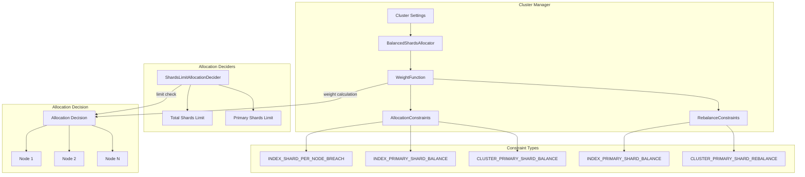

---
tags:
  - indexing
  - performance
---

# Shard Allocation

## Summary

Shard allocation in OpenSearch determines how shards are distributed across cluster nodes. The `BalancedShardsAllocator` uses a `WeightFunction` to calculate optimal node weights based on configurable balance factors. This feature includes settings for primary shard balancing and explicit limits on primary shards per node, which helps distribute primary shards evenly across nodes for better performance and fault tolerance—particularly important for segment replication clusters.

## Details

### Architecture



### Weight Calculation

The `WeightFunction` calculates node weights using the formula:

```
weight(node, index) = θ₀ × (node.numShards - avgShardsPerNode) 
                    + θ₁ × (node.numShards(index) - avgShardsPerNode(index))
```

Where:
- `θ₀ = shardBalance / (indexBalance + shardBalance)`
- `θ₁ = indexBalance / (indexBalance + shardBalance)`

### Components

| Component | Description |
|-----------|-------------|
| `BalancedShardsAllocator` | Main allocator that orchestrates shard distribution |
| `WeightFunction` | Calculates node weights for allocation decisions |
| `AllocationConstraints` | Constraints applied during initial shard allocation |
| `RebalanceConstraints` | Constraints applied during shard rebalancing |
| `LocalShardsBalancer` | Performs actual allocation and rebalancing operations |
| `ShardsLimitAllocationDecider` | Enforces hard limits on shards and primary shards per node |
| `RelocatingShardsBucket` | Tracks relocating shards separately for accurate counting |

### Configuration

#### Balance Settings

| Setting | Description | Default |
|---------|-------------|---------|
| `cluster.routing.allocation.balance.shard` | Weight factor for total shards per node | `0.45` |
| `cluster.routing.allocation.balance.index` | Weight factor for shards per index per node | `0.55` |
| `cluster.routing.allocation.balance.threshold` | Minimum optimization value for operations | `1.0` |
| `cluster.routing.allocation.balance.prefer_primary` | Enable primary shard balancing | `false` |
| `cluster.routing.allocation.rebalance.primary.enable` | Enable primary shard rebalancing | `false` |
| `cluster.routing.allocation.rebalance.primary.buffer` | Buffer for primary shard rebalancing | `0.10` |
| `cluster.routing.allocation.primary_constraint.threshold` | Weight added by primary constraints | `10` |

#### Shard Limit Settings

| Setting | Description | Default | Scope |
|---------|-------------|---------|-------|
| `cluster.routing.allocation.total_shards_per_node` | Maximum total shards per node | `-1` (unlimited) | Cluster |
| `cluster.routing.allocation.total_primary_shards_per_node` | Maximum primary shards per node (remote store only) | `-1` (unlimited) | Cluster |
| `index.routing.allocation.total_shards_per_node` | Maximum shards per node for an index | `-1` (unlimited) | Index |
| `index.routing.allocation.total_primary_shards_per_node` | Maximum primary shards per node for an index (remote store only) | `-1` (unlimited) | Index |

### Usage Example

Enable primary shard balancing for segment replication workloads:

```json
PUT /_cluster/settings
{
  "persistent": {
    "cluster.routing.allocation.balance.prefer_primary": true,
    "cluster.routing.allocation.rebalance.primary.enable": true,
    "cluster.routing.allocation.rebalance.primary.buffer": 0.10
  }
}
```

Limit primary shards per node at cluster level (requires remote store):

```json
PUT /_cluster/settings
{
  "persistent": {
    "cluster.routing.allocation.total_primary_shards_per_node": 3
  }
}
```

Limit primary shards per node for a specific index:

```json
PUT /my-index
{
  "settings": {
    "index.routing.allocation.total_primary_shards_per_node": 1,
    "index.number_of_shards": 6,
    "index.number_of_replicas": 1
  }
}
```

Adjust primary constraint weight:

```json
PUT /_cluster/settings
{
  "persistent": {
    "cluster.routing.allocation.primary_constraint.threshold": 20
  }
}
```

## Limitations

- Primary shard balancing is best-effort and may not achieve perfect distribution in all scenarios
- Enabling primary shard balance does not guarantee equal primary shards on each node, especially during failover
- Changing `prefer_primary` to `false` after enabling does not trigger redistribution
- Primary shard limit settings (`total_primary_shards_per_node`) require remote store to be enabled
- Setting limits too low may result in unassigned shards

## Change History

- **v3.4.0** (2025-10-10): Fixed bug where allocation and rebalance constraints were incorrectly reset when updating balance factors
- **v3.0.0** (2025-05-13): Added primary shard limit settings (`total_primary_shards_per_node`) at cluster and index levels for remote store clusters; Added `primary_constraint.threshold` setting to adjust primary constraint weights

## Related Features
- [OpenSearch Dashboards](../opensearch-dashboards/opensearch-dashboards-ai-chat.md)

## References

### Documentation
- [Cluster Settings Documentation](https://docs.opensearch.org/3.0/install-and-configure/configuring-opensearch/cluster-settings/): Official cluster routing allocation settings
- [Segment Replication Documentation](https://docs.opensearch.org/3.0/tuning-your-cluster/availability-and-recovery/segment-replication/index/): Recommended settings for segment replication

### Pull Requests
| Version | PR | Description | Related Issue |
|---------|-----|-------------|---------------|
| v3.4.0 | [#19012](https://github.com/opensearch-project/OpenSearch/pull/19012) | Fix WeightFunction constraint reset bug | [#13429](https://github.com/opensearch-project/OpenSearch/issues/13429) |
| v3.0.0 | [#17295](https://github.com/opensearch-project/OpenSearch/pull/17295) | Add cluster and index level settings to limit total primary shards per node | [#17293](https://github.com/opensearch-project/OpenSearch/issues/17293) |
| v3.0.0 | [#16471](https://github.com/opensearch-project/OpenSearch/pull/16471) | Add setting to adjust the primary constraint weights | [#16470](https://github.com/opensearch-project/OpenSearch/issues/16470) |

### Issues (Design / RFC)
- [Issue #17293](https://github.com/opensearch-project/OpenSearch/issues/17293): Feature request for primary shard count constraint
- [Issue #16470](https://github.com/opensearch-project/OpenSearch/issues/16470): Bug report for high primary shard weight causing uneven distribution
- [Issue #13429](https://github.com/opensearch-project/OpenSearch/issues/13429): Bug report for constraint reset issue
