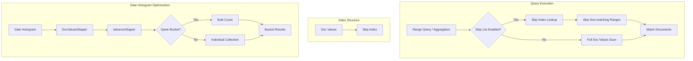

---
tags:
  - domain/core
  - component/server
  - indexing
  - performance
  - search
---
# Skip List

## Summary

The Skip List feature enables skip list indexing on doc values for numeric and date fields in OpenSearch. When enabled via the `skip_list` mapping parameter, this optimization allows the query engine to efficiently skip over document ranges that don't match query criteria, significantly improving performance for range queries and aggregations. Starting in v3.3.0, skip list is automatically enabled for `@timestamp` fields and index sort fields, and supports date histogram aggregations with sub-aggregations.

## Details

### Architecture



### Data Flow

```mermaid
flowchart TB
    subgraph "Indexing"
        V[Numeric/Date Value] --> FM[Field Mapper]
        FM --> C{skip_list enabled?}
        C -->|true| IF[SortedNumericDocValuesField.indexedField]
        C -->|false| NF[new SortedNumericDocValuesField]
        C -->|auto| AC{@timestamp or index sort?}
        AC -->|Yes| IF
        AC -->|No| NF
        IF --> DV[Doc Values + Skip Index]
        NF --> DV2[Doc Values Only]
    end
    
    subgraph "Querying"
        RQ[Range Query / Aggregation] --> QE[Query Engine]
        QE --> SI{Has Skip Index?}
        SI -->|Yes| SK[Skip Non-matching Blocks]
        SI -->|No| SC[Sequential Scan]
        SK --> RS[Results]
        SC --> RS
    end
```

### Components

| Component | Description |
|-----------|-------------|
| `NumberFieldMapper.Builder.skiplist` | Parameter in numeric field mapper builder |
| `DateFieldMapper.Builder.skiplist` | Parameter in date field mapper builder (v3.3.0+) |
| `ScaledFloatFieldMapper.Builder.skiplist` | Parameter in scaled_float field mapper builder (v3.3.0+) |
| `TokenCountFieldMapper.Builder.skiplist` | Parameter in token_count field mapper builder (v3.3.0+) |
| `NumberType.createFields()` | Extended with `skiplist` parameter |
| `SortedNumericDocValuesField.indexedField()` | Lucene method for creating indexed doc values |
| `DocValuesSkipIndexType.RANGE` | Skip index type used when skip_list is enabled |
| `HistogramSkiplistLeafCollector` | Collector for skip list-optimized date histogram aggregations (v3.3.0+) |
| `isSkiplistDefaultEnabled()` | Method to auto-enable skip list for @timestamp and index sort fields (v3.3.0+) |

### Configuration

| Setting | Description | Default |
|---------|-------------|---------|
| `skip_list` (numeric) | Boolean value that enables skip list indexing for numeric doc values | `false` |
| `skip_list` (date) | Boolean value that enables skip list indexing for date doc values | `false` (auto-enabled for @timestamp and index sort fields in v3.3.0+) |
| `skip_list` (scaled_float) | Boolean value that enables skip list indexing for scaled_float doc values | `false` |
| `skip_list` (token_count) | Boolean value that enables skip list indexing for token_count doc values | `false` |

### Supported Field Types

| Field Type | Support | Notes |
|------------|---------|-------|
| `byte` | ✓ | Via INTEGER type |
| `short` | ✓ | Via INTEGER type |
| `integer` | ✓ | Direct support |
| `long` | ✓ | Direct support |
| `float` | ✓ | Direct support |
| `double` | ✓ | Direct support |
| `half_float` | ✓ | Direct support |
| `unsigned_long` | ✓ | Direct support |
| `date` | ✓ | Added in v3.3.0, auto-enabled for @timestamp and index sort fields |
| `date_nanos` | ✓ | Added in v3.3.0, auto-enabled for @timestamp and index sort fields |
| `scaled_float` | ✓ | Added in v3.3.0 |
| `token_count` | ✓ | Added in v3.3.0 |

### Usage Example

Create an index with skip list enabled for numeric fields:

```json
PUT /products
{
  "mappings": {
    "properties": {
      "price": {
        "type": "double",
        "skip_list": true
      },
      "stock_quantity": {
        "type": "integer",
        "skip_list": true
      },
      "rating": {
        "type": "float",
        "skip_list": true
      }
    }
  }
}
```

Create an index with skip list for date fields (v3.3.0+):

```json
PUT /logs
{
  "mappings": {
    "properties": {
      "@timestamp": {
        "type": "date"
      },
      "custom_date": {
        "type": "date",
        "skip_list": true
      },
      "response_time_ms": {
        "type": "scaled_float",
        "scaling_factor": 1000,
        "skip_list": true
      }
    }
  }
}
```

Note: `@timestamp` fields automatically have skip list enabled in v3.3.0+.

Index documents:

```json
POST /products/_bulk
{"index": {"_id": "1"}}
{"price": 29.99, "stock_quantity": 150, "rating": 4.5}
{"index": {"_id": "2"}}
{"price": 49.99, "stock_quantity": 75, "rating": 4.8}
{"index": {"_id": "3"}}
{"price": 19.99, "stock_quantity": 200, "rating": 4.2}
```

Range queries benefit from skip list optimization:

```json
GET /products/_search
{
  "query": {
    "bool": {
      "filter": [
        {
          "range": {
            "price": {
              "gte": 20.00,
              "lte": 40.00
            }
          }
        },
        {
          "range": {
            "stock_quantity": {
              "gte": 100
            }
          }
        }
      ]
    }
  }
}
```

Aggregations also benefit:

```json
GET /products/_search
{
  "size": 0,
  "aggs": {
    "price_ranges": {
      "range": {
        "field": "price",
        "ranges": [
          { "to": 25 },
          { "from": 25, "to": 50 },
          { "from": 50 }
        ]
      }
    }
  }
}
```

Date histogram aggregations with sub-aggregations (v3.3.0+):

```json
GET /logs/_search
{
  "size": 0,
  "aggs": {
    "logs_over_time": {
      "date_histogram": {
        "field": "@timestamp",
        "calendar_interval": "day"
      },
      "aggs": {
        "max_response": {
          "max": {
            "field": "response_time_ms"
          }
        }
      }
    }
  }
}
```

## Limitations

- Increases index size due to additional skip index data structure
- Only effective when `doc_values` is enabled (default is `true`)
- Performance benefits are most noticeable for:
  - Range queries on high-cardinality fields
  - Aggregations with range-based filtering
  - Date histogram aggregations on time-series data
  - Analytics workloads with numeric/date filtering
- Date histogram skip list optimization requires single-valued fields
- Hard bounds in date histogram disable skip list optimization
- Requires reindexing to enable on existing fields

## Change History

- **v3.3.0** (2025-10-01): Extended skip list support - Added date histogram aggregation optimization, extended to date/scaled_float/token_count fields, added sub-aggregation support, auto-enabled for @timestamp and index sort fields
- **v3.2.0** (2025-08-19): Initial implementation - Added `skip_list` parameter to all numeric field mappers

## Related Features
- [OpenSearch Dashboards](../opensearch-dashboards/opensearch-dashboards-ai-chat.md)

## References

### Documentation
- [Documentation PR #10560](https://github.com/opensearch-project/documentation-website/pull/10560): Add skip_list parameter documentation
- [Numeric field types documentation](https://docs.opensearch.org/latest/field-types/supported-field-types/numeric/)
- [Date histogram aggregation](https://docs.opensearch.org/3.0/aggregations/bucket/date-histogram/)
- [PR #18066](https://github.com/opensearch-project/OpenSearch/pull/18066): Previous implementation (replaced by #18889)

### Pull Requests
| Version | PR | Description | Related Issue |
|---------|-----|-------------|---------------|
| v3.3.0 | [#19130](https://github.com/opensearch-project/OpenSearch/pull/19130) | Adding logic for histogram aggregation using skiplist |   |
| v3.3.0 | [#19142](https://github.com/opensearch-project/OpenSearch/pull/19142) | Add skip_list param for date, scaled float and token count fields | [#19123](https://github.com/opensearch-project/OpenSearch/issues/19123) |
| v3.3.0 | [#19438](https://github.com/opensearch-project/OpenSearch/pull/19438) | Add sub aggregation support for histogram aggregation using skiplist |   |
| v3.3.0 | [#19480](https://github.com/opensearch-project/OpenSearch/pull/19480) | Enable skip_list for @timestamp field or index sort field by default | [#19123](https://github.com/opensearch-project/OpenSearch/issues/19123) |
| v3.2.0 | [#18889](https://github.com/opensearch-project/OpenSearch/pull/18889) | Add skip_list parameter to Numeric Field Mappers (default false) |   |

### Issues (Design / RFC)
- [Issue #17965](https://github.com/opensearch-project/OpenSearch/issues/17965): [SparseIndex] Modify FieldMappers to enable SkipList
- [Issue #17283](https://github.com/opensearch-project/OpenSearch/issues/17283): Support for sub-aggregations
- [Issue #19123](https://github.com/opensearch-project/OpenSearch/issues/19123): Enable skip_list by default in 3.3
- [Documentation Issue #11166](https://github.com/opensearch-project/documentation-website/issues/11166): Public documentation for skip_list
