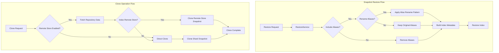

---
tags:
  - domain/core
  - component/server
  - indexing
  - performance
---
# Snapshot Restore Enhancements

## Summary

OpenSearch's snapshot restore functionality allows users to restore indexes and their associated aliases from snapshots. This feature provides alias renaming capabilities during restore operations and optimized clone operations for incremental snapshots, enabling flexible disaster recovery, cluster migration, and debugging workflows.

## Details

### Architecture



### Components

| Component | Description |
|-----------|-------------|
| `RestoreSnapshotRequest` | Request object containing restore parameters including alias rename patterns |
| `RestoreService` | Service that orchestrates the restore operation and applies alias transformations |
| `SnapshotsService` | Service handling snapshot clone operations with optimized path for doc-rep clusters |
| `AliasMetadata` | Metadata class for alias information, supports creating renamed copies |

### Configuration

| Setting | Description | Default |
|---------|-------------|---------|
| `rename_pattern` | Regex pattern to match index names for renaming | None |
| `rename_replacement` | Replacement string for matched index names | None |
| `rename_alias_pattern` | Regex pattern to match alias names for renaming | None |
| `rename_alias_replacement` | Replacement string for matched alias names | None |
| `include_aliases` | Whether to restore aliases with indexes | `true` |

### Usage Examples

#### Basic Restore with Alias Renaming

```json
POST /_snapshot/my_repo/my_snapshot/_restore
{
  "indices": "logs-*",
  "rename_pattern": "logs-(.+)",
  "rename_replacement": "restored-logs-$1",
  "rename_alias_pattern": "(.+)",
  "rename_alias_replacement": "restored-$1",
  "include_aliases": true
}
```

#### Restore for Debugging (Isolated Copy)

```json
POST /_snapshot/production_repo/daily_snapshot/_restore
{
  "indices": "orders",
  "rename_pattern": "(.+)",
  "rename_replacement": "debug_$1",
  "rename_alias_pattern": "(.+)",
  "rename_alias_replacement": "debug_$1",
  "include_aliases": true,
  "index_settings": {
    "index.number_of_replicas": 0
  }
}
```

This creates `debug_orders` index with all aliases prefixed with `debug_`, completely isolated from production.

### API Reference

#### Restore Snapshot API

```
POST /_snapshot/{repository}/{snapshot}/_restore
```

**Request Body Parameters:**

| Parameter | Type | Description |
|-----------|------|-------------|
| `indices` | String/Array | Indexes to restore (supports wildcards) |
| `rename_pattern` | String | Regex pattern for index renaming |
| `rename_replacement` | String | Replacement for index names |
| `rename_alias_pattern` | String | Regex pattern for alias renaming |
| `rename_alias_replacement` | String | Replacement for alias names |
| `include_aliases` | Boolean | Include aliases in restore (default: true) |
| `include_global_state` | Boolean | Restore cluster state (default: false) |
| `partial` | Boolean | Allow partial restore (default: false) |

## Limitations

- Alias renaming uses Java regex; complex patterns may impact performance
- Cannot rename aliases to names that conflict with existing indexes
- Clone optimization only benefits document replication clusters
- Repository data fetch still required for remote store enabled clusters during clone
- When repository is updated during snapshot creation, the snapshot operation will fail and must be retried
- File cache validation may be less accurate when shard size information is unavailable (logs warning)

## Change History

- **v3.4.0** (2026-01-11): Fixed NPE when restoring remote snapshots with missing shard size information in ClusterInfo cache
- **v3.1.0** (2026-01-10): Fixed infinite loop when updating repository during snapshot creation; fixed NPE when restoring legacy searchable snapshots
- **v2.18.0** (2024-11-05): Added alias renaming support during snapshot restore; optimized clone operations for doc-rep clusters

## Related Features
- [OpenSearch Dashboards](../opensearch-dashboards/opensearch-dashboards-ai-chat.md)

## References

### Documentation
- [Snapshot Restore Documentation](https://docs.opensearch.org/3.0/api-reference/snapshots/create-repository/): Official documentation
- [Restore Snapshot API](https://docs.opensearch.org/3.0/api-reference/snapshots/restore-snapshot/): API reference

### Pull Requests
| Version | PR | Description | Related Issue |
|---------|-----|-------------|---------------|
| v3.4.0 | [#19684](https://github.com/opensearch-project/OpenSearch/pull/19684) | Fix NPE in validateSearchableSnapshotRestorable when shard size is unavailable | [#19349](https://github.com/opensearch-project/OpenSearch/issues/19349) |
| v3.1.0 | [#17532](https://github.com/opensearch-project/OpenSearch/pull/17532) | Fix infinite loop when simultaneously creating snapshot and updating repository | [#17531](https://github.com/opensearch-project/OpenSearch/issues/17531) |
| v3.1.0 | [#18218](https://github.com/opensearch-project/OpenSearch/pull/18218) | Avoid NPE on SnapshotInfo if 'shallow' boolean not present | [#18187](https://github.com/opensearch-project/OpenSearch/issues/18187) |
| v2.18.0 | [#16292](https://github.com/opensearch-project/OpenSearch/pull/16292) | Add support for renaming aliases during snapshot restore | [#15632](https://github.com/opensearch-project/OpenSearch/issues/15632) |
| v2.18.0 | [#16296](https://github.com/opensearch-project/OpenSearch/pull/16296) | Optimise clone operation for incremental full cluster snapshots | [#16295](https://github.com/opensearch-project/OpenSearch/issues/16295) |

### Issues (Design / RFC)
- [Issue #19349](https://github.com/opensearch-project/OpenSearch/issues/19349): Bug report for NullPointerException when restoring remote snapshots with missing shard size
- [Issue #17531](https://github.com/opensearch-project/OpenSearch/issues/17531): Bug report for infinite loop during concurrent snapshot/repository update
- [Issue #18187](https://github.com/opensearch-project/OpenSearch/issues/18187): Bug report for NPE when restoring legacy searchable snapshots
- [Issue #15632](https://github.com/opensearch-project/OpenSearch/issues/15632): Original feature request for alias renaming
- [Issue #16295](https://github.com/opensearch-project/OpenSearch/issues/16295): Clone optimization request
