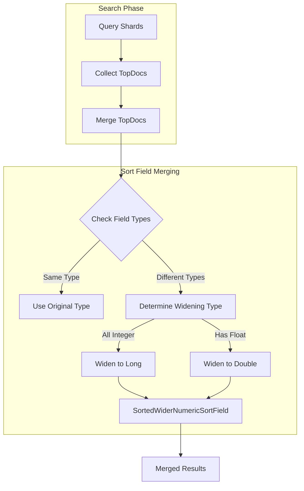

---
tags:
  - opensearch
---
# Sort Field Merging

## Summary

Sort field merging handles the combination of search results from multiple shards when sorting by numeric fields. When indices have different numeric field types for the same field name, OpenSearch widens the sort field type to ensure correct comparison across all results.

## Details

### Architecture



### Components

| Component | Description |
|-----------|-------------|
| `SearchPhaseController` | Coordinates the merge of search results from multiple shards |
| `SortedWiderNumericSortField` | Custom sort field that handles comparison of widened numeric types |
| `IndexFieldData.XFieldComparatorSource` | Provides the reduced type for sort field comparison |

### Supported Types

| Original Type | Widened To | Notes |
|---------------|------------|-------|
| `long` | `Long` | When all fields are integer types |
| `integer` | `Long` | When all fields are integer types |
| `short` | `Long` | When all fields are integer types |
| `byte` | `Long` | When all fields are integer types |
| `double` | `Double` | When any field is floating-point |
| `float` | `Double` | When any field is floating-point |
| `half_float` | `Double` | When any field is floating-point |

### Usage Example

When searching across multiple indices with different field types:

```json
GET /index_long,index_integer/_search
{
  "query": { "match_all": {} },
  "sort": [
    { "numeric_field": { "order": "asc" } }
  ]
}
```

OpenSearch automatically detects the different field types and applies appropriate widening.

## Limitations

- `unsigned_long` fields are not supported for type widening and cannot be mixed with other numeric types
- When mixing integer and floating-point types, precision loss may occur for very large integer values (> 2^53 - 1)
- Custom sort field comparators may not be compatible with type widening

## Change History

- **v2.19.0** (2025-01-10): Fixed type widening to use `Long` for integer-only fields, preventing precision loss for large values ([#16881](https://github.com/opensearch-project/OpenSearch/pull/16881))
- **v2.6.0**: Initial implementation of sort field widening using `Double` for all numeric types ([#6424](https://github.com/opensearch-project/OpenSearch/pull/6424))

## References

### Documentation

- [Sort results](https://docs.opensearch.org/latest/search-plugins/searching-data/sort/) - OpenSearch documentation on sorting search results
- [Numeric field types](https://docs.opensearch.org/latest/field-types/supported-field-types/numeric/) - Supported numeric field types

### Pull Requests

| Version | PR | Description |
|---------|-----|-------------|
| v2.19.0 | [#16881](https://github.com/opensearch-project/OpenSearch/pull/16881) | Use the correct type to widen the sort fields when merging top docs |
| v2.6.0 | [#6424](https://github.com/opensearch-project/OpenSearch/pull/6424) | Initial sort field widening implementation |

### Related Issues

- [#16860](https://github.com/opensearch-project/OpenSearch/issues/16860) - Bug report for incorrect sorting with large values
- [#6326](https://github.com/opensearch-project/OpenSearch/issues/6326) - Original issue for sort optimization
