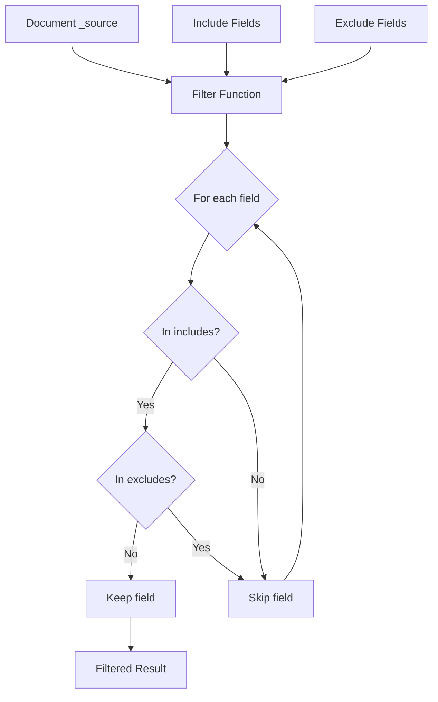

---
tags:
  - opensearch
---
# Source Field Matching

## Summary

Source field matching is the mechanism OpenSearch uses to filter which fields from the `_source` document are returned in search responses. The `_source` field contains the original JSON document that was indexed, and source filtering allows you to selectively include or exclude specific fields to reduce network transfer and improve performance.

In v3.0.0, OpenSearch introduced a significant performance optimization that uses HashSet-based matching for simple field names, avoiding the overhead of automaton-based pattern matching.

## Details

### Architecture

```mermaid
flowchart TB
    subgraph "Search Request"
        A[_source filtering<br/>includes/excludes]
    end
    
    subgraph "XContentMapValues.filter()"
        B{Field pattern<br/>analysis}
        C[HashSet Filter<br/>O(1) lookup]
        D[Automaton Filter<br/>Pattern matching]
    end
    
    subgraph "Output"
        E[Filtered _source]
    end
    
    A --> B
    B -->|Simple names| C
    B -->|Wildcards/dots| D
    C --> E
    D --> E
```

### Data Flow



### Components

| Component | Description |
|-----------|-------------|
| `XContentMapValues` | Utility class for filtering and extracting values from XContent maps |
| `filter()` | Main entry point that selects the appropriate filtering strategy |
| `hasNoWildcardsOrDots()` | Checks if field names are simple (no `*` or `.` characters) |
| `createSetBasedFilter()` | Creates efficient HashSet-based filter for simple field names |
| `createAutomatonFilter()` | Creates automaton-based filter for complex patterns |

### Configuration

Source filtering is configured at query time through the `_source` parameter:

| Parameter | Description | Example |
|-----------|-------------|---------|
| `_source` | Boolean to enable/disable source | `"_source": false` |
| `_source.includes` | Fields to include | `["title", "author"]` |
| `_source.excludes` | Fields to exclude | `["password", "internal_*"]` |

### Usage Example

```json
// Disable _source entirely
GET /index/_search
{
  "_source": false,
  "query": { "match_all": {} }
}
```

```json
// Include specific fields (uses HashSet optimization)
GET /index/_search
{
  "_source": ["title", "author", "price"],
  "query": { "match_all": {} }
}
```

```json
// Include/exclude with patterns (uses automaton matching)
GET /index/_search
{
  "_source": {
    "includes": ["user.*"],
    "excludes": ["user.password"]
  },
  "query": { "match_all": {} }
}
```

## Limitations

- HashSet optimization only applies when all field names are simple (no wildcards or dots)
- Disabling `_source` in index mappings affects features like `update`, `update_by_query`, and `reindex`
- Dots in field names are treated as sub-objects (e.g., including `a` will also include `a.b`)

## Change History

- **v3.0.0** (2025-05-06): Added HashSet-based filtering optimization for simple field names to prevent TooComplexToDeterminizeException


## References

### Documentation
- [Source Field Documentation](https://docs.opensearch.org/3.0/field-types/metadata-fields/source/): Official `_source` field documentation
- [Retrieve Specific Fields](https://docs.opensearch.org/3.0/search-plugins/searching-data/retrieve-specific-fields/): Source filtering documentation

### Pull Requests
| Version | PR | Description | Related Issue |
|---------|-----|-------------|---------------|
| v3.0.0 | [#17160](https://github.com/opensearch-project/OpenSearch/pull/17160) | Add HashSet based filtering optimization to XContentMapValues | [#17114](https://github.com/opensearch-project/OpenSearch/issues/17114) |

### Issues (Design / RFC)
- [Issue #17114](https://github.com/opensearch-project/OpenSearch/issues/17114): Bug report - Fetching source uses automata even for simple matching
