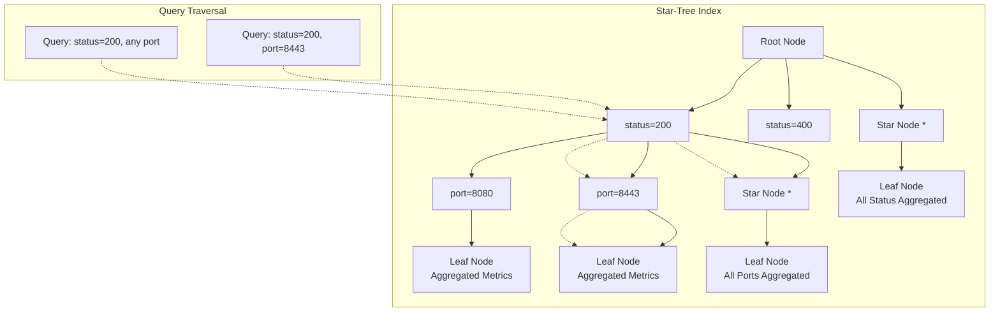
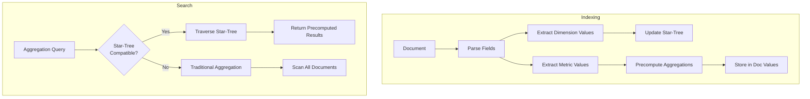

---
tags:
  - domain/core
  - component/server
  - dashboards
  - indexing
  - observability
  - performance
  - search
---
# Star Tree Index

## Summary

Star-tree index is a multi-field index in OpenSearch designed to accelerate aggregation queries. Inspired by Apache Pinot, it precomputes aggregations during indexing, storing results in a tree structure that enables sub-millisecond query latency even on datasets with hundreds of millions of documents. Star-tree index is particularly beneficial for dashboards, real-time analytics, and observability use cases where aggregation performance is critical.

## Details

### Architecture



### Data Flow



### Components

| Component | Description |
|-----------|-------------|
| Star-Tree Structure | Hierarchical tree organizing dimension values with star nodes for aggregation |
| Leaf Nodes | Store precomputed aggregation results for dimension combinations |
| Star Nodes | Represent aggregated values across all values of a dimension |
| Doc Values | Columnar storage for preaggregated metrics |
| Filter Providers | Convert queries to star-tree traversal filters |
| Aggregators | Resolve aggregations using star-tree data |

### Configuration

| Setting | Description | Default |
|---------|-------------|---------|
| `index.composite_index` | Enable composite index support | `false` |
| `index.append_only.enabled` | Required for star-tree (immutable data) | `false` |
| `indices.composite_index.star_tree.enabled` | Enable star-tree search optimization cluster-wide | `true` |
| `index.search.star_tree_index.enabled` | Enable star-tree search per index (v3.1.0+) | `true` |
| `max_leaf_docs` | Maximum documents per leaf node | `10000` |
| `skip_star_node_creation_for_dimensions` | Dimensions to skip star node creation | `[]` |

### Security Integration

Star-tree query optimization is automatically disabled when security restrictions are applied (v3.2.0+):

| Security Feature | Star-Tree Behavior |
|------------------|-------------------|
| Document-Level Security (DLS) | Disabled - falls back to standard aggregation |
| Field-Level Security (FLS) | Disabled - falls back to standard aggregation |
| Field Masking | Disabled - falls back to standard aggregation |
| No restrictions | Enabled - uses precomputed aggregations |

This ensures that precomputed aggregations don't bypass security filters. Users with DLS/FLS/Field Masking will experience standard aggregation performance rather than star-tree acceleration.

### Monitoring

Star-tree search statistics are available (v3.2.0+) through the stats APIs:

| Metric | Description |
|--------|-------------|
| `startree_query_total` | Total queries resolved using star-tree |
| `startree_query_time_in_millis` | Time spent in star-tree queries |
| `startree_query_current` | Currently running star-tree queries |
| `query_failed` | Total failed query phase operations (v3.3.0+) |
| `startree_query_failed` | Failed star-tree query operations (v3.3.0+) |

Access via `/_nodes/stats/indices/search`, `/_stats/search`, `/_cat/shards`, `/_cat/nodes`, `/_cat/indices`, or `/_stats/search?level=shards`.

### Supported Features

#### Supported Dimension Types
- Numeric types: integer, long, float, double, half_float, unsigned_long
- Keyword fields
- IP fields (v3.2.0+)
- Date fields (for date_dimension)

#### Queries
- Term query
- Terms query
- Range query (including date range queries as of v3.1.0)
- Match all docs query
- Boolean query (MUST, FILTER, SHOULD clauses)

#### Aggregations
- Metric aggregations: sum, min, max, avg, value_count
- Date histogram with metric sub-aggregations
- Terms aggregations (keyword and numeric)
- Range aggregations with metric sub-aggregations
- Nested bucket aggregations (v3.1.0+): terms → terms → metric, date_histogram → terms → metric, etc.
- Multi-terms aggregations (v3.3.0+): group by multiple dimension fields simultaneously

### Usage Example

```yaml
# Index mapping with star-tree configuration
PUT logs
{
  "settings": {
    "index.number_of_shards": 1,
    "index.composite_index": true,
    "index.append_only.enabled": true
  },
  "mappings": {
    "composite": {
      "request_aggs": {
        "type": "star_tree",
        "config": {
          "date_dimension": {
            "name": "@timestamp",
            "calendar_intervals": ["month", "day"]
          },
          "ordered_dimensions": [
            { "name": "status" },
            { "name": "port" },
            { "name": "method" }
          ],
          "metrics": [
            { "name": "size", "stats": ["sum", "avg"] },
            { "name": "latency", "stats": ["avg", "max", "min"] }
          ]
        }
      }
    },
    "properties": {
      "status": { "type": "integer" },
      "port": { "type": "integer" },
      "method": { "type": "keyword" },
      "size": { "type": "integer" },
      "latency": { "type": "scaled_float", "scaling_factor": 10 }
    }
  }
}
```

```json
// Query automatically uses star-tree when eligible
POST /logs/_search
{
  "size": 0,
  "query": {
    "term": { "status": 200 }
  },
  "aggs": {
    "avg_latency": { "avg": { "field": "latency" } },
    "total_size": { "sum": { "field": "size" } }
  }
}
```

## Limitations

- Only suitable for immutable datasets (updates/deletions not reflected)
- Cannot be removed once created; requires reindex to disable
- High cardinality dimensions increase storage and query latency
- Multi-values/array values not supported
- Boolean `must_not` clauses not supported
- `minimum_should_match` parameter not supported
- Nested aggregations limited to 3-4 levels

## Change History

- **v3.3.0** (2025-10-28): Added multi-terms aggregation support (up to 40x performance improvement), search query failure statistics (query_failed, startree_query_failed)
- **v3.2.0** (2025-09-16): Added DLS/FLS/Field Masking security integration (disables star-tree for restricted users), IP field search support, star-tree search statistics (query count, time, current)
- **v3.1.0** (2025-06-10): Production-ready status, removed feature flag, added index-level setting, date range query support, nested bucket aggregations
- **v3.0.0** (2025-05-12): Added boolean query support, terms aggregations, range aggregations, unsigned-long support
- **v2.19** (2024-12-10): Added date histogram aggregations, term/terms/range query support
- **v2.18** (2024-10-22): Initial experimental release with metric aggregations (sum, min, max, avg, value_count)

## Related Features
- [OpenSearch Dashboards](../opensearch-dashboards/opensearch-dashboards-ai-chat.md)

## References

### Documentation
- [Documentation](https://docs.opensearch.org/3.1/search-plugins/star-tree-index/): Official star-tree index documentation
- [Field Type Documentation](https://docs.opensearch.org/3.1/field-types/supported-field-types/star-tree/): Star-tree field type reference

### Blog Posts
- [Blog: The power of star-tree indexes](https://opensearch.org/blog/the-power-of-star-tree-indexes-supercharging-opensearch-aggregations/): Performance analysis and use cases

### Pull Requests
| Version | PR | Description | Related Issue |
|---------|-----|-------------|---------------|
| v3.3.0 | [#19284](https://github.com/opensearch-project/OpenSearch/pull/19284) | Support for multi-terms aggregations | [#18398](https://github.com/opensearch-project/OpenSearch/issues/18398) |
| v3.3.0 | [#19209](https://github.com/opensearch-project/OpenSearch/pull/19209) | Add search & star-tree search query failure count metrics | [#19210](https://github.com/opensearch-project/OpenSearch/issues/19210) |
| v3.2.0 | [security#5492](https://github.com/opensearch-project/security/pull/5492) | Restrict star-tree for users with DLS/FLS/Field Masking |   |
| v3.2.0 | [#18707](https://github.com/opensearch-project/OpenSearch/pull/18707) | Add star-tree search statistics |   |
| v3.2.0 | [#18671](https://github.com/opensearch-project/OpenSearch/pull/18671) | Add IP field search support | [#16547](https://github.com/opensearch-project/OpenSearch/issues/16547) |
| v3.1.0 | [#18070](https://github.com/opensearch-project/OpenSearch/pull/18070) | Remove feature flag, add index-level star-tree search setting |   |
| v3.1.0 | [#18048](https://github.com/opensearch-project/OpenSearch/pull/18048) | Support nested bucket aggregations | [#17274](https://github.com/opensearch-project/OpenSearch/issues/17274) |
| v3.1.0 | [#17855](https://github.com/opensearch-project/OpenSearch/pull/17855) | Support date range queries in aggregations | [#17443](https://github.com/opensearch-project/OpenSearch/issues/17443) |
| v3.0.0 | [#17941](https://github.com/opensearch-project/OpenSearch/pull/17941) | Boolean query support | [#17267](https://github.com/opensearch-project/OpenSearch/issues/17267) |
| v3.0.0 | [#17275](https://github.com/opensearch-project/OpenSearch/pull/17275) | Unsigned-long query support | [#15231](https://github.com/opensearch-project/OpenSearch/issues/15231) |
| v3.0.0 | [#17273](https://github.com/opensearch-project/OpenSearch/pull/17273) | Range aggregations | [#16553](https://github.com/opensearch-project/OpenSearch/issues/16553) |
| v3.0.0 | [#17165](https://github.com/opensearch-project/OpenSearch/pull/17165) | Terms aggregations (keyword/numeric) | [#16551](https://github.com/opensearch-project/OpenSearch/issues/16551) |
| v2.18.0 | [#15289](https://github.com/opensearch-project/OpenSearch/pull/15289) | Initial metric aggregations with/without term query | [#15257](https://github.com/opensearch-project/OpenSearch/issues/15257) |

### Issues (Design / RFC)
- [Issue #18398](https://github.com/opensearch-project/OpenSearch/issues/18398): Multi-terms aggregation feature request
- [Issue #19210](https://github.com/opensearch-project/OpenSearch/issues/19210): Query failure stats feature request
- [Issue #17443](https://github.com/opensearch-project/OpenSearch/issues/17443): Date range query support
- [Issue #17274](https://github.com/opensearch-project/OpenSearch/issues/17274): Nested bucket aggregations
- [Issue #16551](https://github.com/opensearch-project/OpenSearch/issues/16551): Bucket terms aggregation feature request
- [Issue #16553](https://github.com/opensearch-project/OpenSearch/issues/16553): Range aggregations feature request
- [Issue #16547](https://github.com/opensearch-project/OpenSearch/issues/16547): IP field support feature request
- [Issue #15231](https://github.com/opensearch-project/OpenSearch/issues/15231): Unsigned long support
- [Issue #17267](https://github.com/opensearch-project/OpenSearch/issues/17267): Boolean query support
- [Issue #15257](https://github.com/opensearch-project/OpenSearch/issues/15257): Star-tree tracking issue
