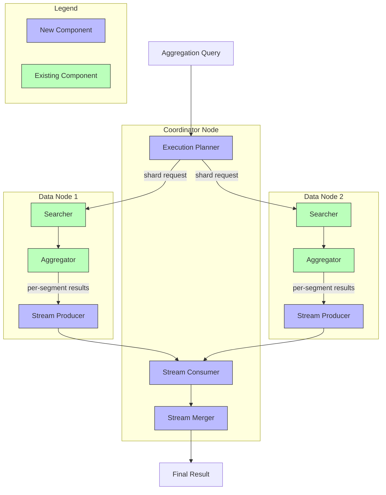
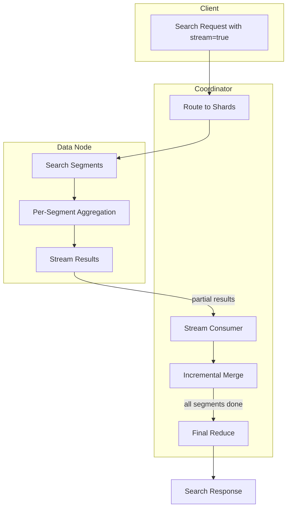

---
tags:
  - domain/core
  - component/server
  - indexing
  - search
---
# Streaming Transport & Aggregation

## Summary

Streaming Transport & Aggregation is a memory-efficient approach to aggregation processing in OpenSearch. Instead of accumulating all partial aggregation results on data nodes before sending them to the coordinator, this feature streams partial results per segment immediately. This redistributes memory load from data nodes to coordinator nodes, improving cluster stability and enabling better resource utilization for high-cardinality aggregation workloads.

## Details

### Architecture



### Data Flow



### Components

| Component | Description |
|-----------|-------------|
| `StreamTransportService` | Transport service handling streaming requests with connection management |
| `StreamSearchTransportService` | Search-specific streaming transport for query/fetch phases |
| `StreamTransportResponseHandler` | Interface for handling streaming responses with `handleStreamResponse()` |
| `StreamQueryPhaseResultConsumer` | Consumes and merges streaming aggregation results |
| `StreamSearchQueryThenFetchAsyncAction` | Coordinates streaming search execution across shards |
| `StreamStringTermsAggregator` | Per-segment string terms aggregator that resets after each batch |
| `StreamNumericTermsAggregator` | Per-segment numeric terms aggregator for long, double, unsigned long types |
| `StreamCardinalityAggregator` | Per-segment cardinality aggregator using ordinals collector |
| `StreamSearchChannelListener` | Sends streaming responses back to coordinator |
| `StreamSearchActionListener` | Handles intermediate and final streaming responses |
| `FlushModeResolver` | Analyzes aggregator trees to determine optimal flush mode |
| `StreamingCostMetrics` | Cost analysis metrics for streaming decision-making |
| `AggregatorTreeEvaluator` | Evaluates and recreates aggregator trees with optimal types |
| `Streamable` | Interface for collectors supporting streaming aggregation |

### Configuration

| Setting | Description | Default |
|---------|-------------|---------|
| `search.stream.enabled` | Dynamic cluster setting to enable/disable stream search (v3.3.0+) | false |
| `transport.stream.request_timeout` | Timeout for streaming transport requests | 5 minutes |
| `search.aggregations.streaming.max_estimated_bucket_count` | Maximum estimated buckets for streaming eligibility | 100,000 |
| `search.aggregations.streaming.min_cardinality_ratio` | Minimum cardinality ratio (buckets/docs) for streaming | 0.01 |
| `search.aggregations.streaming.min_estimated_bucket_count` | Minimum estimated buckets for streaming eligibility | 1,000 |

### Usage Example

Enable the feature via cluster setting (v3.3.0+, no restart required):

```bash
PUT /_cluster/settings
{
  "persistent": {
    "search.stream.enabled": true
  }
}
```

Use the `stream` parameter in search requests:

```bash
GET /my-index/_search?stream=true
{
  "size": 0,
  "aggs": {
    "categories": {
      "terms": {
        "field": "category.keyword"
      },
      "aggs": {
        "max_price": {
          "max": { "field": "price" }
        }
      }
    }
  }
}
```

Java client usage:

```java
// Using streaming search
SearchRequestBuilder builder = client.prepareStreamSearch("my-index")
    .addAggregation(
        AggregationBuilders.terms("categories")
            .field("category.keyword")
            .subAggregation(AggregationBuilders.max("max_price").field("price"))
    )
    .setSize(0);

SearchResponse response = builder.execute().actionGet();
```

## Limitations

- Requires the Arrow Flight RPC plugin for stream transport implementation
- Feature is experimental (controlled via cluster setting since v3.3.0)
- Does not support concurrent segment search mode
- Only `QUERY_THEN_FETCH` search type is supported
- Pre-filter (can_match) phase is not supported in streaming mode
- Cardinality streaming only supports ordinal value sources (keyword fields)
- Request cache is automatically disabled for streaming queries

## Change History

- **v3.3.0** (2025-10): Added numeric terms aggregator, cardinality aggregator, query planning for flush mode, dynamic cluster setting, request cache handling
- **v3.2.0** (2025-08): Initial implementation with stream transport framework and streaming terms aggregation with max sub-aggregation support


## References

### Blog Posts
- [Apache Arrow Flight](https://arrow.apache.org/blog/2019/10/13/introducing-arrow-flight/): Underlying transport technology

### Pull Requests
| Version | PR | Description | Related Issue |
|---------|-----|-------------|---------------|
| v3.3.0 | [#19335](https://github.com/opensearch-project/OpenSearch/pull/19335) | Add `StreamNumericTermsAggregator` for numeric term aggregation streaming |   |
| v3.3.0 | [#19484](https://github.com/opensearch-project/OpenSearch/pull/19484) | Add streaming cardinality aggregator with ordinals collector | [#19515](https://github.com/opensearch-project/OpenSearch/issues/19515) |
| v3.3.0 | [#19488](https://github.com/opensearch-project/OpenSearch/pull/19488) | Query planning to determine flush mode for streaming aggregations |   |
| v3.3.0 | [#19506](https://github.com/opensearch-project/OpenSearch/pull/19506) | Convert stream search feature flag to dynamic cluster setting |   |
| v3.3.0 | [#19520](https://github.com/opensearch-project/OpenSearch/pull/19520) | Disable request cache for streaming aggregation queries | [#19518](https://github.com/opensearch-project/OpenSearch/issues/19518) |
| v3.2.0 | [#18722](https://github.com/opensearch-project/OpenSearch/pull/18722) | APIs for stream transport and stream-based search action | [#18425](https://github.com/opensearch-project/OpenSearch/issues/18425) |
| v3.2.0 | [#18874](https://github.com/opensearch-project/OpenSearch/pull/18874) | Streaming aggregation implementation |   |

### Issues (Design / RFC)
- [RFC #16774](https://github.com/opensearch-project/OpenSearch/issues/16774): Streaming Aggregation - A Memory-Efficient Approach
- [RFC #18425](https://github.com/opensearch-project/OpenSearch/issues/18425): Alternate Stream Transport in OpenSearch
- [Issue #19515](https://github.com/opensearch-project/OpenSearch/issues/19515): Extending streaming aggregators to cardinality aggregator
- [Issue #19518](https://github.com/opensearch-project/OpenSearch/issues/19518): Streaming aggregation with request cache and other fixes
