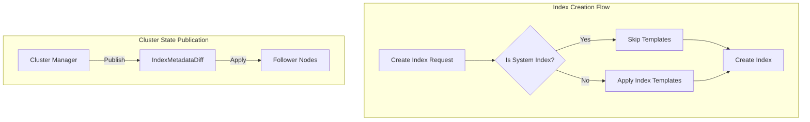

---
tags:
  - opensearch
---
# System Indices

## Summary

System indices are special indices used internally by OpenSearch and its plugins to store configuration, state, and operational data. They are protected from direct user access and have special handling to ensure cluster stability and security.

## Details

### Architecture

### Components

| Component | Description |
|-----------|-------------|
| `SystemIndices` | Registry of system index descriptors, provides `isSystemIndex()` check |
| `SystemIndexPlugin` | Plugin interface for declaring system indices via `getSystemIndexDescriptors()` |
| `IndexMetadata.isSystem` | Flag indicating whether an index is a system index |
| `MetadataCreateIndexService` | Handles index creation, includes system index template bypass |

### Configuration

System indices are typically configured through the Security plugin:

| Setting | Description | Default |
|---------|-------------|---------|
| `plugins.security.system_indices.enabled` | Enable system index protection | `true` |
| `plugins.security.system_indices.indices` | List of protected system index patterns | Plugin-specific |

### Common System Indices

| Index Pattern | Plugin | Purpose |
|---------------|--------|---------|
| `.opendistro_security` | Security | Security configuration |
| `.opensearch-observability` | Observability | Observability objects |
| `.plugins-ml-*` | ML Commons | ML model data |
| `.opensearch-notifications-*` | Notifications | Notification channels |

### Behavior

1. **Template Exclusion**: System indices bypass all index template matching during creation
2. **Access Protection**: Direct access to system indices generates deprecation warnings (will be blocked in future versions)
3. **Cluster State Consistency**: The `isSystem` flag is properly propagated during cluster state publication

## Limitations

- System index protection requires the Security plugin to be installed and configured
- Plugins must explicitly register their indices as system indices via `SystemIndexPlugin.getSystemIndexDescriptors()`
- During rolling upgrades, temporary inconsistencies may occur if plugins retroactively declare indices as system indices

## Change History

- **v2.19.0** (2024-12-17): Fixed index template application to system indices; Fixed `isSystem` flag consistency during cluster state publication

## References

### Documentation

- [System indexes](https://docs.opensearch.org/latest/security/configuration/system-indices/)

### Pull Requests

| Version | PR | Description |
|---------|-----|-------------|
| v2.19.0 | [#16418](https://github.com/opensearch-project/OpenSearch/pull/16418) | Ensure index templates are not applied to system indices |
| v2.19.0 | [#16644](https://github.com/opensearch-project/OpenSearch/pull/16644) | Ensure consistency of system flag on IndexMetadata after diff is applied |
