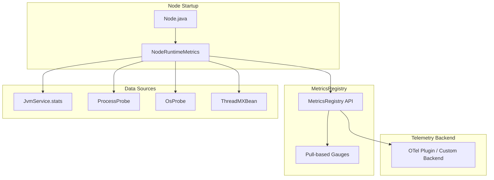

---
tags:
  - opensearch
---
# Telemetry & Observability Metrics

## Summary

OpenSearch's telemetry framework provides a framework-agnostic `MetricsRegistry` API for emitting metrics (counters, histograms, gauges) that are automatically exported through whatever telemetry backend the cluster is configured with. The framework includes an immutable `Tags` class for zero-allocation metric tagging and built-in JVM/CPU runtime gauges following OpenTelemetry semantic conventions.

## Details

### Architecture

### Components

| Component | Description |
|-----------|-------------|
| `Tags` | Immutable sorted-array tag container with precomputed hash for zero-allocation metric hot paths |
| `NodeRuntimeMetrics` | Registers ~30 pull-based gauges for JVM memory, GC, buffer pools, threads, classes, CPU, and uptime |
| `MetricsRegistry` | Framework-agnostic API for registering counters, histograms, and gauges |

### Tags API

| Method | Description |
|--------|-------------|
| `Tags.of(key, value)` | 1-tag factory (String, long, double, boolean overloads) |
| `Tags.ofStringPairs(String...)` | N-pair varargs factory with sort and dedup |
| `Tags.concat(a, b)` | Merge-sort two Tags; `b` wins on key collision |
| `Tags.fromMap(Map)` | Bridge from map-based callers |
| `Tags.EMPTY` | Singleton empty tags |
| `size()`, `getKey(i)`, `getValue(i)` | Direct indexed access |
| `equals()`, `hashCode()` | Content-based, safe as map keys |

### Runtime Metrics

| Category | Metrics | Tags |
|----------|---------|------|
| Memory | `jvm.memory.used`, `jvm.memory.committed`, `jvm.memory.limit`, `jvm.memory.used_after_last_gc` | `type`, `pool` |
| GC | `jvm.gc.duration`, `jvm.gc.count` | `gc` |
| Buffer pools | `jvm.buffer.memory.used`, `jvm.buffer.memory.limit`, `jvm.buffer.count` | `pool` |
| Threads | `jvm.thread.count` | `state` (optional) |
| Classes | `jvm.class.count`, `jvm.class.loaded`, `jvm.class.unloaded` | — |
| CPU | `jvm.cpu.recent_utilization`, `jvm.system.cpu.utilization` | — |
| Uptime | `jvm.uptime` | — |

### Configuration

No additional configuration is required. Runtime metrics are automatically registered when a telemetry backend plugin is present. Metric names follow OpenTelemetry JVM semantic conventions.

## Limitations

- JVM runtime metrics are pull-based gauges only; no event-driven GC pause duration histograms
- Requires a telemetry backend plugin (e.g., OTel plugin) for metric export
- CPU utilization values are clamped to [0.0, 1.0]; negative OS probe values report as 0.0
- Deprecated `Tags.create()` / `addTag()` chains allocate more than equivalent `Tags.of()` calls

## Change History

- **v3.6.0** (2026-03): Added `NodeRuntimeMetrics` with ~30 JVM/CPU gauges following OTel semantic conventions. Redesigned `Tags` to immutable sorted-array implementation with precomputed hash. Fixed `AutoForceMergeMetrics` tag-dropping bug.

## References

### Pull Requests
| Version | PR | Description |
|---------|-----|-------------|
| v3.6.0 | `https://github.com/opensearch-project/OpenSearch/pull/20844` | Add node-level JVM and CPU runtime metrics |
| v3.6.0 | `https://github.com/opensearch-project/OpenSearch/pull/20788` | Make Telemetry Tags Immutable |

### External References
- OpenTelemetry JVM semantic conventions: https://opentelemetry.io/docs/specs/semconv/runtime/jvm-metrics/
