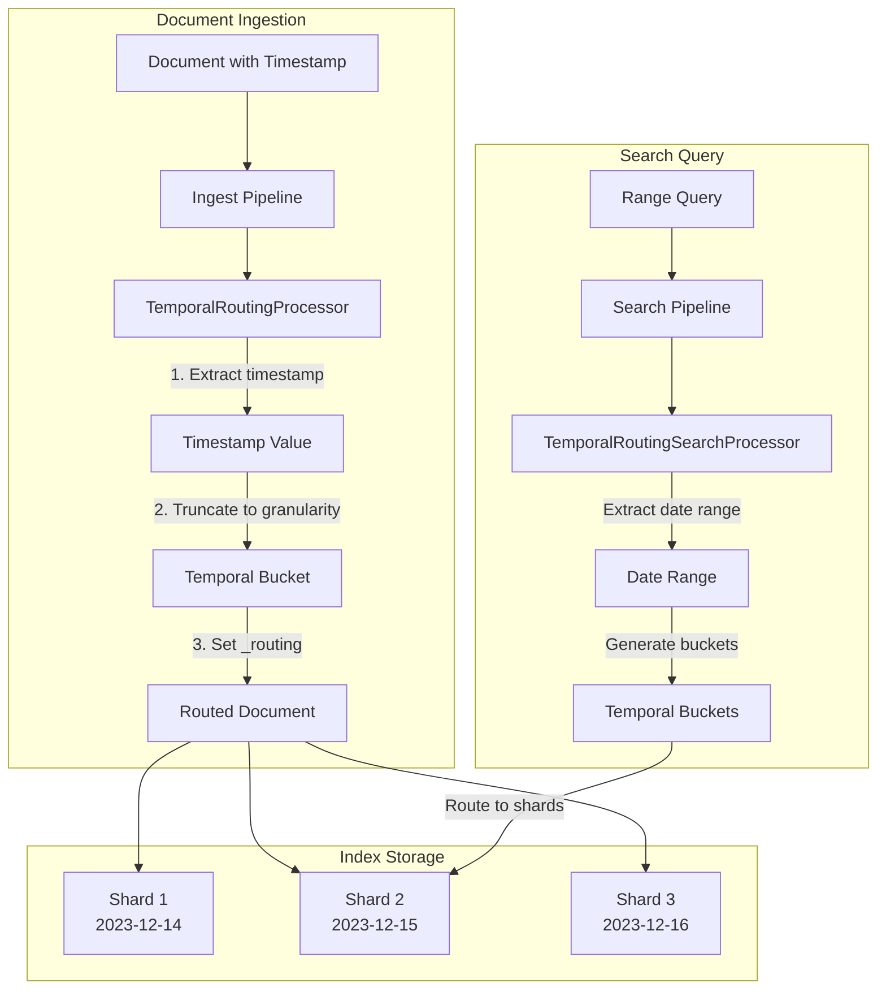
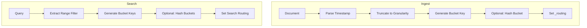

---
tags:
  - indexing
  - observability
  - performance
  - search
---

# Temporal Routing

## Summary

Temporal routing is a feature that enables intelligent document co-location based on time-based patterns. By routing documents to shards based on timestamp fields, it provides shard-level temporal locality for log, metrics, and time-series workloads. This improves query performance by allowing searches to target only relevant shards and increases cache hit rates.

## Details

### Architecture



### Data Flow



### Components

| Component | Module | Description |
|-----------|--------|-------------|
| `TemporalRoutingProcessor` | ingest-common | Ingest processor that extracts timestamp, truncates to granularity, and sets `_routing` |
| `TemporalRoutingSearchProcessor` | search-pipeline-common | Search processor that extracts temporal ranges from queries and sets search routing |
| `Granularity` | Both modules | Enum supporting `HOUR`, `DAY`, `WEEK`, `MONTH` temporal buckets |

### Configuration

**Ingest Processor (`temporal_routing`):**

| Setting | Type | Required | Description | Default |
|---------|------|----------|-------------|---------|
| `timestamp_field` | string | Yes | Field containing the date/time value | - |
| `granularity` | string | Yes | Bucket size: `hour`, `day`, `week`, `month` | - |
| `format` | string | No | Date format pattern | `strict_date_optional_time` |
| `ignore_missing` | boolean | No | Skip processing if timestamp field is missing | `false` |
| `override_existing` | boolean | No | Overwrite existing `_routing` value | `true` |
| `hash_bucket` | boolean | No | Hash bucket string for better shard distribution | `false` |

**Search Processor (`temporal_routing_search`):**

| Setting | Type | Required | Description | Default |
|---------|------|----------|-------------|---------|
| `timestamp_field` | string | Yes | Field to match in range queries | - |
| `granularity` | string | Yes | Bucket size: `hour`, `day`, `week`, `month` | - |
| `format` | string | No | Date format pattern | `strict_date_optional_time` |
| `enable_auto_detection` | boolean | No | Auto-detect temporal ranges from queries | `true` |
| `hash_bucket` | boolean | No | Hash bucket string (must match ingest setting) | `false` |

### Temporal Bucket Formats

| Granularity | Format | Example |
|-------------|--------|---------|
| `hour` | `yyyy-MM-ddTHH` | `2023-12-15T14` |
| `day` | `yyyy-MM-dd` | `2023-12-15` |
| `week` | `yyyy-Www` (ISO week) | `2023-W50` |
| `month` | `yyyy-MM` | `2023-12` |

### Usage Example

**1. Create ingest pipeline:**

```json
PUT _ingest/pipeline/temporal-routing
{
  "description": "Route documents by timestamp",
  "processors": [
    {
      "temporal_routing": {
        "timestamp_field": "@timestamp",
        "granularity": "day"
      }
    }
  ]
}
```

**2. Create search pipeline:**

```json
PUT _search/pipeline/temporal-routing-search
{
  "description": "Route searches by timestamp range",
  "request_processors": [
    {
      "temporal_routing_search": {
        "timestamp_field": "@timestamp",
        "granularity": "day"
      }
    }
  ]
}
```

**3. Create index with default pipeline:**

```json
PUT logs
{
  "settings": {
    "index.default_pipeline": "temporal-routing"
  },
  "mappings": {
    "properties": {
      "@timestamp": { "type": "date" },
      "message": { "type": "text" }
    }
  }
}
```

**4. Index documents:**

```json
POST logs/_doc
{
  "@timestamp": "2023-12-15T14:30:45.123Z",
  "message": "Application started"
}
```

**5. Search with automatic routing:**

```json
GET logs/_search?search_pipeline=temporal-routing-search
{
  "query": {
    "bool": {
      "filter": [
        {
          "range": {
            "@timestamp": {
              "gte": "2023-12-15T00:00:00Z",
              "lte": "2023-12-17T23:59:59Z"
            }
          }
        }
      ],
      "must": [
        { "match": { "message": "started" } }
      ]
    }
  }
}
```

### Use Cases

1. **Log Analytics**: Route logs by day/hour for efficient time-range queries
2. **Metrics Storage**: Co-locate metrics from the same time period
3. **Audit Records**: Organize compliance data by month for retention policies
4. **Time-Series Data**: Optimize IoT sensor data queries

## Limitations

- Range queries spanning many temporal buckets generate multiple routing values (hard limit: 100 buckets)
- Only `MUST` and `FILTER` boolean clauses are considered for routing extraction
- `SHOULD` and `MUST_NOT` clauses are ignored as they don't guarantee document presence
- The `hash_bucket` setting must be consistent between ingest and search processors
- Does not replace Index Lifecycle Management (ILM) - this is for shard-level locality within a single index

## Change History

- **v3.3.0** (2025-08-11): Initial implementation with `TemporalRoutingProcessor` and `TemporalRoutingSearchProcessor`

## Related Features
- [OpenSearch Dashboards](../opensearch-dashboards/opensearch-dashboards-ai-chat.md)

## References

### Documentation
- [Routing documentation](https://docs.opensearch.org/3.3/mappings/metadata-fields/routing/): OpenSearch routing concepts
- [Ingest processors](https://docs.opensearch.org/3.3/ingest-pipelines/processors/index-processors/): Ingest pipeline processors
- [Search pipelines](https://docs.opensearch.org/3.3/search-plugins/search-pipelines/): Search pipeline documentation

### Pull Requests
| Version | PR | Description | Related Issue |
|---------|-----|-------------|---------------|
| v3.3.0 | [#18966](https://github.com/opensearch-project/OpenSearch/pull/18966) | Add temporal routing processors for time-based document routing |   |

### Issues (Design / RFC)
- [Issue #18920](https://github.com/opensearch-project/OpenSearch/issues/18920): RFC for Temporal Routing Processors
