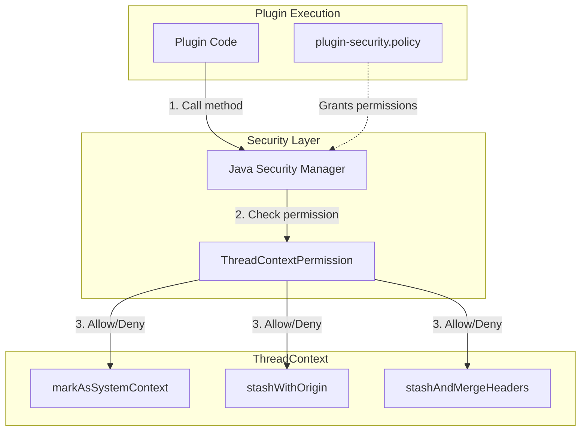
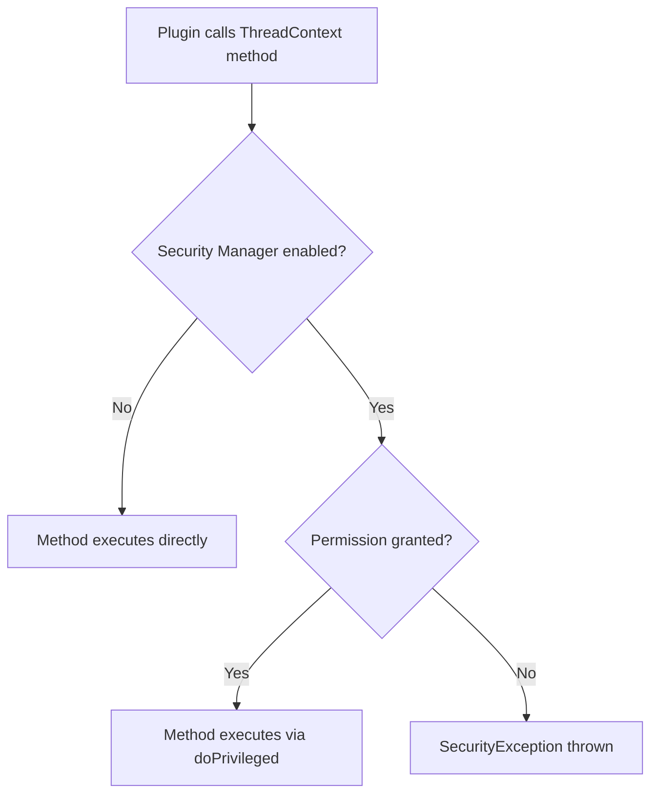

---
tags:
  - domain/core
  - component/server
  - security
---
# Thread Context Permissions

## Summary

Thread Context Permissions is a security enhancement that protects sensitive methods in OpenSearch's `ThreadContext` class using Java Security Manager permissions. This feature ensures that plugins must explicitly declare their need to perform privileged operations like marking a thread as a system context or manipulating thread context origins.

The `ThreadContext` class manages request-scoped state (headers, transient values) that flows through OpenSearch operations. Certain methods in this class can bypass security checks or affect authorization decisions, making them sensitive from a security perspective.

## Details

### Architecture



### Data Flow



### Components

| Component | Package | Description |
|-----------|---------|-------------|
| `ThreadContextPermission` | `org.opensearch.secure_sm` | A `BasicPermission` subclass that defines permissions for ThreadContext operations |
| `ThreadContextAccess` | `org.opensearch.common.util.concurrent` | Internal utility class providing privileged access wrappers for core code |
| `ThreadContext` | `org.opensearch.common.util.concurrent` | Core class managing thread-local request context with permission checks |

### Protected Methods

| Method | Purpose | Risk if Unprotected |
|--------|---------|---------------------|
| `markAsSystemContext()` | Marks current thread as system context, bypassing user authentication | Plugins could impersonate system operations |
| `stashWithOrigin(String)` | Stashes context and sets action origin | Plugins could spoof action origins affecting authorization |
| `stashAndMergeHeaders(Map)` | Stashes context and merges headers | Plugins could inject arbitrary headers |

### Configuration

Plugins requiring these permissions must add entries to their `plugin-security.policy` file:

| Permission | Declaration |
|------------|-------------|
| markAsSystemContext | `permission org.opensearch.secure_sm.ThreadContextPermission "markAsSystemContext";` |
| stashWithOrigin | `permission org.opensearch.secure_sm.ThreadContextPermission "stashWithOrigin";` |
| stashAndMergeHeaders | `permission org.opensearch.secure_sm.ThreadContextPermission "stashAndMergeHeaders";` |

### Usage Example

```java
// plugin-security.policy
grant {
    permission org.opensearch.secure_sm.ThreadContextPermission "markAsSystemContext";
};

// Plugin code
import java.security.AccessController;
import java.security.PrivilegedAction;

public class MyPlugin extends Plugin {
    
    public void executeAsSystem(ThreadContext threadContext) {
        try (ThreadContext.StoredContext ignore = threadContext.stashContext()) {
            // Must use doPrivileged when calling protected methods
            AccessController.doPrivileged((PrivilegedAction<Void>) () -> {
                threadContext.markAsSystemContext();
                return null;
            });
            
            // Now executing in system context
            performSystemOperation();
        }
    }
}
```

## Limitations

- Requires Java Security Manager to be enabled (default in OpenSearch)
- Plugins must be recompiled and updated to include security policy declarations
- Does not provide fine-grained control over which origins or headers can be set
- Permission is binary (granted or not)—no partial access

## Change History

- **v3.0.0** (2024-07-31): Initial implementation - Added ThreadContextPermission for markAsSystemContext, stashWithOrigin, and stashAndMergeHeaders methods

## Related Features
- [OpenSearch Dashboards](../opensearch-dashboards/opensearch-dashboards-ai-chat.md)

## References

### Documentation
- [OpenSearch Security Permissions](https://docs.opensearch.org/3.0/security/access-control/permissions/): Security plugin permissions documentation
- [Installing Plugins](https://docs.opensearch.org/3.0/install-and-configure/plugins/): Plugin security policy documentation

### Pull Requests
| Version | PR | Description | Related Issue |
|---------|-----|-------------|---------------|
| v3.0.0 | [#15016](https://github.com/opensearch-project/OpenSearch/pull/15016) | Add ThreadContextPermission for markAsSystemContext | [#14931](https://github.com/opensearch-project/OpenSearch/issues/14931) |
| v3.0.0 | [#15039](https://github.com/opensearch-project/OpenSearch/pull/15039) | Add ThreadContextPermission for stashAndMergeHeaders and stashWithOrigin | [#14931](https://github.com/opensearch-project/OpenSearch/issues/14931) |

### Issues (Design / RFC)
- [Issue #14931](https://github.com/opensearch-project/OpenSearch/issues/14931): Original feature request for higher-level plugin context switching APIs
