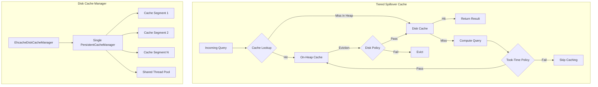
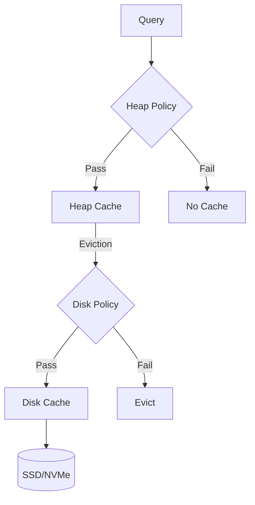

---
tags:
  - domain/core
  - component/server
  - indexing
  - performance
  - search
---
# Tiered Caching

## Summary

Tiered caching is a multi-level caching mechanism in OpenSearch that combines an on-heap cache tier with a disk-based cache tier. This approach balances performance and capacity, allowing larger datasets to be cached without consuming valuable heap memory. When items are evicted from the faster on-heap tier, they spill over to the larger disk tier, reducing cache misses and improving query performance for repeated queries.

## Details

### Architecture



### Data Flow



### Components

| Component | Description |
|-----------|-------------|
| `TieredSpilloverCache` | Main cache implementation that coordinates between heap and disk tiers |
| `TieredSpilloverCacheSegment` | Individual cache segment with its own read/write lock for concurrency |
| `EhcacheDiskCacheManager` | Singleton manager that creates and manages disk caches via a single `PersistentCacheManager` |
| `TookTimePolicy` | Policy that filters cache entries based on query execution time |
| `OpenSearchOnHeapCache` | Built-in on-heap cache implementation |
| `EhcacheDiskCache` | Disk cache implementation using Ehcache library |

### Configuration

| Setting | Description | Default |
|---------|-------------|---------|
| `indices.requests.cache.store.name` | Cache store implementation | `opensearch_onheap` |
| `indices.requests.cache.tiered_spillover.onheap.store.name` | On-heap tier implementation | `opensearch_onheap` |
| `indices.requests.cache.tiered_spillover.disk.store.name` | Disk tier implementation | `ehcache_disk` |
| `indices.requests.cache.tiered_spillover.onheap.store.size` | On-heap cache size | 1% of heap |
| `indices.requests.cache.tiered_spillover.disk.store.size` | Disk cache size | 1 GB |
| `indices.requests.cache.tiered_spillover.segments` | Number of cache segments | `2^(ceil(log2(CPU_CORES * 1.5)))` |
| `indices.requests.cache.tiered_spillover.policies.took_time.threshold` | Min query time to enter cache | `0ms` |
| `indices.requests.cache.tiered_spillover.disk.store.policies.took_time.threshold` | Min query time to enter disk tier | `10ms` |
| `indices.requests.cache.tiered_spillover.disk.store.enabled` | Enable/disable disk tier dynamically | `true` |
| `indices.requests.cache.ehcache_disk.max_size_in_bytes` | Disk cache size in bytes | 1 GB |
| `indices.requests.cache.ehcache_disk.segments` | Disk cache segments | 16 |
| `indices.requests.cache.ehcache_disk.min_threads` | Min disk write threads | 2 |
| `indices.requests.cache.ehcache_disk.max_threads` | Max disk write threads | 1.5 × CPU cores |

### Usage Example

```yaml
# opensearch.yml - Enable tiered caching
indices.requests.cache.store.name: tiered_spillover
indices.requests.cache.tiered_spillover.onheap.store.name: opensearch_onheap
indices.requests.cache.tiered_spillover.disk.store.name: ehcache_disk

# Configure cache sizes
indices.requests.cache.tiered_spillover.onheap.store.size: 2%
indices.requests.cache.tiered_spillover.disk.store.size: 5gb

# Configure took-time policies
indices.requests.cache.tiered_spillover.policies.took_time.threshold: 0ms
indices.requests.cache.tiered_spillover.disk.store.policies.took_time.threshold: 10ms
```

Check cache statistics:
```bash
GET /_nodes/stats/caches/request_cache?level=tier
```

## Limitations

- Currently only supported for the request cache (not query cache)
- Experimental feature - not recommended for production use
- Requires `cache-ehcache` plugin installation for disk tier
- Disk cache data is not persisted between process restarts
- Minimum disk cache size is 10 MB

## Change History

- **v3.3.0** (2025-11-18): Fixed query execution exception handling; ensures proper cleanup of concurrent request tracking map when exceptions occur
- **v3.0.0** (2025-05-06): Single cache manager for disk caches reduces CPU overhead; took-time policy extended to guard heap tier
- **v2.19.0** (2025-02-11): Disk cache partitioning with read/write locks for improved concurrency
- **v2.18.0** (2024-11-05): Segmented cache architecture with configurable segments; query recomputation moved outside write lock; new settings for segment count and per-tier sizes
- **v2.14.0** (2024-05-14): Initial experimental tiered caching support for request cache
- **v2.13.0** (2024-04-02): cache-ehcache plugin introduced for disk cache implementation

## Related Features
- [OpenSearch Dashboards](../opensearch-dashboards/opensearch-dashboards-ai-chat.md)

## References

### Documentation
- [Tiered Cache Documentation](https://docs.opensearch.org/3.0/search-plugins/caching/tiered-cache/)
- [Request Cache Documentation](https://docs.opensearch.org/3.0/search-plugins/caching/request-cache/)

### Blog Posts
- [Tiered Caching Blog](https://opensearch.org/blog/tiered-cache/)

### Pull Requests
| Version | PR | Description | Related Issue |
|---------|-----|-------------|---------------|
| v3.3.0 | [#19000](https://github.com/opensearch-project/OpenSearch/pull/19000) | Handle query execution exception |   |
| v3.0.0 | [#17513](https://github.com/opensearch-project/OpenSearch/pull/17513) | Single cache manager for all ehcache disk caches |   |
| v3.0.0 | [#17190](https://github.com/opensearch-project/OpenSearch/pull/17190) | Took-time threshold guards heap tier as well as disk tier | [#16162](https://github.com/opensearch-project/OpenSearch/issues/16162) |
| v2.19.0 | - | Disk cache partitioning for improved concurrency |   |
| v2.18.0 | [#16047](https://github.com/opensearch-project/OpenSearch/pull/16047) | Segmented cache changes for improved concurrency | [#13989](https://github.com/opensearch-project/OpenSearch/issues/13989) |
| v2.14.0 | - | Initial tiered caching support (experimental) |   |
| v2.13.0 | - | cache-ehcache plugin introduced |   |

### Issues (Design / RFC)
- [Issue #16162](https://github.com/opensearch-project/OpenSearch/issues/16162): RFC - Optimize caching policy for Request cache
- [Issue #13989](https://github.com/opensearch-project/OpenSearch/issues/13989): Performance improvement for TieredCaching
- [Issue #10024](https://github.com/opensearch-project/OpenSearch/issues/10024): Tiered caching tracking issue
