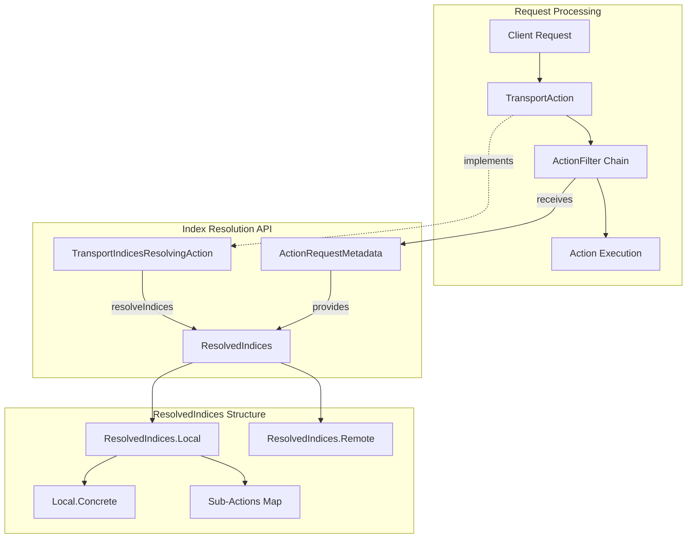
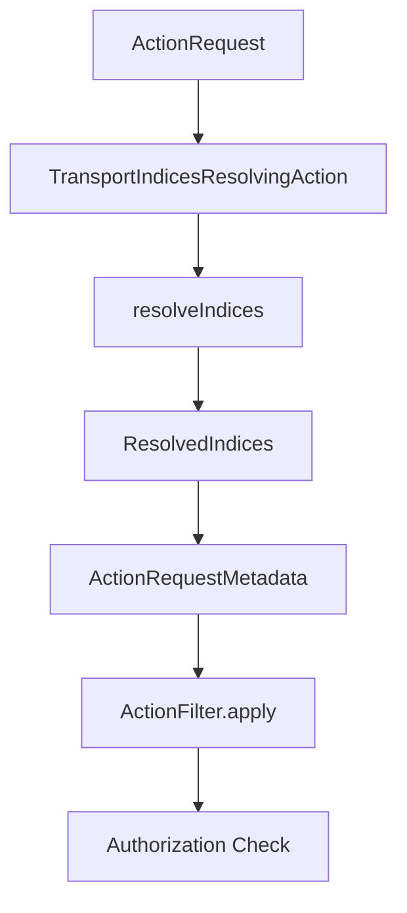

---
tags:
  - domain/core
  - component/server
  - indexing
  - performance
  - security
---
# Transport Actions API

## Summary

The Transport Actions API provides a standardized mechanism for transport actions to communicate precise information about the indices they will operate on. This internal API enables components like `ActionFilter` implementations (particularly the security plugin) to retrieve accurate index metadata without maintaining hard-coded knowledge of how each action interprets index expressions.

The API addresses performance and maintainability issues in index-based access control by allowing transport actions to explicitly report their resolved indices, eliminating the need for external components to guess or duplicate index resolution logic.

## Details

### Architecture



### Data Flow



### Components

| Component | Description |
|-----------|-------------|
| `TransportIndicesResolvingAction<Request>` | Interface for transport actions to implement explicit index resolution |
| `ActionRequestMetadata<Request, Response>` | Container passed to `ActionFilter.apply()` providing access to resolved indices |
| `OptionallyResolvedIndices` | Base class representing potentially unknown resolved indices |
| `ResolvedIndices` | Immutable class containing resolved local and remote indices |
| `ResolvedIndices.Local` | Local indices, aliases, and data streams with names |
| `ResolvedIndices.Local.Concrete` | Concrete indices with `Index` objects from `IndexNameExpressionResolver` |
| `ResolvedIndices.Remote` | Remote cluster indices as cluster-to-indices map |

### Configuration

This is an internal API with no user-configurable settings. Transport actions opt-in by implementing the `TransportIndicesResolvingAction` interface.

### Usage Example

#### Implementing in a Transport Action

```java
public class TransportMyAction extends HandledTransportAction<MyRequest, MyResponse>
    implements TransportIndicesResolvingAction<MyRequest> {
    
    private final IndexNameExpressionResolver indexNameExpressionResolver;
    private final ClusterService clusterService;
    
    @Override
    public ResolvedIndices resolveIndices(MyRequest request) {
        // Use the same resolution logic as the action execution
        return ResolvedIndices.of(
            indexNameExpressionResolver.concreteResolvedIndices(
                clusterService.state(), 
                request
            )
        );
    }
    
    @Override
    protected void doExecute(Task task, MyRequest request, ActionListener<MyResponse> listener) {
        // Action execution uses same resolution
        Index[] indices = indexNameExpressionResolver.concreteIndices(
            clusterService.state(), 
            request
        );
        // ...
    }
}
```

#### Consuming in an ActionFilter

```java
public class MyActionFilter implements ActionFilter {
    
    @Override
    public <Request extends ActionRequest, Response extends ActionResponse> void apply(
        Task task, 
        String action, 
        Request request,
        ActionRequestMetadata<Request, Response> actionRequestMetadata,
        ActionListener<Response> listener,
        ActionFilterChain<Request, Response> chain
    ) {
        OptionallyResolvedIndices resolved = actionRequestMetadata.resolvedIndices();
        
        if (resolved instanceof ResolvedIndices resolvedIndices) {
            // Precise index information available
            Set<String> localIndices = resolvedIndices.local().names();
            Map<String, OriginalIndices> remoteIndices = resolvedIndices.remote().asClusterToOriginalIndicesMap();
            
            // Check sub-actions for composite requests
            Map<String, ResolvedIndices.Local> subActions = resolvedIndices.local().subActions();
            
            // Perform authorization
            if (!authorize(localIndices)) {
                listener.onFailure(new SecurityException("Access denied"));
                return;
            }
        } else {
            // Unknown indices - apply conservative authorization
            // Assume all indices are potentially accessed
        }
        
        chain.proceed(task, action, request, actionRequestMetadata, listener);
    }
}
```

#### Working with Composite Requests

```java
// For actions like reindex that touch multiple indices with different roles
@Override
public ResolvedIndices resolveIndices(ReindexRequest request) {
    return transportSearchAction.resolveIndices(request.getSearchRequest())
        .withLocalSubActions(
            IndexAction.INSTANCE,
            ResolvedIndices.Local.of(
                indexNameExpressionResolver.resolveDateMathExpression(
                    request.getDestination().index()
                )
            )
        );
}
```

## Limitations

- Marked as `@ExperimentalApi` - API may change in future versions
- Not all transport actions implement the interface; `OptionallyResolvedIndices.unknown()` returned for non-implementing actions
- Primarily designed for security plugin use case
- Resolution is performed on each `ActionFilter.apply()` call (not cached) to handle request modifications

## Change History

- **v3.4.0** (2025-10-23): Initial implementation introducing `TransportIndicesResolvingAction`, `ActionRequestMetadata`, `ResolvedIndices`, and `OptionallyResolvedIndices` classes

## Related Features
- [OpenSearch Dashboards](../opensearch-dashboards/opensearch-dashboards-ai-chat.md)

## References

### Documentation
- [PR #5399](https://github.com/opensearch-project/security/pull/5399): Security plugin implementation using this API
- [TransportIndicesResolvingAction.java](https://github.com/opensearch-project/OpenSearch/blob/main/server/src/main/java/org/opensearch/action/support/TransportIndicesResolvingAction.java): Interface source
- [ResolvedIndices.java](https://github.com/opensearch-project/OpenSearch/blob/main/server/src/main/java/org/opensearch/cluster/metadata/ResolvedIndices.java): Main data class source

### Pull Requests
| Version | PR | Description | Related Issue |
|---------|-----|-------------|---------------|
| v3.4.0 | [#18523](https://github.com/opensearch-project/OpenSearch/pull/18523) | Initial implementation of explicit index resolution API | [#5367](https://github.com/opensearch-project/OpenSearch/issues/5367) |

### Issues (Design / RFC)
- [Issue #5367](https://github.com/opensearch-project/security/issues/5367): Index pattern resolution improvements (motivation)
