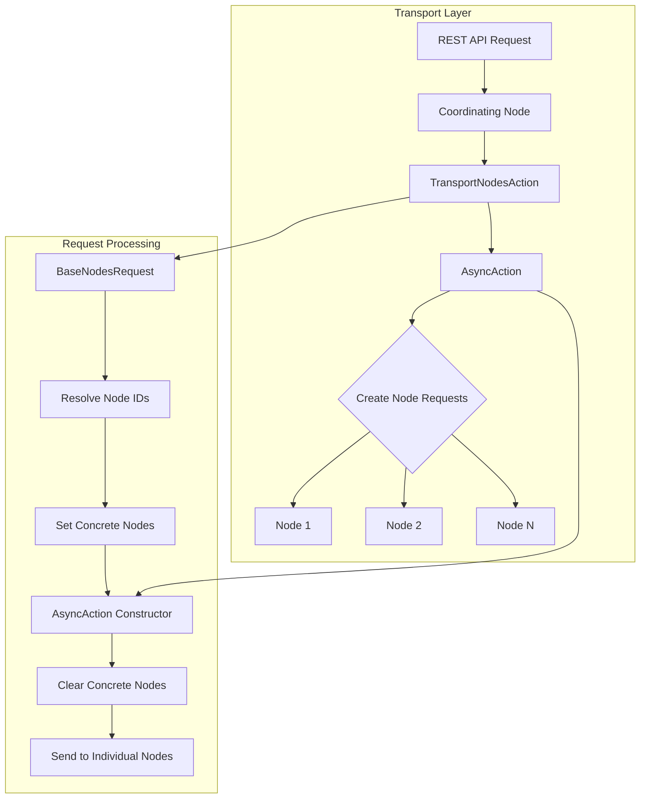
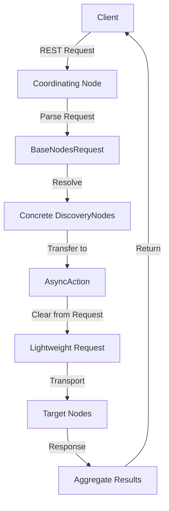

---
tags:
  - opensearch
---
# Transport Nodes Action Optimization

## Summary

The Transport Nodes Action Optimization feature improves the performance of inter-node communication in OpenSearch clusters by eliminating redundant discovery node information from transport requests. This optimization significantly reduces network traffic, serialization overhead, and memory usage, particularly beneficial for large clusters with hundreds or thousands of nodes.

## Details

### Architecture



### Data Flow



### Components

| Component | Description |
|-----------|-------------|
| `BaseNodesRequest` | Base class for all node-targeted requests; no longer carries discovery nodes during transport |
| `TransportNodesAction` | Abstract transport action that handles node-level operations |
| `AsyncAction` | Inner class that manages asynchronous execution and owns the concrete nodes reference |
| `NodesStatsRequest` | Request for node statistics (optimized) |
| `NodesInfoRequest` | Request for node information (optimized) |
| `ClusterStatsRequest` | Request for cluster statistics (optimized) |

### Configuration

This optimization is built into the core transport layer and requires no configuration. It is automatically applied to all actions extending `TransportNodesAction`.

### Usage Example

No changes required for end users. The optimization is transparent:

```bash
# These APIs automatically benefit from the optimization
GET /_nodes/stats
GET /_nodes
GET /_cat/nodes
GET /_cluster/stats
```

For plugin developers extending `BaseNodesRequest`:

```java
// Simple constructor - discovery nodes handled automatically
public class MyNodesRequest extends BaseNodesRequest<MyNodesRequest> {
    public MyNodesRequest(String... nodesIds) {
        super(nodesIds);
    }
    
    public MyNodesRequest(DiscoveryNode... concreteNodes) {
        super(concreteNodes);
    }
}
```

## Limitations

- Actions requiring discovery node information during transport must implement custom handling
- Breaking change for plugins using the removed `includeDiscoveryNodes` parameter
- The `concreteNodes` field is null when accessed within transport action handlers

## Change History

- **v3.0.0** (2025-05-13): Breaking change - removed `includeDiscoveryNodes` field, made optimization mandatory for all TransportNodesAction requests
- **v2.16.0** (2024-07-22): Initial optimization with opt-in flag for NodeStats, ClusterStats, NodeInfo actions


## References

### Documentation
- [Nodes APIs Documentation](https://docs.opensearch.org/3.0/api-reference/nodes-apis/index/): Official API documentation
- [Configuration and System Settings](https://docs.opensearch.org/3.0/install-and-configure/configuring-opensearch/configuration-system/): Node roles configuration

### Pull Requests
| Version | PR | Description | Related Issue |
|---------|-----|-------------|---------------|
| v3.0.0 | [#17682](https://github.com/opensearch-project/OpenSearch/pull/17682) | Unset discovery nodes for every transport node actions request (breaking change) | [#17008](https://github.com/opensearch-project/OpenSearch/issues/17008) |
| v2.16.0 | [#15131](https://github.com/opensearch-project/OpenSearch/pull/15131) | Reset discovery nodes in all transport node actions request | [#14713](https://github.com/opensearch-project/OpenSearch/issues/14713) |
| v2.16.0 | [#14749](https://github.com/opensearch-project/OpenSearch/pull/14749) | Initial optimization for NodeStats, ClusterStats, NodeInfo | [#14713](https://github.com/opensearch-project/OpenSearch/issues/14713) |

### Issues (Design / RFC)
- [Issue #17008](https://github.com/opensearch-project/OpenSearch/issues/17008): Feature request for v3.0.0 breaking change
- [Issue #14713](https://github.com/opensearch-project/OpenSearch/issues/14713): Original performance issue report
