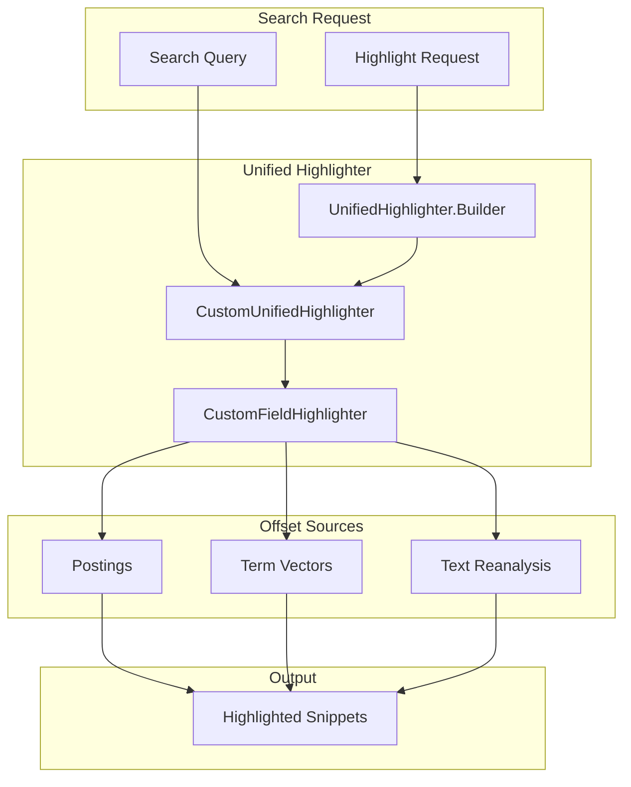

---
tags:
  - search
---

# Unified Highlighter

## Summary

The unified highlighter is the default highlighter in OpenSearch, based on the Lucene Unified Highlighter. It provides flexible text highlighting by dividing text into sentences and scoring them using the BM25 algorithm. The unified highlighter supports exact phrase and multi-term highlighting, including fuzzy, prefix, and regex queries. Starting from v3.1.0, it also supports the `matched_fields` option to combine matches from multiple fields into a single highlighted snippet.

## Details

### Architecture



### Offset Source Selection

The unified highlighter automatically selects the best offset source based on field configuration:

| Configuration | Offset Source |
|---------------|---------------|
| `term_vector: with_positions_offsets` | Term vectors |
| `index_options: offsets` | Postings |
| Default | Text reanalysis |

### Components

| Component | Description |
|-----------|-------------|
| `CustomUnifiedHighlighter` | OpenSearch's extension of Lucene's UnifiedHighlighter with custom break iterator and no-match handling |
| `CustomFieldHighlighter` | Handles per-field highlighting with locale-aware break iteration |
| `CustomPassageFormatter` | Formats highlighted passages with configurable pre/post tags |
| `UnifiedHighlighter.Builder` | Configures highlighter with field matcher and masked fields function |

### Configuration

| Setting | Description | Default |
|---------|-------------|---------|
| `type` | Highlighter type | `unified` |
| `fragment_size` | Size of highlighted fragment in characters | 100 |
| `number_of_fragments` | Maximum number of fragments to return | 5 |
| `pre_tags` | HTML tags before highlighted terms | `["<em>"]` |
| `post_tags` | HTML tags after highlighted terms | `["</em>"]` |
| `matched_fields` | Additional fields to blend matches from (v3.1.0+) | None |
| `require_field_match` | Only highlight fields that match the query | `true` |
| `boundary_scanner` | How to split fragments (`sentence`, `word`) | `sentence` |
| `boundary_scanner_locale` | Locale for boundary scanner | `Locale.ROOT` |
| `no_match_size` | Characters to return if no match found | 0 |

### Usage Example

Basic highlighting:

```json
GET my-index/_search
{
  "query": {
    "match": {
      "content": "OpenSearch highlighting"
    }
  },
  "highlight": {
    "type": "unified",
    "fields": {
      "content": {
        "fragment_size": 150,
        "number_of_fragments": 3
      }
    }
  }
}
```

Using `matched_fields` (v3.1.0+):

```json
GET my-index/_search
{
  "query": {
    "multi_match": {
      "query": "running",
      "fields": ["content", "content.english"]
    }
  },
  "highlight": {
    "type": "unified",
    "fields": {
      "content": {
        "matched_fields": ["content.english"]
      }
    }
  }
}
```

### Best Practices

1. **For large fields**: Use `index_options: offsets` to avoid reanalysis overhead
2. **For multi-field matching**: Use `matched_fields` to blend matches from different analyzers
3. **For sentence-level highlighting**: Set `fragment_size: 0` to return whole sentences
4. **For performance**: Consider using postings over term vectors to reduce index size

## Limitations

- Does not support span queries
- Text reanalysis can be slow for very large fields
- `matched_fields` requires all fields to have compatible content

## Change History

- **v3.1.0** (2025-05-19): Added `matched_fields` support using Lucene 10's `withMaskedFieldsFunc` API

## Related Features
- [OpenSearch Dashboards](../opensearch-dashboards/opensearch-dashboards-ai-chat.md)

## References

### Documentation
- [Highlight Query Matches](https://docs.opensearch.org/3.0/search-plugins/searching-data/highlight/): Official highlighting documentation
- [Documentation PR #9793](https://github.com/opensearch-project/documentation-website/pull/9793): Documentation for matched_fields support

### Pull Requests
| Version | PR | Description | Related Issue |
|---------|-----|-------------|---------------|
| v3.1.0 | [#18166](https://github.com/opensearch-project/OpenSearch/pull/18166) | Add support for matched_fields with the unified highlighter | [#18164](https://github.com/opensearch-project/OpenSearch/issues/18164) |

### Issues (Design / RFC)
- [Issue #18164](https://github.com/opensearch-project/OpenSearch/issues/18164): Feature request for matched_fields support
