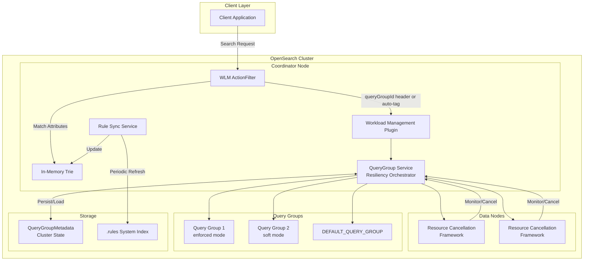
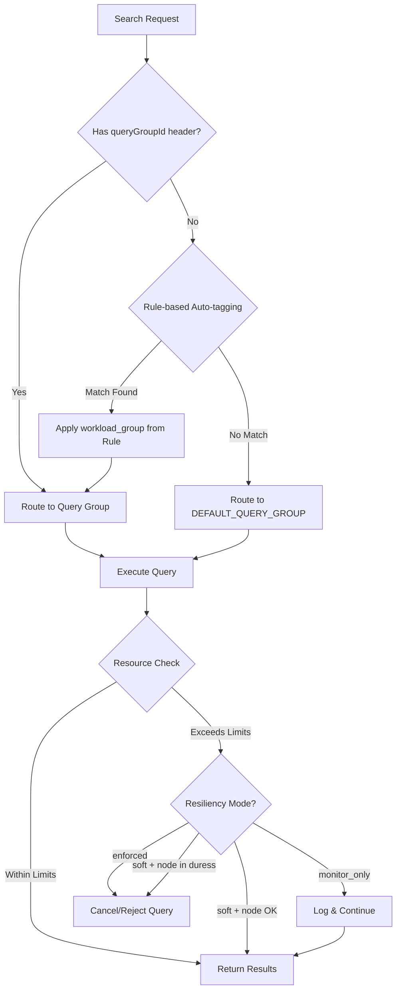

---
tags:
  - domain/core
  - component/server
  - indexing
  - search
---
# Workload Management

## Summary

Workload Management (WLM) is a feature that enables tenant-level admission control and reactive query management in OpenSearch. It allows system administrators to group search traffic into query groups with defined resource limits (CPU, memory), preventing resource overuse by specific requests and ensuring fair resource distribution across the cluster. When resource usage exceeds configured limits, WLM automatically identifies and cancels demanding queries.

## Details

### Architecture



### Data Flow



### Components

| Component | Description |
|-----------|-------------|
| `QueryGroupService` | Core orchestrator for query sandboxing and resource enforcement |
| `QueryGroupMetadata` | Persistable metadata stored in ClusterState for durability |
| `ResourceCancellationFramework` | Node-level framework for canceling queries exceeding limits |
| `WLM Stats API` | Provides per-node query group statistics and metrics |
| `WLM Paginated Stats API` | Scalable paginated endpoint for stats retrieval (v3.1.0+) |
| `WlmPaginationStrategy` | Pagination logic for WLM stats with sorting and token management (v3.1.0+) |
| `Query Group CRUD APIs` | REST APIs for managing query group lifecycle |
| `DEFAULT_QUERY_GROUP` | Built-in query group for requests without explicit group assignment |
| `WlmActionFilter` | Transport layer filter for automatic request tagging (v3.1.0+) |
| `RuleSyncService` | Periodically refreshes in-memory rules from system index (v3.1.0+) |
| `Rule CRUD APIs` | REST APIs for managing auto-tagging rules (v3.1.0+) |
| `FeatureValueResolver` | Central class for multi-attribute label resolution (v3.3.0+) |
| `FeatureValueCollector` | Extracts and merges values for single attributes (v3.3.0+) |
| `PrincipalAttribute` | Schema for security attributes (username, role) (v3.3.0+) |

### Configuration

| Setting | Description | Default |
|---------|-------------|---------|
| `wlm.query_group.mode` | Operating mode: `disabled`, `enabled`, `monitor_only` | `monitor_only` |
| `wlm.query_group.duress_streak` | Consecutive checks before node is marked "in duress" | - |
| `wlm.query_group.enforcement_interval` | Interval for resource monitoring checks | - |
| `wlm.query_group.node.memory_rejection_threshold` | Memory threshold triggering request rejection | - |
| `wlm.query_group.node.cpu_rejection_threshold` | CPU threshold triggering request rejection | - |
| `wlm.query_group.node.memory_cancellation_threshold` | Memory threshold for marking node in duress | - |
| `wlm.query_group.node.cpu_cancellation_threshold` | CPU threshold for marking node in duress | - |
| `wlm.autotagging.max_rules` | Maximum number of auto-tagging rules allowed (v3.2.0+) | 200 (range: 10-500) |

### Rule Schema (v3.3.0+)

Rules support multiple attributes for flexible matching:

```json
{
  "_id": "rule-uuid",
  "description": "Production analytics rule",
  "index_pattern": ["logs-prod-*"],
  "principal": {
    "username": ["admin", "analyst"],
    "role": ["all_access"]
  },
  "workload_group": "production_workload_id",
  "updated_at": "2025-09-25T16:28:50Z"
}
```

### Supported Attributes

| Attribute | Description | Matching |
|-----------|-------------|----------|
| `index_pattern` | Index name patterns | Prefix/wildcard |
| `principal.username` | Security username | Exact match |
| `principal.role` | Security role | Exact match |

### Label Resolution Priority

When multiple rules match, attributes are evaluated in priority order:
1. `principal.username` (highest priority)
2. `principal.role`
3. `index_pattern` (lowest priority)

### Operating Modes

| Mode | Behavior |
|------|----------|
| `disabled` | Workload management is completely disabled |
| `enabled` | Full enforcement - queries are canceled/rejected when limits exceeded |
| `monitor_only` | Resources monitored but no cancellation/rejection (default) |

### Resiliency Modes

| Mode | Behavior |
|------|----------|
| `enforced` | Strict enforcement - queries canceled when group limits exceeded |
| `soft` | Queries may be rejected only when node is in duress |

### Usage Example

**Install Plugin:**
```bash
./bin/opensearch-plugin install workload-management
```

**Create Query Group:**
```json
PUT _wlm/query_group
{
  "name": "analytics",
  "resiliency_mode": "enforced",
  "resource_limits": {
    "cpu": 0.4,
    "memory": 0.2
  }
}
```

**Response:**
```json
{
  "_id": "preXpc67RbKKeCyka72_Gw",
  "name": "analytics",
  "resiliency_mode": "enforced",
  "resource_limits": {
    "cpu": 0.4,
    "memory": 0.2
  },
  "updated_at": 1726270184642
}
```

**Execute Query with Query Group:**
```
GET testindex/_search
Host: localhost:9200
Content-Type: application/json
queryGroupId: preXpc67RbKKeCyka72_Gw

{
  "query": {
    "match": {
      "field_name": "value"
    }
  }
}
```

**Get Query Group Stats:**
```
GET _wlm/stats
```

**Get Paginated Stats (v3.1.0+):**
```
GET _list/wlm_stats?size=50&sort=node_id&order=asc&v=true
```

**Paginated Stats Response:**
```
NODE_ID | WORKLOAD_GROUP_ID | TOTAL_COMPLETIONS | TOTAL_REJECTIONS | TOTAL_CANCELLATIONS | CPU_USAGE | MEMORY_USAGE
node-1  | analytics         | 1000              | 5                | 2                   | 0.45      | 0.30
node-1  | DEFAULT_WORKLOAD_GROUP | 5000         | 0                | 0                   | 0.10      | 0.05
next_token: <encrypted_token>
```

**Fetch Next Page:**
```
GET _list/wlm_stats?size=50&sort=node_id&order=asc&next_token=<encrypted_token>
```

**Stats Response:**
```json
{
  "_nodes": {
    "total": 1,
    "successful": 1,
    "failed": 0
  },
  "cluster_name": "my-cluster",
  "node_id": {
    "query_groups": {
      "16YGxFlPRdqIO7K4EACJlw": {
        "total_completions": 33570,
        "total_rejections": 0,
        "total_cancellations": 0,
        "cpu": {
          "current_usage": 0.033,
          "cancellations": 0,
          "rejections": 0
        },
        "memory": {
          "current_usage": 0.002,
          "cancellations": 0,
          "rejections": 0
        }
      },
      "DEFAULT_QUERY_GROUP": {
        "total_completions": 42572,
        "total_rejections": 0,
        "total_cancellations": 0,
        "cpu": {
          "current_usage": 0,
          "cancellations": 0,
          "rejections": 0
        },
        "memory": {
          "current_usage": 0,
          "cancellations": 0,
          "rejections": 0
        }
      }
    }
  }
}
```

## Limitations

- Sum of resource limits for a single resource type (CPU or memory) across all query groups must not exceed 1.0
- Rejection threshold should always be lower than cancellation threshold
- Only administrator-level users can create and update query groups
- Requires installing the `workload-management` plugin
- Operates at node level for search workloads

## Change History

- **v3.4.0** (2026-01-11): Security plugin integration for WLM auto-tagging now available as a stable feature; Added `PrincipalAttribute`, `PrincipalExtractor`, `PrincipalAttributeExtractorExtension`, and `PrincipalAttributesExtension` components in Security plugin to extract username and roles from authenticated requests; Security plugin now depends on `workload-management-wlm-spi` (optional) and `autotagging-commons-spi` for SPI integration (PR #5606)
- **v3.3.0** (2026-01-11): **Dashboard Enhancements**: Added bi-directional navigation between WLM and Live Queries dashboards (PR #299); Added WLM Group column to Live Queries table with clickable links; Added Multi-Data Source (MDS) support for WLM dashboard (PR #352); Added feature flag for WLM (PR #348); Added version decoupling requiring data source >= v3.1 (PR #361); Added check to prevent workload group deletion when associated rules exist (PR #19502). **Backend**: Added security attributes support (`principal.username`, `principal.role`) for rule-based auto-tagging via Security plugin integration (PR #5606); Implemented multi-attribute label resolving logic with priority-based scoring via `FeatureValueResolver` and `MatchLabel`; Restructured in-memory trie to store values as sets for multiple labels per attribute key; Enhanced GET Rule API to support filtering by nested attributes; Added comprehensive integration tests for auto-tagging scenarios; Fixed Update Rule API handling for multiple attributes; Fixed principal attribute scoring to correctly assign 0.0 for unspecified attributes (PR #19599)
- **v3.2.0** (2026-01-10): Added WLM mode validation for workload group CRUD requests (Create/Update/Delete operations now fail when WLM mode is `disabled` or `monitor_only`); Added `WlmClusterSettingValuesProvider` component for centralized cluster settings management; Renamed `WorkloadGroupTestUtil` to `WorkloadManagementTestUtil`; Updated all "QueryGroup" references to "WorkloadGroup" in comments and Javadocs; Improved logging to dynamically show actual resiliency mode; Added configurable rule cardinality limit (`wlm.autotagging.max_rules`) with default of 200 rules (range: 10-500); Fixed delete rule event consumption for wildcard index based rules; Bug fixes including stricter attribute parameter extraction, centralized feature value validation, force refresh for immediate rule visibility, and graceful IndexNotFoundException handling
- **v3.1.0** (2026-01-10): Added rule-based auto-tagging with full CRUD API (`/_rules/workload_group`), WLM ActionFilter for automatic request tagging, refresh-based rule synchronization, and paginated `/_list/wlm_stats` API
- **v3.0.0** (2025-02-25): Renamed QueryGroup to WorkloadGroup throughout the codebase for clearer terminology (PR #17901); API endpoints changed from `_wlm/query_group` to `_wlm/workload_group`; Response field changed from `query_groups` to `workload_groups`; Added WLM support for search scroll API to fix warning logs when using scroll operations (PR #16981); Modified `TransportSearchScrollAction` to set `queryGroupId` from thread context; Added `isQueryGroupSet()` method to `QueryGroupTask`
- **v2.18.0** (2024-10-22): Initial implementation with QueryGroup CRUD APIs, Stats API, resource cancellation framework, resiliency orchestrator, persistence, and enhanced rejection logic


## References

### Documentation
- [Workload Management Documentation](https://docs.opensearch.org/3.0/tuning-your-cluster/availability-and-recovery/workload-management/wlm-feature-overview/)
- [Query Group Lifecycle API](https://docs.opensearch.org/3.0/tuning-your-cluster/availability-and-recovery/workload-management/workload-group-lifecycle-api/)
- [Rule-based Auto-tagging Documentation](https://docs.opensearch.org/3.1/tuning-your-cluster/availability-and-recovery/rule-based-autotagging/autotagging/)
- [Rule Lifecycle API](https://docs.opensearch.org/3.1/tuning-your-cluster/availability-and-recovery/rule-based-autotagging/rule-lifecycle-api/)

### Pull Requests
| Version | PR | Repository | Description | Related Issue |
|---------|-----|------------|-------------|---------------|
| v3.4.0 | [#5606](https://github.com/opensearch-project/security/pull/5606) | security | Security attribute feature for WLM dashboard |   |
| v3.3.0 | [#19502](https://github.com/opensearch-project/OpenSearch/pull/19502) | OpenSearch | Add check to stop workload group deletion with associated rules | [#19388](https://github.com/opensearch-project/OpenSearch/issues/19388) |
| v3.3.0 | [#299](https://github.com/opensearch-project/query-insights-dashboards/pull/299) | query-insights-dashboards | Bi-directional navigation between WLM and Live Queries |   |
| v3.3.0 | [#330](https://github.com/opensearch-project/query-insights-dashboards/pull/330) | query-insights-dashboards | Add navigation for Query Insights and WLM dashboards |   |
| v3.3.0 | [#336](https://github.com/opensearch-project/query-insights-dashboards/pull/336) | query-insights-dashboards | Enable WLM mode in pipeline |   |
| v3.3.0 | [#348](https://github.com/opensearch-project/query-insights-dashboards/pull/348) | query-insights-dashboards | Add feature flag for WLM |   |
| v3.3.0 | [#352](https://github.com/opensearch-project/query-insights-dashboards/pull/352) | query-insights-dashboards | MDS support for WLM |   |
| v3.3.0 | [#361](https://github.com/opensearch-project/query-insights-dashboards/pull/361) | query-insights-dashboards | Version decoupling for WLM dashboard |   |
| v3.3.0 | [#363](https://github.com/opensearch-project/query-insights-dashboards/pull/363) | query-insights-dashboards | Version decouple unit tests |   |
| v3.3.0 | [#19599](https://github.com/opensearch-project/OpenSearch/pull/19599) | OpenSearch | Fix auto tagging label resolving logic for principal attributes |   |
| v3.3.0 | [#19497](https://github.com/opensearch-project/OpenSearch/pull/19497) | OpenSearch | Bug fix on Update Rule API with multiple attributes |   |
| v3.3.0 | [#19486](https://github.com/opensearch-project/OpenSearch/pull/19486) | OpenSearch | Add autotagging label resolving logic for multiple attributes |   |
| v3.3.0 | [#19429](https://github.com/opensearch-project/OpenSearch/pull/19429) | OpenSearch | Modify get rule API to suit nested attributes |   |
| v3.3.0 | [#19344](https://github.com/opensearch-project/OpenSearch/pull/19344) | OpenSearch | Restructure in-memory trie to store values as a set |   |
| v3.3.0 | [#5606](https://github.com/opensearch-project/security/pull/5606) | security | Add logic to extract security attributes for rule-based autotagging |   |
| v3.3.0 | [#18550](https://github.com/opensearch-project/OpenSearch/pull/18550) | OpenSearch | Add autotagging rule integration tests |   |
| v3.2.0 | [#18726](https://github.com/opensearch-project/OpenSearch/pull/18726) | OpenSearch | Bug fix and improvements for rule-based auto tagging |   |
| v3.2.0 | [#18663](https://github.com/opensearch-project/OpenSearch/pull/18663) | OpenSearch | Add configurable limit on rule cardinality |   |
| v3.2.0 | [#18652](https://github.com/opensearch-project/OpenSearch/pull/18652) | OpenSearch | Add WLM mode validation for workload group CRUD requests |   |
| v3.2.0 | [#18628](https://github.com/opensearch-project/OpenSearch/pull/18628) | OpenSearch | Fix delete rule event consumption for wildcard index based rules |   |
| v3.2.0 | [#18709](https://github.com/opensearch-project/OpenSearch/pull/18709) | OpenSearch | Rename WorkloadGroupTestUtil to WorkloadManagementTestUtil |   |
| v3.2.0 | [#18711](https://github.com/opensearch-project/OpenSearch/pull/18711) | OpenSearch | Rename QueryGroup to WorkloadGroup in comments and Javadocs |   |
| v3.2.0 | [#18712](https://github.com/opensearch-project/OpenSearch/pull/18712) | OpenSearch | Modify logging message to show actual resiliency mode |   |
| v3.0.0 | [#17901](https://github.com/opensearch-project/OpenSearch/pull/17901) | OpenSearch | Rename QueryGroup to WorkloadGroup |   |
| v3.0.0 | [#16981](https://github.com/opensearch-project/OpenSearch/pull/16981) | OpenSearch | Add WLM support for search scroll API | [#16874](https://github.com/opensearch-project/OpenSearch/issues/16874) |
| v3.1.0 | [#17638](https://github.com/opensearch-project/OpenSearch/pull/17638) | OpenSearch | Add paginated wlm/stats API |   |
| v3.1.0 | [#17336](https://github.com/opensearch-project/OpenSearch/pull/17336) | OpenSearch | Add Get Rule API for auto-tagging |   |
| v3.1.0 | [#17791](https://github.com/opensearch-project/OpenSearch/pull/17791) | OpenSearch | Add WLM ActionFilter for automatic tagging |   |
| v3.1.0 | [#17792](https://github.com/opensearch-project/OpenSearch/pull/17792) | OpenSearch | Add Create Rule API |   |
| v3.1.0 | [#17797](https://github.com/opensearch-project/OpenSearch/pull/17797) | OpenSearch | Add Update Rule API |   |
| v3.1.0 | [#18128](https://github.com/opensearch-project/OpenSearch/pull/18128) | OpenSearch | Add refresh-based rule synchronization |   |
| v3.1.0 | [#18184](https://github.com/opensearch-project/OpenSearch/pull/18184) | OpenSearch | Add Delete Rule API |   |
| v3.1.0 | [#18488](https://github.com/opensearch-project/OpenSearch/pull/18488) | OpenSearch | Bug fix for update rule API |   |
| v2.18.0 | [#15651](https://github.com/opensearch-project/OpenSearch/pull/15651) | OpenSearch | Add cancellation framework changes in WLM | [#14883](https://github.com/opensearch-project/OpenSearch/issues/14883) |
| v2.18.0 | [#15777](https://github.com/opensearch-project/OpenSearch/pull/15777) | OpenSearch | QueryGroup Stats API logic |   |
| v2.18.0 | [#15925](https://github.com/opensearch-project/OpenSearch/pull/15925) | OpenSearch | Add WLM resiliency orchestrator (QueryGroup Service) |   |
| v2.18.0 | [#15955](https://github.com/opensearch-project/OpenSearch/pull/15955) | OpenSearch | Add integration tests for WLM CRUD APIs |   |
| v2.18.0 | [#16370](https://github.com/opensearch-project/OpenSearch/pull/16370) | OpenSearch | Make QueryGroups durable |   |
| v2.18.0 | [#16417](https://github.com/opensearch-project/OpenSearch/pull/16417) | OpenSearch | Improve rejection logic for WLM |   |
| v2.18.0 | [#16422](https://github.com/opensearch-project/OpenSearch/pull/16422) | OpenSearch | WLM create/update REST API bug fix |   |

### Issues (Design / RFC)
- [RFC #12342](https://github.com/opensearch-project/OpenSearch/issues/12342): Search Query Sandboxing: User Experience
- [Issue #16874](https://github.com/opensearch-project/OpenSearch/issues/16874): Bug report for QueryGroupTask warning in scroll API
- [Issue #16797](https://github.com/opensearch-project/OpenSearch/issues/16797): RFC for automated labeling of search requests
- [Issue #17592](https://github.com/opensearch-project/OpenSearch/issues/17592): Feature request for paginating _wlm/stats API
- [Issue #153](https://github.com/opensearch-project/query-insights-dashboards/issues/153): Feature request for bi-directional navigation
- [Issue #19388](https://github.com/opensearch-project/OpenSearch/issues/19388): Bug report for WLM _rules API ValidationException
