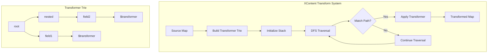
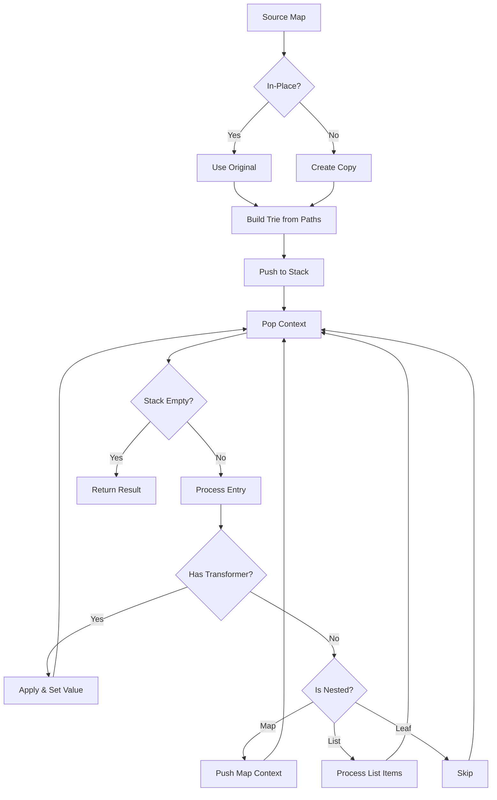

---
tags:
  - opensearch
---
# XContent Transform

## Summary

XContent Transform provides a depth-first search (DFS) transformation utility for nested map structures in OpenSearch. The `XContentMapValues.transform()` method enables field-specific transformations on document content while preserving the overall structure, including empty objects in arrays. This is essential for features like k-NN's derived source, which masks vector fields to reduce storage overhead.

## Details

### Architecture



### Data Flow



### Components

| Component | Description |
|-----------|-------------|
| `XContentMapValues.transform()` | Core utility method for DFS transformation |
| `TransformContext` | Internal class holding map and trie state during traversal |
| Transformer Trie | Path-based lookup structure built from transformer map |
| `TRANSFORMER_TRIE_LEAF_KEY` | Special key (`$transformer`) marking transformer functions in trie |

### Configuration

| Parameter | Description | Default |
|-----------|-------------|---------|
| `transformers` | Map from dot-notation path to transformer function | Required |
| `inPlace` | Whether to modify source directly or create a copy | Required |

### API Methods

```java
// Transform with explicit source
Map<String, Object> transform(
    Map<String, Object> source,
    Map<String, Function<Object, Object>> transformers,
    boolean inPlace
)

// Get reusable transform function
Function<Map<String, Object>, Map<String, Object>> transform(
    Map<String, Function<Object, Object>> transformers,
    boolean inPlace
)
```

### Path Matching

| Pattern | Example | Behavior |
|---------|---------|----------|
| Simple field | `"field"` | Transforms top-level `field` |
| Nested path | `"parent.child"` | Transforms `child` under `parent` |
| Deep nesting | `"a.b.c"` | Transforms `c` under `a.b` |
| Array handling | `"items.value"` | Transforms `value` in each item of `items` array |

### Key Differences from filter()

| Aspect | `filter()` | `transform()` |
|--------|-----------|---------------|
| Purpose | Include/exclude fields | Transform field values |
| Empty objects | Removed from arrays | Preserved |
| Wildcards | Supported | Not supported |
| Output | Filtered structure | Same structure, transformed values |
| Use case | Security filtering | Value masking/conversion |

### Usage Example

```java
// Define transformers for vector fields
Map<String, Function<Object, Object>> transformers = Map.of(
    "embedding", v -> "[MASKED]",
    "nested.vector", v -> List.of(0.0f)  // Replace with placeholder
);

// Original document
Map<String, Object> source = Map.of(
    "title", "Document",
    "embedding", List.of(0.1f, 0.2f, 0.3f, 0.4f),
    "nested", Map.of(
        "vector", List.of(0.5f, 0.6f),
        "other", "preserved"
    )
);

// Transform (create copy)
Map<String, Object> result = XContentMapValues.transform(source, transformers, false);

// Result:
// {
//   "title": "Document",
//   "embedding": "[MASKED]",
//   "nested": {
//     "vector": [0.0],
//     "other": "preserved"
//   }
// }
```

### Nested Array Handling

```java
// Transformers work on nested arrays
Map<String, Function<Object, Object>> transformers = Map.of(
    "items.vector", v -> "[MASKED]"
);

Map<String, Object> source = Map.of(
    "items", List.of(
        Map.of("vector", List.of(1, 2), "name", "a"),
        Map.of("vector", List.of(3, 4), "name", "b"),
        Map.of("name", "c")  // No vector - preserved as-is
    )
);

Map<String, Object> result = XContentMapValues.transform(source, transformers, false);

// Result: items array structure preserved, vectors masked
// [
//   {"vector": "[MASKED]", "name": "a"},
//   {"vector": "[MASKED]", "name": "b"},
//   {"name": "c"}
// ]
```

### Reusable Transform Function

```java
// Create reusable transformer for batch processing
Function<Map<String, Object>, Map<String, Object>> transformer = 
    XContentMapValues.transform(
        Map.of("vector", v -> "[MASKED]"),
        false  // create copies
    );

// Apply to multiple documents
List<Map<String, Object>> results = documents.stream()
    .map(transformer)
    .collect(Collectors.toList());
```

## Limitations

- No wildcard pattern support (exact paths only)
- For overlapping paths (e.g., `"test"` and `"test.nested"`), only the shorter path's transformer is applied
- Transformer functions must handle null values if fields may be null
- In-place mode modifies the original map; use with caution

## Change History

- **v3.0.0** (2025-03-20): Initial implementation for k-NN derived source support


## References

### Documentation
- [XContentMapValues.java](https://github.com/opensearch-project/OpenSearch/blob/main/server/src/main/java/org/opensearch/common/xcontent/support/XContentMapValues.java): Core implementation
- XContent Filtering: Related filtering functionality

### Pull Requests
| Version | PR | Description | Related Issue |
|---------|-----|-------------|---------------|
| v3.0.0 | [#17612](https://github.com/opensearch-project/OpenSearch/pull/17612) | Add dfs transformation function in XContentMapValues | [#2377](https://github.com/opensearch-project/OpenSearch/issues/2377) |

### Issues (Design / RFC)
- [Issue #2377](https://github.com/opensearch-project/k-NN/issues/2377): RFC - Derived Source for Vectors (motivation)
