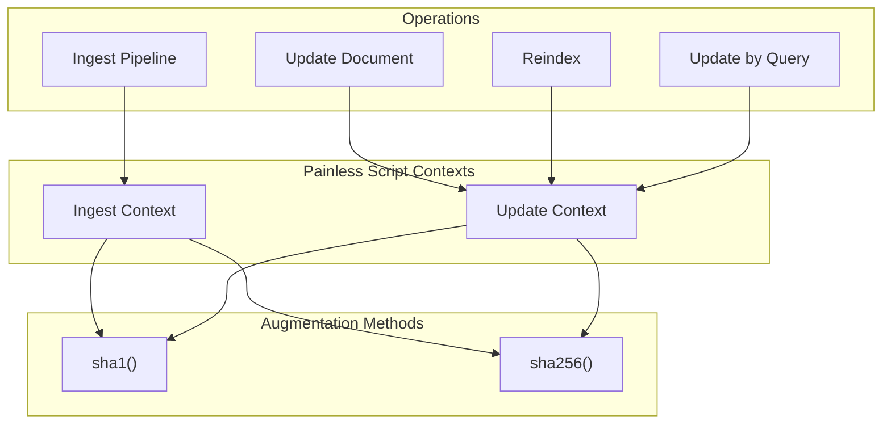

---
tags:
  - opensearch
---
# Painless Script Hashing Methods

## Summary

OpenSearch provides `sha1()` and `sha256()` augmentation methods for strings in Painless scripts, enabling cryptographic hashing of field values during document processing. These methods are available in ingest and update script contexts.

## Details

### Architecture



### Available Methods

| Method | Return Type | Description |
|--------|-------------|-------------|
| `sha1()` | String | Returns SHA-1 hash of the string (40 hex characters) |
| `sha256()` | String | Returns SHA-256 hash of the string (64 hex characters) |

### Script Contexts

| Context | Available Since | Use Cases |
|---------|-----------------|-----------|
| Ingest | 1.0 | Ingest pipelines |
| Update | 2.19.0 | Update, reindex, update_by_query |

### Usage Examples

**Ingest pipeline processor:**
```json
PUT _ingest/pipeline/hash_pipeline
{
  "processors": [
    {
      "script": {
        "source": "ctx.url_hash = ctx.url.sha256()"
      }
    }
  ]
}
```

**Update document:**
```json
POST /index/_update/1
{
  "script": {
    "source": "ctx._source.hash = ctx._source.field.sha256()"
  }
}
```

**Reindex with custom ID:**
```json
POST /_reindex
{
  "source": { "index": "src" },
  "dest": { "index": "dest" },
  "script": {
    "source": "ctx._id = ctx._source.url.sha256()"
  }
}
```

### Implementation Details

The hashing methods are implemented as augmentation methods in `org.opensearch.painless.api.Augmentation` class. They are registered via allowlist files for each script context:

- `org.opensearch.ingest.txt` - Ingest context
- `org.opensearch.update.txt` - Update context (added in v2.19.0)

## Limitations

- Only available for `java.lang.String` type
- Not available in search, aggregation, or other script contexts
- Hash output is always lowercase hexadecimal

## Change History

- **v2.19.0** (2025-02-25): Extended `sha1()` and `sha256()` methods to update script context, enabling use in update, reindex, and update_by_query operations

## References

### Documentation
- [Script processor](https://docs.opensearch.org/latest/ingest-pipelines/processors/script/)
- [Update by query](https://docs.opensearch.org/latest/api-reference/document-apis/update-by-query/)

### Pull Requests
| Version | PR | Description |
|---------|-----|-------------|
| v2.19.0 | [#16923](https://github.com/opensearch-project/OpenSearch/pull/16923) | Update script supports sha1() and sha256() methods |

### Related Issues
- [#16423](https://github.com/opensearch-project/OpenSearch/issues/16423) - Request to enable sha256() in reindex scripts
