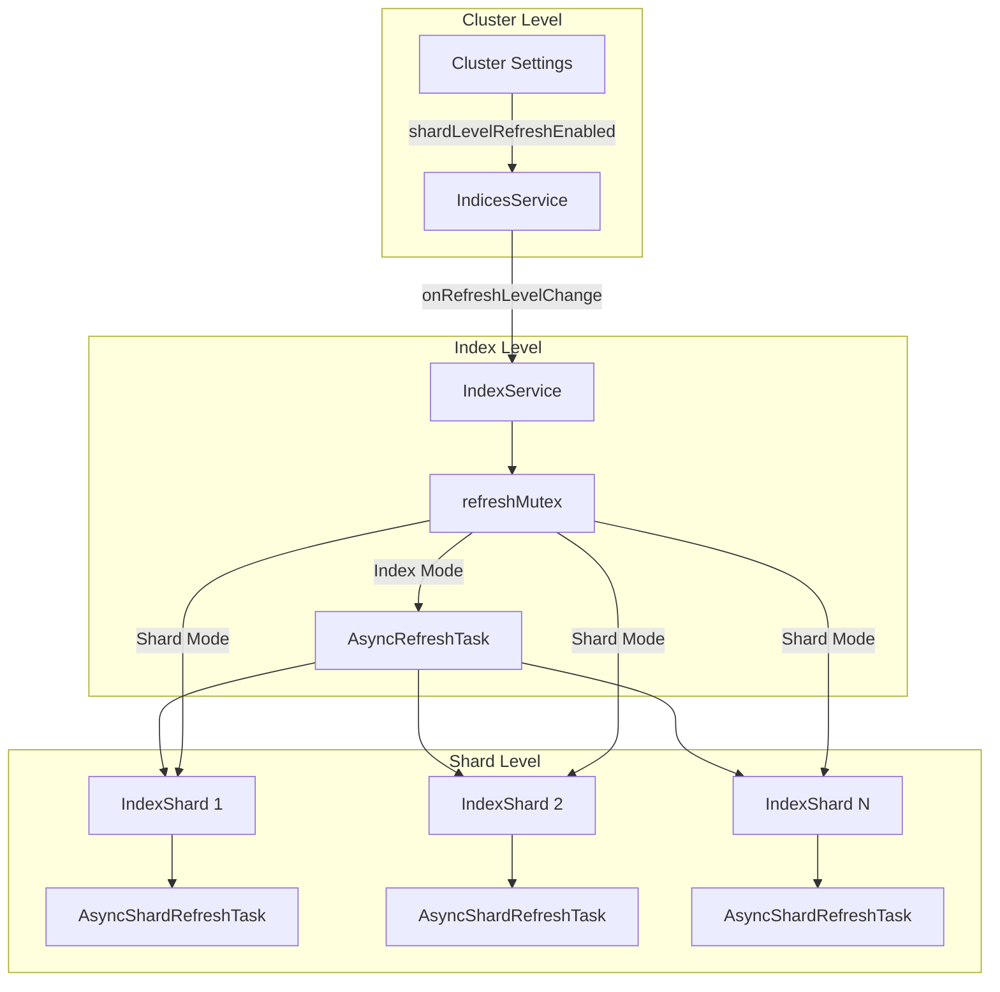
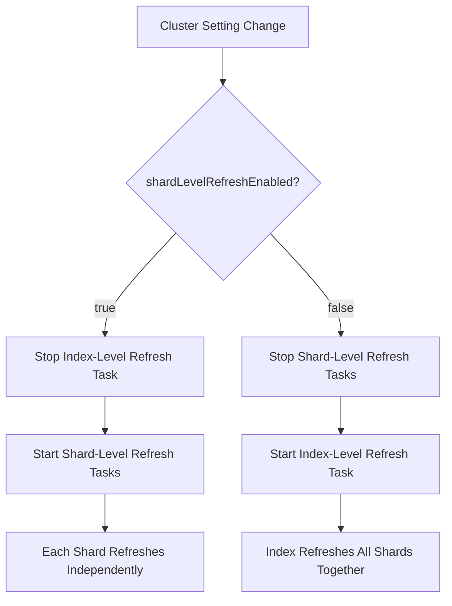

# Parallel Shard Refresh

## Summary

Parallel Shard Refresh is an experimental feature that enables individual shards within an index to refresh independently rather than at the index level. This capability improves data freshness for remote store indexes by allowing more granular control over refresh operations and better resource utilization through parallel execution across shards.

## Details

### Architecture



### Data Flow



### Components

| Component | Description |
|-----------|-------------|
| `IndicesService` | Manages cluster-level refresh settings and propagates changes to all indexes |
| `IndexService` | Coordinates refresh mode transitions with proper synchronization |
| `IndexShard` | Manages individual shard refresh tasks when shard-level refresh is enabled |
| `AsyncRefreshTask` | Existing index-level refresh task (used when shard-level refresh is disabled) |
| `AsyncShardRefreshTask` | New shard-level refresh task that runs independently per shard |
| `refreshMutex` | Synchronization object ensuring safe transitions between refresh modes |

### Configuration

| Setting | Description | Default | Scope |
|---------|-------------|---------|-------|
| `cluster.index.refresh.shard_level.enabled` | Enables parallel shard-level refresh across all indexes | `false` | Cluster (Dynamic) |
| `index.refresh_interval` | Refresh interval for the index (applies to both modes) | `1s` | Index |

### Usage Example

Enable parallel shard refresh:

```json
PUT /_cluster/settings
{
  "persistent": {
    "cluster.index.refresh.shard_level.enabled": true
  }
}
```

Verify the setting:

```json
GET /_cluster/settings?include_defaults=true&filter_path=*.cluster.index.refresh
```

Combine with custom refresh interval:

```json
PUT /my-index/_settings
{
  "index": {
    "refresh_interval": "500ms"
  }
}
```

## Limitations

- Experimental feature - API may change in future releases
- Cluster-wide setting affects all indexes (no per-index control)
- Benefits are most noticeable with indexes having multiple shards
- Part of a larger initiative for remote store data freshness improvements

## Related PRs

| Version | PR | Description |
|---------|-----|-------------|
| v3.1.0 | [#17782](https://github.com/opensearch-project/OpenSearch/pull/17782) | Implement parallel shard refresh behind cluster settings |

## References

- [Issue #17776](https://github.com/opensearch-project/OpenSearch/issues/17776): META - Improve Data Freshness for Remote Store Indexes
- [Refresh Index API](https://docs.opensearch.org/3.0/api-reference/index-apis/refresh/): Official documentation on refresh operations

## Change History

- **v3.1.0** (2025-04-20): Initial implementation of parallel shard refresh with cluster setting control
