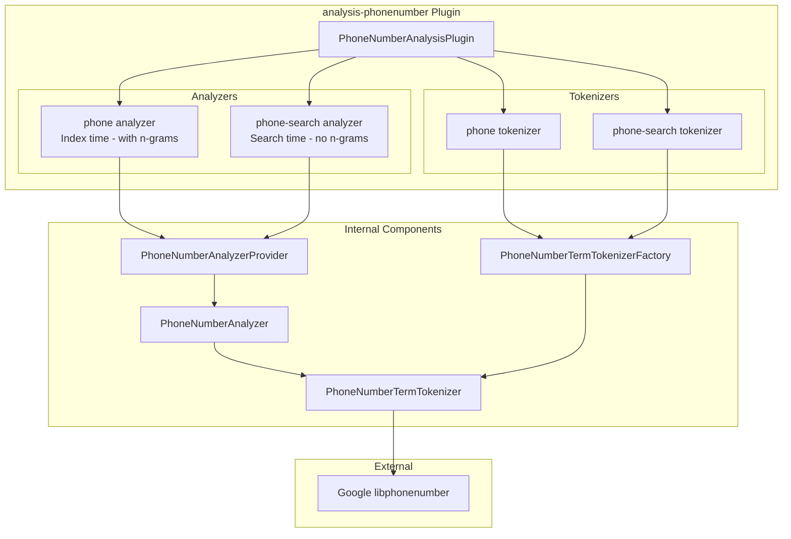
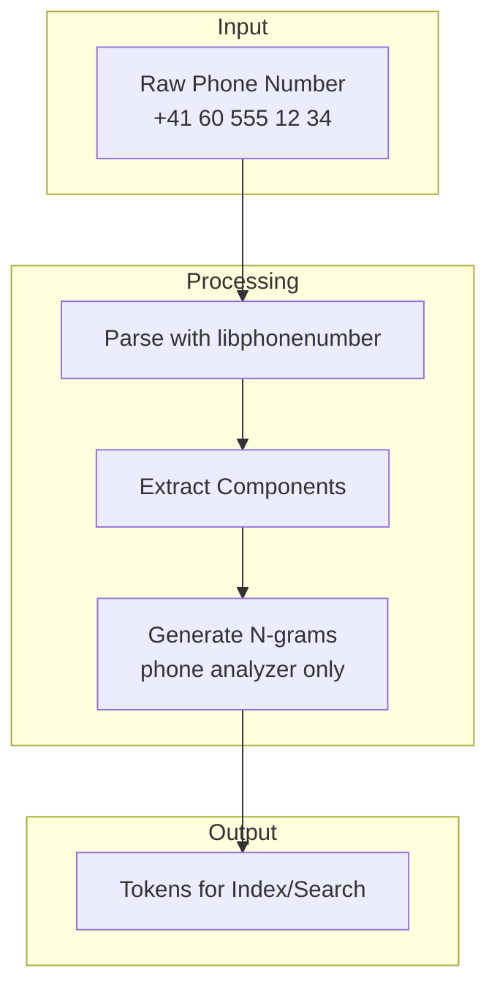

---
tags:
  - indexing
  - search
---

# Phone Number Analyzer

## Summary

The Phone Number Analyzer is an OpenSearch plugin (`analysis-phonenumber`) that provides specialized analyzers and tokenizers for indexing and searching phone numbers. It handles the complexity of international phone number formats using Google's `libphonenumber` library, enabling flexible search across various phone number representations (with/without country codes, different separators, national prefixes, etc.).

## Details

### Architecture



### Data Flow



### Components

| Component | Description |
|-----------|-------------|
| `PhoneNumberAnalysisPlugin` | Main plugin class that registers analyzers and tokenizers with OpenSearch |
| `PhoneNumberAnalyzer` | Analyzer implementation that wraps the tokenizer |
| `PhoneNumberAnalyzerProvider` | Provider for creating analyzer instances with configuration |
| `PhoneNumberTermTokenizer` | Core tokenizer that parses phone numbers using libphonenumber |
| `PhoneNumberTermTokenizerFactory` | Factory for creating tokenizer instances |

### Configuration

| Setting | Description | Default |
|---------|-------------|---------|
| `phone-region` | ISO 3166 country code for parsing local phone numbers without international prefix | `ZZ` (unknown region) |

### Analyzer Types

#### phone (Index Analyzer)

Generates n-grams from the phone number for flexible partial matching during search:

```
Input: "+41 60 555 12 34"
Output tokens: ["+41 60 555 12 34", "6055512", "41605551", "416055512", 
                "6055", "41605551234", "605551234", "41", ...]
```

#### phone-search (Search Analyzer)

Generates only basic tokens without n-grams for efficient search:

```
Input: "+41 60 555 12 34"
Output tokens: ["+41 60 555 12 34", "41 60 555 12 34", "41605551234", "605551234", "41"]
```

### Usage Example

```json
PUT /contacts
{
  "settings": {
    "analysis": {
      "analyzer": {
        "phone-ch": {
          "type": "phone",
          "phone-region": "CH"
        },
        "phone-search-ch": {
          "type": "phone-search",
          "phone-region": "CH"
        }
      }
    }
  },
  "mappings": {
    "properties": {
      "phone_number": {
        "type": "text",
        "analyzer": "phone-ch",
        "search_analyzer": "phone-search-ch"
      }
    }
  }
}
```

### Regional Phone Number Support

When specifying a region, the analyzer can parse local phone numbers:

```json
// With phone-region: "CH" (Switzerland)
// Input: "058 316 10 10" (local format)
// Correctly parsed as Swiss number: +41 58 316 10 10
```

Without a region, only numbers with international prefix (`+`) are fully parsed.

## Limitations

- Not designed for finding phone numbers within large text documents
- Should be used on fields containing only phone numbers
- Collects entire field content into memory (unsuitable for large field values)
- `phone-email` analyzer from the original elasticsearch-phone is not included
- Alphabetic phone representations (e.g., `1-800-MICROSOFT`) are not fully supported

## Change History

- **v2.18.0** (2024-10-22): Initial implementation with `phone` and `phone-search` analyzers/tokenizers

## Related Features
- [OpenSearch Dashboards](../opensearch-dashboards/ai-chat.md)

## References

### Documentation
- [Documentation](https://docs.opensearch.org/2.18/analyzers/supported-analyzers/phone-analyzers/): Official phone analyzer documentation
- [libphonenumber](https://github.com/google/libphonenumber): Google's phone number parsing library
- [elasticsearch-phone](https://github.com/purecloudlabs/elasticsearch-phone): Original Elasticsearch plugin this is based on
- [Falsehoods about phone numbers](https://github.com/google/libphonenumber/blob/master/FALSEHOODS.md): Why phone number parsing is complex

### Pull Requests
| Version | PR | Description | Related Issue |
|---------|-----|-------------|---------------|
| v2.18.0 | [#15915](https://github.com/opensearch-project/OpenSearch/pull/15915) | Initial implementation of phone number analyzer | [#11326](https://github.com/opensearch-project/OpenSearch/issues/11326) |

### Issues (Design / RFC)
- [Issue #11326](https://github.com/opensearch-project/OpenSearch/issues/11326): Original RFC for phone number analyzer
- [Documentation Issue #8389](https://github.com/opensearch-project/documentation-website/issues/8389): Documentation PR
