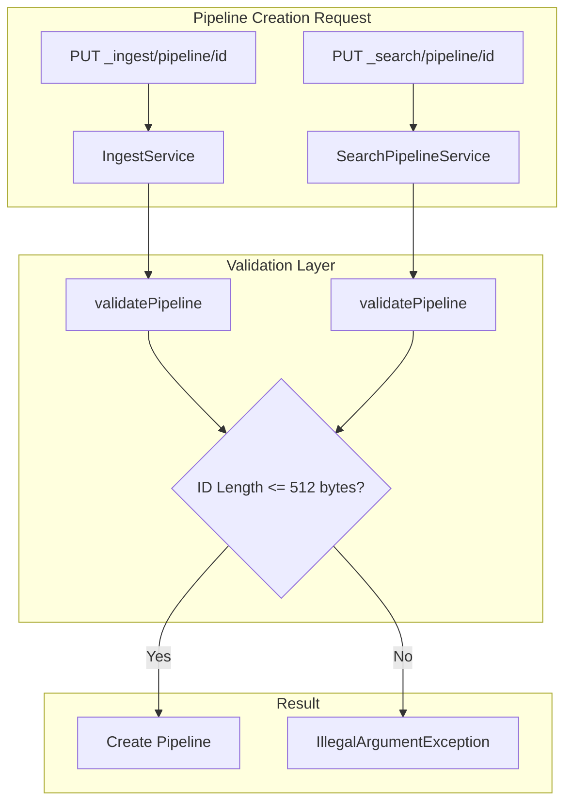

# Pipeline ID Limits

## Summary

OpenSearch enforces a maximum length limit on pipeline identifiers for both ingest pipelines and search pipelines. This validation ensures pipeline IDs remain manageable and prevents potential issues with cluster state storage and management.

## Details

### Architecture



### Components

| Component | Description |
|-----------|-------------|
| IngestService | Handles ingest pipeline CRUD operations with ID validation |
| SearchPipelineService | Handles search pipeline CRUD operations with ID validation |
| UnicodeUtil | Lucene utility for accurate UTF-8 byte length calculation |

### Configuration

| Setting | Description | Default | Since |
|---------|-------------|---------|-------|
| MAX_PIPELINE_ID_BYTES | Maximum allowed UTF-8 bytes for pipeline ID | 512 | v3.0.0 |

### Usage Example

#### Creating an Ingest Pipeline

```json
PUT _ingest/pipeline/my-data-pipeline
{
  "description": "Pipeline for processing incoming data",
  "processors": [
    {
      "set": {
        "field": "ingested_at",
        "value": "{{_ingest.timestamp}}"
      }
    }
  ]
}
```

#### Creating a Search Pipeline

```json
PUT _search/pipeline/my-search-pipeline
{
  "request_processors": [
    {
      "filter_query": {
        "query": {
          "term": {
            "status": "active"
          }
        }
      }
    }
  ]
}
```

#### Error Response for Invalid ID

```json
{
  "error": {
    "root_cause": [
      {
        "type": "illegal_argument_exception",
        "reason": "Pipeline id [very-long-id...] exceeds maximum length of 512 UTF-8 bytes (actual: 513 bytes)"
      }
    ],
    "type": "illegal_argument_exception",
    "reason": "Pipeline id [very-long-id...] exceeds maximum length of 512 UTF-8 bytes (actual: 513 bytes)"
  },
  "status": 400
}
```

## Limitations

- The 512-byte limit is hardcoded and not configurable via cluster settings
- Multi-byte UTF-8 characters (e.g., CJK characters, emojis) consume more of the byte limit than ASCII characters
- Existing pipelines with non-compliant IDs created before v3.0.0 will continue to function but cannot be updated

## Related PRs

| Version | PR | Description |
|---------|-----|-------------|
| v3.0.0 | [#17786](https://github.com/opensearch-project/OpenSearch/pull/17786) | Introduce 512 byte limit to search and ingest pipeline IDs |

## References

- [Issue #17766](https://github.com/opensearch-project/OpenSearch/issues/17766): Original feature request
- [Ingest Pipeline Documentation](https://docs.opensearch.org/latest/ingest-pipelines/create-ingest/): Official ingest pipeline docs
- [Search Pipeline Documentation](https://docs.opensearch.org/latest/search-plugins/search-pipelines/creating-search-pipeline/): Official search pipeline docs

## Change History

- **v3.0.0** (2025-05-13): Initial implementation - 512 byte limit for ingest and search pipeline IDs
