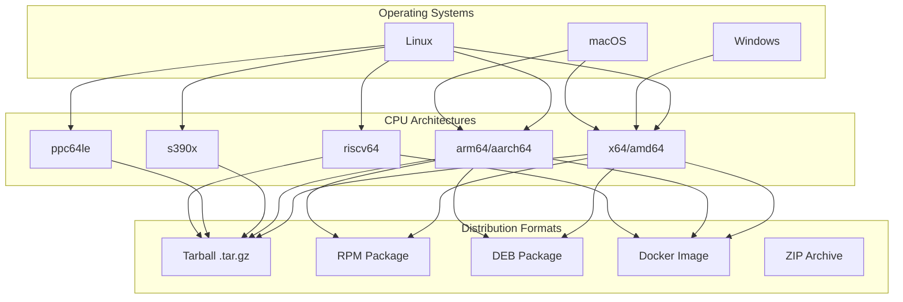

---
tags:
  - search
---

# Platform Support

## Summary

OpenSearch supports multiple CPU architectures and operating systems, enabling deployment across diverse hardware environments. The platform support includes x64 (amd64), ARM64 (aarch64), s390x, ppc64le, and riscv64 architectures on Linux, with x64 support on Windows and macOS.

## Details

### Architecture



### Supported Platforms

| Architecture | Linux | Windows | macOS | Docker |
|--------------|-------|---------|-------|--------|
| x64 (amd64) | ✅ | ✅ | ✅ | ✅ |
| ARM64 (aarch64) | ✅ | ❌ | ✅ | ✅ |
| s390x | ✅ | ❌ | ❌ | ✅ |
| ppc64le | ✅ | ❌ | ❌ | ✅ |
| riscv64 | ✅ | ❌ | ❌ | ✅ |

### Distribution Types

| Type | Description | JDK Included |
|------|-------------|--------------|
| Standard Tarball | Full distribution with bundled JDK | Yes |
| No-JDK Tarball | Distribution without JDK (BYOJDK) | No |
| RPM Package | Red Hat/CentOS/Fedora package | Yes |
| DEB Package | Debian/Ubuntu package | Yes |
| Docker Image | Container image | Yes |

### Build System Components

| Component | Description |
|-----------|-------------|
| `Architecture.java` | Enum defining supported CPU architectures |
| `DistributionDownloadPlugin.java` | Handles distribution artifact downloads |
| `JavaVariant.java` | Manages JDK variants for different platforms |
| `VersionProperties.java` | Platform-specific version properties |
| `SystemCallFilter.java` | Seccomp syscall filters for each architecture |

### Configuration

The build system automatically detects the current architecture:

```java
// Architecture detection
public static Architecture current() {
    final String architecture = System.getProperty("os.arch", "");
    switch (architecture) {
        case "amd64":
        case "x86_64":
            return X64;
        case "aarch64":
            return ARM64;
        case "s390x":
            return S390X;
        case "ppc64le":
            return PPC64LE;
        case "riscv64":
            return RISCV64;
        default:
            throw new IllegalArgumentException("Unknown architecture: " + architecture);
    }
}
```

### Usage Example

```bash
# Download for your architecture
# x64
wget https://artifacts.opensearch.org/releases/bundle/opensearch/3.1.0/opensearch-3.1.0-linux-x64.tar.gz

# ARM64
wget https://artifacts.opensearch.org/releases/bundle/opensearch/3.1.0/opensearch-3.1.0-linux-arm64.tar.gz

# RISC-V 64
wget https://artifacts.opensearch.org/releases/bundle/opensearch/3.1.0/opensearch-3.1.0-linux-riscv64.tar.gz

# Extract and run
tar -xvf opensearch-3.1.0-linux-*.tar.gz
cd opensearch-3.1.0
./bin/opensearch
```

## Limitations

- Windows support is limited to x64 architecture only
- Some architectures (s390x, ppc64le, riscv64) may have limited JDK availability
- Building from source on riscv64 requires providing your own protoc executable
- Not all plugins may be available for all architectures

## Change History

- **v3.1.0** (2025-04-30): Added Linux riscv64 platform support

## References

### Documentation
- [OpenSearch Installation Guide](https://docs.opensearch.org/3.1/install-and-configure/): Official installation documentation
- [Tarball Installation](https://docs.opensearch.org/3.1/install-and-configure/install-opensearch/tar/): Tarball installation guide

### Pull Requests
| Version | PR | Description | Related Issue |
|---------|-----|-------------|---------------|
| v3.1.0 | [#18156](https://github.com/opensearch-project/OpenSearch/pull/18156) | Add support for linux riscv64 platform | [#2341](https://github.com/opensearch-project/OpenSearch/issues/2341) |

### Issues (Design / RFC)
- [Issue #2341](https://github.com/opensearch-project/OpenSearch/issues/2341): RISC-V 64 support request
