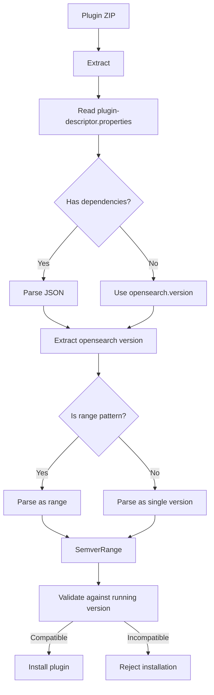

# Plugin Dependencies

## Summary

OpenSearch plugins declare their compatibility with OpenSearch versions through the `plugin-descriptor.properties` file. The plugin dependencies feature allows plugins to specify version compatibility using semantic versioning (semver) notation, including range expressions. This enables plugins to declare compatibility with multiple OpenSearch versions without requiring separate builds for each version. Additionally, plugins can declare optional dependencies on other plugins, with relaxed jarHell validation for optional extended plugins.

## Details

### Architecture

```mermaid
graph TB
    subgraph "Plugin Descriptor"
        PDF[plugin-descriptor.properties]
        OV[opensearch.version]
        DEP[dependencies]
    end
    
    subgraph "Version Parsing"
        PI[PluginInfo]
        SR[SemverRange]
        RP[RANGE_PATTERN]
    end
    
    subgraph "Range Operators"
        EQ[Equal =]
        TL[Tilde ~]
        CR[Caret ^]
        RG[Range [...]]
    end
    
    PDF --> OV
    PDF --> DEP
    OV --> PI
    DEP --> PI
    PI --> SR
    SR --> RP
    RP --> RG
    SR --> EQ
    SR --> TL
    SR --> CR
```

### Data Flow



### Components

| Component | Description |
|-----------|-------------|
| `SemverRange` | Represents a semantic version range with operator and bounds |
| `SemverRange.RangeOperator` | Enum defining supported operators (EQ, TILDE, CARET, RANGE) |
| `SemverRange.RANGE_PATTERN` | Regex pattern for parsing range expressions |
| `PluginInfo` | In-memory representation of plugin descriptor |
| `Range` | Expression class for evaluating explicit range bounds |

### Configuration

Plugins specify version compatibility in `plugin-descriptor.properties`:

| Property | Description | Example |
|----------|-------------|---------|
| `opensearch.version` | Single version or semver expression | `2.3.0`, `~2.3.0`, `^2.3.0` |
| `dependencies` | JSON object with opensearch version | `{ opensearch: "[2.0.0, 3.0.0)" }` |
| `extended.plugins` | Comma-separated list of plugins this plugin extends | `opensearch-job-scheduler` |
| `optional.plugins` | Comma-separated list of optional extended plugins | `opensearch-security` |

Note: Only one of `opensearch.version` or `dependencies` can be specified. Plugins listed in `optional.plugins` must also be in `extended.plugins`.

### Supported Version Notations

| Notation | Syntax | Compatible Versions |
|----------|--------|---------------------|
| Exact | `2.3.0` or `=2.3.0` | Only 2.3.0 |
| Tilde | `~2.3.0` | 2.3.0 ≤ v < 2.4.0 |
| Caret | `^2.3.0` | 2.3.0 ≤ v < 3.0.0 |
| Inclusive Range | `[2.0.0, 3.0.0]` | 2.0.0 ≤ v ≤ 3.0.0 |
| Exclusive Range | `(2.0.0, 3.0.0)` | 2.0.0 < v < 3.0.0 |
| Mixed Range | `[2.0.0, 3.0.0)` | 2.0.0 ≤ v < 3.0.0 |

### Usage Example

#### Using opensearch.version (traditional)

```properties
name=my-plugin
description=My custom plugin
version=1.0.0
opensearch.version=2.3.0
java.version=21
classname=org.example.MyPlugin
```

#### Using dependencies with range (recommended for multi-version support)

```properties
name=my-plugin
description=My custom plugin
version=1.0.0
dependencies={ opensearch: "[2.0.0, 3.0.0)" }
java.version=21
classname=org.example.MyPlugin
```

#### Using tilde notation

```properties
name=my-plugin
description=My custom plugin
version=1.0.0
opensearch.version=~2.3.0
java.version=21
classname=org.example.MyPlugin
```

#### Using optional extended plugins (v3.0.0+)

```properties
name=my-plugin
description=Plugin with optional security integration
version=3.0.0
opensearch.version=3.0.0
java.version=21
classname=org.example.MyPlugin
extended.plugins=opensearch-security
optional.plugins=opensearch-security
```

When `opensearch-security` is listed in both `extended.plugins` and `optional.plugins`, the jarHell check is skipped for that dependency, allowing installation even if both plugins share common JAR files.

## Limitations

- Only one dependency (`opensearch`) is allowed in the `dependencies` field
- Only one range can be specified per plugin
- Cannot use both `opensearch.version` and `dependencies` properties simultaneously
- Range expressions must follow the exact pattern: `[( ]version, version[) ]`
- Optional extended plugins must still be listed in `extended.plugins`
- Some features may not function when optional dependencies are not installed (a warning is logged)

## Change History

- **v3.4.0** (2025-11): Extended range semver support to `dependencies` field in plugin-descriptor.properties
- **v3.0.0** (2025-05): Relaxed jarHell check for optionally extended plugins, enabling plugins to declare optional dependencies without jar conflicts
- **v2.16.0** (2025-07): Added explicit range notation support (`[2.0.0, 3.0.0)`) for `opensearch.version`
- **v2.13.0** (2024-02): Initial SemverRange implementation with tilde (`~`) and caret (`^`) operators

## References

### Documentation
- [Documentation: Installing plugins](https://docs.opensearch.org/3.0/install-and-configure/plugins/): Official plugin installation guide

### Blog Posts
- [OpenSearch Versioning Blog](https://opensearch.org/blog/what-is-semver/): OpenSearch Versioning, or What is SemVer anyway?

### Pull Requests
| Version | PR | Description | Related Issue |
|---------|-----|-------------|---------------|
| v3.4.0 | [#19939](https://github.com/opensearch-project/OpenSearch/pull/19939) | Add RangeSemver for `dependencies` in `plugin-descriptor.properties` |   |
| v3.0.0 | [#17893](https://github.com/opensearch-project/OpenSearch/pull/17893) | Relaxes jarHell check for optionally extended plugins |   |
| v2.16.0 | [#18557](https://github.com/opensearch-project/OpenSearch/pull/18557) | Added support for range version support in semver | [#18554](https://github.com/opensearch-project/OpenSearch/issues/18554) |
| v2.13.0 | - | Initial SemverRange implementation with tilde and caret operators |   |

### Issues (Design / RFC)
- [Issue #1707](https://github.com/opensearch-project/OpenSearch/issues/1707): Cannot install old patch version of plugins on newer OpenSearch builds
- [Issue #18554](https://github.com/opensearch-project/OpenSearch/issues/18554): Add range support in SemVer
- [Issue #4500](https://github.com/opensearch-project/security/issues/4500): Resource Permissions and Sharing - motivation for optional plugin dependencies
