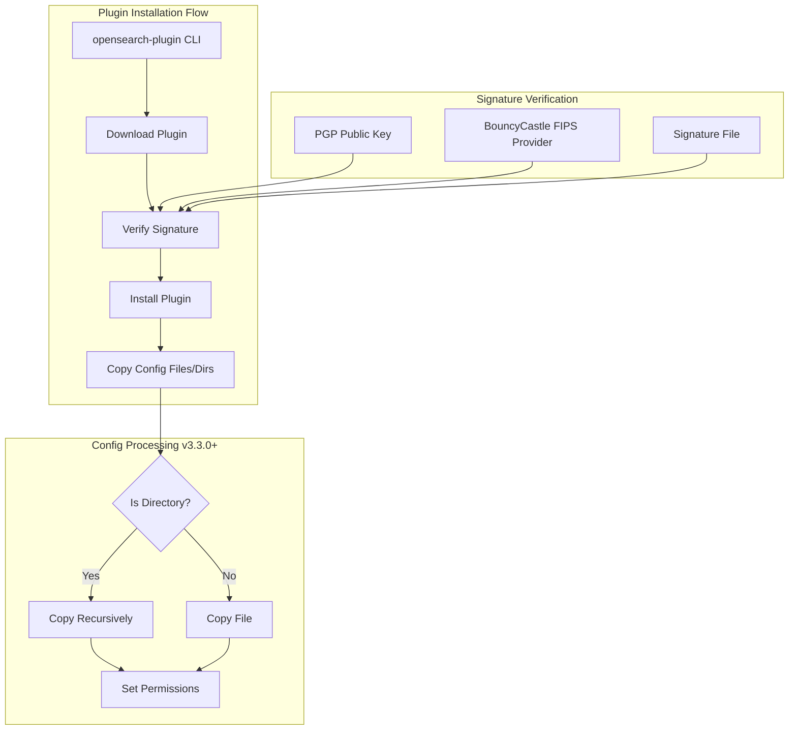

# Plugin Installation

## Summary

OpenSearch provides a command-line tool (`opensearch-plugin`) for managing plugins. This tool allows users to install, list, and remove plugins from their OpenSearch installation. Plugin installation includes signature verification using PGP keys to ensure artifact integrity and authenticity. Starting from v3.3.0, plugins can also include directory structures in their config folder.

## Details

### Architecture



### Components

| Component | Description |
|-----------|-------------|
| `InstallPluginCommand` | Main command handler for plugin installation |
| `PluginCli` | Entry point for the plugin CLI tool |
| `public_key.sig` | PGP public key for signature verification |
| BouncyCastle FIPS | Cryptographic provider for PGP operations |
| `copyDirectoryRecursively()` | Recursively copies directory structures (v3.3.0+) |
| `copyWithPermissions()` | Copies files/dirs with proper permissions (v3.3.0+) |

### Configuration

| Setting | Description | Default |
|---------|-------------|---------|
| `--batch` | Skip confirmation prompts | false |
| `--verbose` | Enable verbose output | false |

### Usage Example

```bash
# Install a plugin by name
./bin/opensearch-plugin install analysis-icu

# Install multiple plugins
./bin/opensearch-plugin install analysis-nori repository-s3

# Install from URL
./bin/opensearch-plugin install https://example.com/plugin.zip

# Install from local file
./bin/opensearch-plugin install file:/path/to/plugin.zip

# Install using Maven coordinates
./bin/opensearch-plugin install org.opensearch.plugin:opensearch-anomaly-detection:2.2.0.0

# List installed plugins
./bin/opensearch-plugin list

# Remove a plugin
./bin/opensearch-plugin remove opensearch-anomaly-detection
```

### Signature Verification

OpenSearch verifies plugin signatures using PGP keys:

- **v1.x/v2.x**: Uses `opensearch@amazon.com` key
- **v3.x+**: Uses `release@opensearch.org` key

The verification process:
1. Downloads the plugin zip file
2. Downloads the corresponding `.sig` signature file
3. Loads the embedded PGP public key
4. Initializes BouncyCastle FIPS provider
5. Verifies the signature against the downloaded artifact

## Limitations

- Plugin versions must match the OpenSearch version
- Some plugins require additional permissions (prompted during installation)
- Signature verification requires network access to download signature files
- Custom plugins from untrusted sources bypass signature verification

## Change History

- **v3.3.0** (2026-01-11): Added support for copying directories to plugin config folder during installation
- **v3.1.0** (2026-01-10): Fixed signature verification failure caused by PGP public key change; added BouncyCastle FIPS provider initialization

## References

### Documentation
- [Documentation](https://docs.opensearch.org/3.0/install-and-configure/plugins/): Installing plugins

### Pull Requests
| Version | PR | Description | Related Issue |
|---------|-----|-------------|---------------|
| v3.3.0 | [#19343](https://github.com/opensearch-project/OpenSearch/pull/19343) | Allow plugins to copy folders into their config dir during installation |   |
| v3.1.0 | [#18147](https://github.com/opensearch-project/OpenSearch/pull/18147) | Fix native plugin installation error caused by PGP public key change | [#3747](https://github.com/opensearch-project/opensearch-build/issues/3747) |

### Issues (Design / RFC)
- [Issue #5308](https://github.com/opensearch-project/opensearch-build/issues/5308): New PGP key for signing artifacts starting 3.0.0
