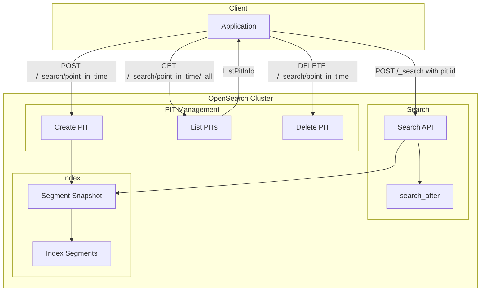

---
tags:
  - opensearch
---
# Point in Time (PIT) API

## Summary

Point in Time (PIT) is a lightweight view into the state of data as it existed at a specific point in time. PIT enables consistent search results across multiple queries by preserving a snapshot of the index state, even when the underlying data changes. This is essential for pagination, deep scrolling, and scenarios requiring repeatable search results.

## Details

### Architecture



### Components

| Component | Description |
|-----------|-------------|
| `ListPitInfo` | Data class containing PIT metadata: `pitId`, `creationTime`, `keepAlive` |
| `CreatePitAction` | Action for creating new PIT contexts |
| `GetAllPitNodesResponse` | Response containing list of all PITs across nodes |
| `DeletePitAction` | Action for deleting PIT contexts |

### API Endpoints

| Operation | Endpoint | Description |
|-----------|----------|-------------|
| Create PIT | `POST /<index>/_search/point_in_time?keep_alive=1h` | Creates a PIT for specified indexes |
| List PITs | `GET /_search/point_in_time/_all` | Lists all active PITs |
| Delete PIT | `DELETE /_search/point_in_time` | Deletes specified PITs |
| Search with PIT | `POST /_search` with `pit.id` in body | Searches using a PIT context |

### Configuration

| Setting | Description | Default |
|---------|-------------|---------|
| `point_in_time.max_keep_alive` | Maximum allowed keep-alive for PITs | `24h` |
| `search.max_open_pit_context` | Maximum number of open PIT contexts | `300` |

### Usage Example

```bash
# Create a PIT
POST /my-index/_search/point_in_time?keep_alive=1h

# Response
{
  "pit_id": "46ToAwMDaWR5BXV1aWQy...",
  "creation_time": 1718990725000
}

# Search with PIT
POST /_search
{
  "pit": {
    "id": "46ToAwMDaWR5BXV1aWQy...",
    "keep_alive": "1h"
  },
  "sort": [{"@timestamp": "asc"}],
  "search_after": [1718990725000]
}

# List all PITs
GET /_search/point_in_time/_all

# Response
{
  "pits": [
    {
      "pit_id": "46ToAwMDaWR5BXV1aWQy...",
      "creation_time": 1718990725000,
      "keep_alive": 3600000
    }
  ]
}

# Delete PIT
DELETE /_search/point_in_time
{
  "pit_id": ["46ToAwMDaWR5BXV1aWQy..."]
}
```

### Java Client Usage

```java
// Create PIT
CreatePitRequest request = new CreatePitRequest(TimeValue.timeValueHours(1), true, "my-index");
CreatePitResponse response = client.execute(CreatePitAction.INSTANCE, request).get();
String pitId = response.getId();

// List all PITs
GetAllPitNodesResponse pitsResponse = client.execute(GetAllPitsAction.INSTANCE, new GetAllPitNodesRequest()).get();
for (ListPitInfo pitInfo : pitsResponse.getPitInfos()) {
    String id = pitInfo.getPitId();
    long creationTime = pitInfo.getCreationTime();
    long keepAlive = pitInfo.getKeepAlive();  // Available since v2.16.0
}
```

## Limitations

- PIT contexts consume cluster resources (memory and disk for retained segments)
- PIT data is lost on cluster or node failure
- Maximum keep-alive is limited by `point_in_time.max_keep_alive` setting
- PITs cannot be used with the Scroll API simultaneously

## Change History

- **v2.16.0** (2024-08-06): Added `ListPitInfo.getKeepAlive()` getter for programmatic access to keep-alive duration
- **v2.4.0**: Initial PIT API implementation

## References

### Documentation
- [Point in Time](https://docs.opensearch.org/latest/search-plugins/searching-data/point-in-time/): Conceptual overview
- [Point in Time API](https://docs.opensearch.org/latest/search-plugins/searching-data/point-in-time-api/): API reference

### Pull Requests
| Version | PR | Description |
|---------|-----|-------------|
| v2.16.0 | [#14495](https://github.com/opensearch-project/OpenSearch/pull/14495) | Add ListPitInfo::getKeepAlive() getter |
