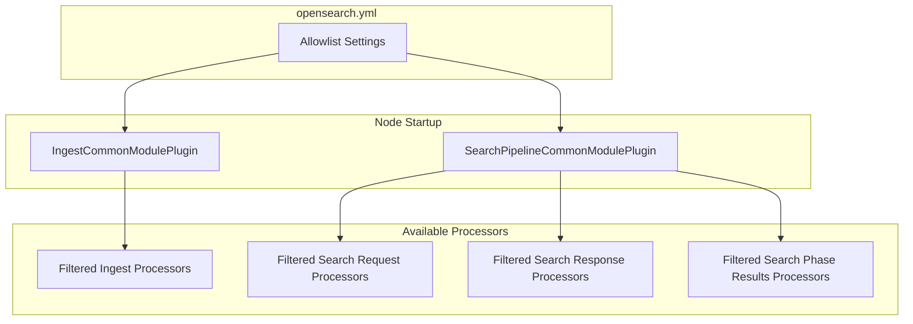

---
tags:
  - opensearch
---
# Processor Allowlist

## Summary

Processor Allowlist is a security and operational feature that allows cluster operators to selectively enable specific ingest and search pipeline processors. This provides fine-grained control over which processors are available, useful for limiting CPU-bound work on coordinator nodes or restricting functionality in security-conscious environments.

## Details

### Architecture



### Configuration

| Setting | Scope | Description |
|---------|-------|-------------|
| `ingest.common.processors.allowed` | Node | Allowlist for ingest-common processors |
| `search.pipeline.common.request.processors.allowed` | Node | Allowlist for search request processors |
| `search.pipeline.common.response.processors.allowed` | Node | Allowlist for search response processors |
| `search.pipeline.common.search.phase.results.processors.allowed` | Node | Allowlist for search phase results processors |

### Behavior Rules

| Configuration | Result |
|---------------|--------|
| Setting not defined | All processors enabled (default behavior) |
| Empty list `[]` | All processors disabled |
| `["processor1", "processor2"]` | Only listed processors enabled |
| Unknown processor in list | Node fails to start with `IllegalArgumentException` |

### Usage Example

```yaml
# opensearch.yml - Restrict to minimal processors
ingest.common.processors.allowed:
  - date
  - set
  - remove

search.pipeline.common.request.processors.allowed:
  - filter_query

search.pipeline.common.response.processors.allowed:
  - rename_field
```

### Available Ingest Processors

The following processors can be controlled via `ingest.common.processors.allowed`:

`append`, `bytes`, `community_id`, `convert`, `copy`, `csv`, `date`, `date_index_name`, `dissect`, `dot_expander`, `drop`, `fail`, `fingerprint`, `foreach`, `grok`, `gsub`, `html_strip`, `join`, `json`, `kv`, `lowercase`, `pipeline`, `remove`, `remove_by_pattern`, `rename`, `script`, `set`, `sort`, `split`, `trim`, `uppercase`, `urldecode`

### Available Search Pipeline Processors

**Request Processors** (`search.pipeline.common.request.processors.allowed`):
- `filter_query`
- `script`
- `oversample`

**Response Processors** (`search.pipeline.common.response.processors.allowed`):
- `rename_field`
- `truncate_hits`
- `collapse`

## Limitations

- Static settings require node restart to take effect
- Changing allowlist between restarts causes pipelines using disabled processors to fail
- Cannot selectively enable processors from plugins (only module processors)

## Change History

- **v2.16.0** (2024-08-06): Initial implementation for ingest-common and search-pipeline-common processors

## References

### Documentation

- [Ingest Processors](https://docs.opensearch.org/latest/ingest-pipelines/processors/index-processors/)
- [Search Processors](https://docs.opensearch.org/latest/search-plugins/search-pipelines/search-processors/)

### Pull Requests

| Version | PR | Description |
|---------|-----|-------------|
| v2.16.0 | [#14479](https://github.com/opensearch-project/OpenSearch/pull/14479) | Add allowlist setting for ingest-common processors |
| v2.16.0 | [#14562](https://github.com/opensearch-project/OpenSearch/pull/14562) | Add allowlist setting for search-pipeline-common processors |

### Issues

- [#14439](https://github.com/opensearch-project/OpenSearch/issues/14439) - Feature request for fine-grained control of processors
