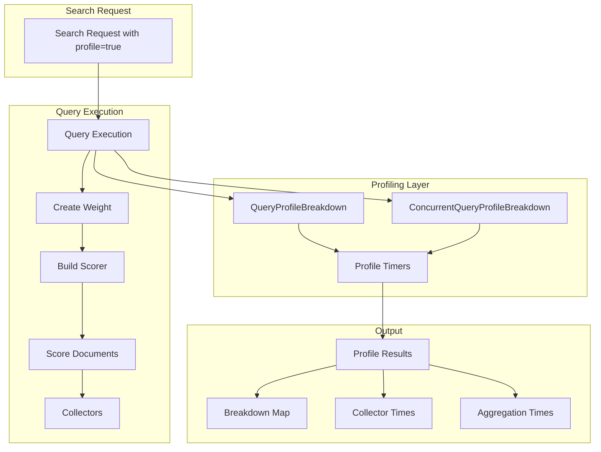
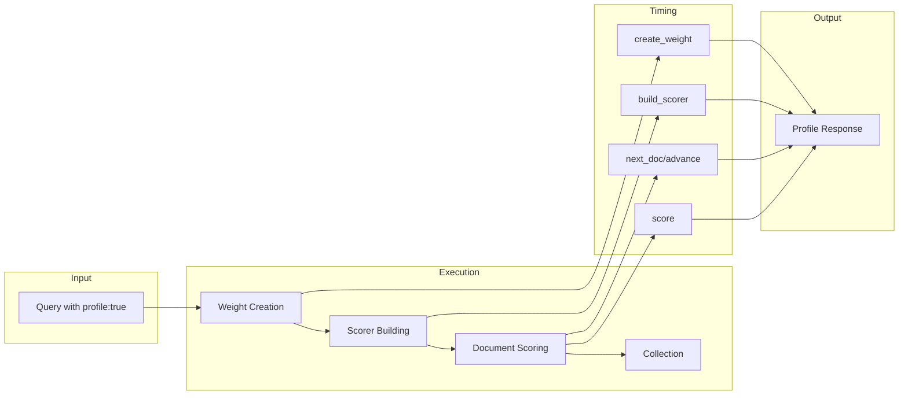

# Query Profiler

## Summary

The Query Profiler (Profile API) provides detailed timing information about the execution of individual components of a search request. It helps debug slow queries and understand how to improve search performance by breaking down query execution into measurable components.

## Details

### Architecture



### Data Flow



### Components

| Component | Description |
|-----------|-------------|
| `QueryProfileBreakdown` | Tracks timing for non-concurrent query execution |
| `ConcurrentQueryProfileBreakdown` | Tracks timing for concurrent segment search with slice-level statistics |
| `ProfileTimer` | Low-level timer for measuring individual operations |
| `ProfileCollector` | Wraps collectors to measure collection time |

### Configuration

The Profile API is enabled per-request using the `profile` parameter:

| Setting | Description | Default |
|---------|-------------|---------|
| `profile` | Enable profiling for the request | `false` |
| `human` | Return human-readable time values | `false` |

### Usage Example

```json
GET /myindex/_search
{
  "profile": true,
  "query": {
    "match": { "title": "opensearch" }
  }
}
```

Response includes breakdown timing:

```json
{
  "profile": {
    "shards": [{
      "searches": [{
        "query": [{
          "type": "TermQuery",
          "description": "title:opensearch",
          "time_in_nanos": 123456,
          "breakdown": {
            "create_weight": 10000,
            "create_weight_count": 1,
            "build_scorer": 50000,
            "build_scorer_count": 2,
            "next_doc": 30000,
            "next_doc_count": 100,
            "score": 20000,
            "score_count": 100
          }
        }]
      }]
    }]
  }
}
```

### Concurrent Segment Search Support

When concurrent segment search is enabled, the profiler provides additional slice-level statistics:

| Field | Description |
|-------|-------------|
| `max_slice_time_in_nanos` | Maximum time across all slices |
| `min_slice_time_in_nanos` | Minimum time across all slices |
| `avg_slice_time_in_nanos` | Average time across all slices |
| `slice_count` | Number of slices executed |

## Limitations

- Profiling adds overhead to search operations
- Does not measure network latency
- Does not measure fetch phase time
- Does not measure queue wait time

## Related PRs

| Version | PR | Description |
|---------|-----|-------------|
| v3.2.0 | [#18540](https://github.com/opensearch-project/OpenSearch/pull/18540) | Fix concurrent timings in profiler |

## References

- [Profile API Documentation](https://docs.opensearch.org/3.0/api-reference/search-apis/profile/): Official API reference
- [Concurrent Segment Search](https://docs.opensearch.org/3.0/search-plugins/concurrent-segment-search/): Related feature

## Change History

- **v3.2.0** (2025-06-21): Fixed incorrect timing values for concurrent segment search when timers have zero invocations
