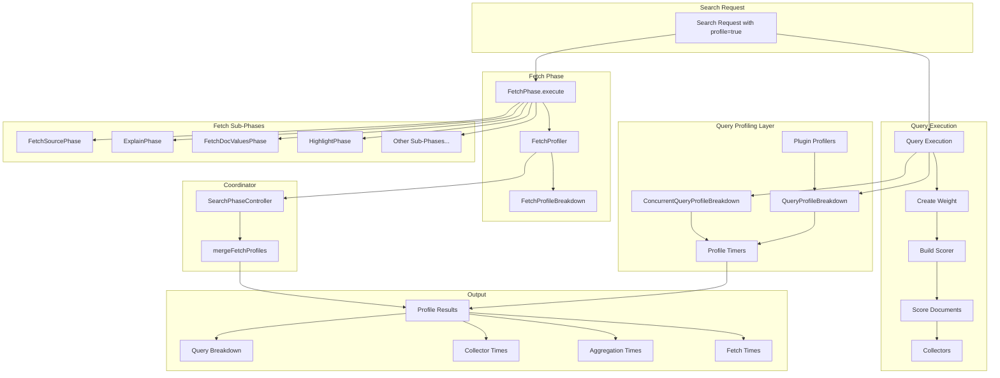
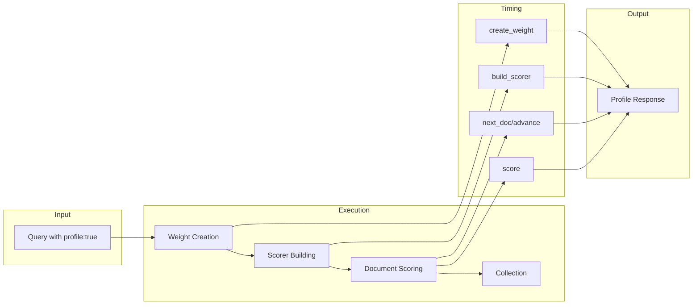

# Query Profiler

## Summary

The Query Profiler (Profile API) provides detailed timing information about the execution of individual components of a search request. It helps debug slow queries and understand how to improve search performance by breaking down query execution into measurable components. Starting in v3.2.0, the Profile API includes comprehensive fetch phase profiling with detailed timing breakdowns, plugin profiling extensibility, and multi-shard fetch phase support.

## Details

### Architecture



### Data Flow



### Components

| Component | Description |
|-----------|-------------|
| `QueryProfileBreakdown` | Tracks timing for non-concurrent query execution |
| `ConcurrentQueryProfileBreakdown` | Tracks timing for concurrent segment search with slice-level statistics |
| `ProfileTimer` | Low-level timer for measuring individual operations |
| `ProfileCollector` | Wraps collectors to measure collection time |
| `SearchPlugin.ProfileMetricsProvider` | Interface for plugins to provide custom profile metrics (v3.2.0+) |
| `FetchProfiler` | Profiler for fetch phase operations (v3.2.0+) |
| `FetchProfileBreakdown` | Tracks timing for individual fetch operations (v3.2.0+) |
| `FetchProfileShardResult` | Holds fetch profile results for a shard (v3.2.0+) |
| `FetchTimingType` | Enum defining timing points for fetch profiling (v3.2.0+) |
| `SearchPhaseController.mergeFetchProfiles()` | Merges fetch phase profiles with query phase profiles (v3.2.0+) |

### Fetch Phase Timing Types (v3.2.0+)

| Timing Type | Description |
|-------------|-------------|
| `create_stored_fields_visitor` | Time creating the stored fields visitor |
| `build_sub_phase_processors` | Time building fetch sub-phase processors |
| `get_next_reader` | Time getting the leaf reader context for a segment |
| `set_next_reader` | Time setting next reader for each sub-phase processor |
| `load_stored_fields` | Time loading stored fields for a hit |
| `load_source` | Time loading the document `_source` |
| `process` | Time executing a fetch sub-phase |

### Profiled Fetch Sub-Phases (v3.2.0+)

| Sub-Phase | Description |
|-----------|-------------|
| `FetchSourcePhase` | Loads document `_source` |
| `ExplainPhase` | Generates query explanations |
| `FetchDocValuesPhase` | Loads doc values fields |
| `FetchFieldsPhase` | Loads stored fields |
| `FetchVersionPhase` | Retrieves document versions |
| `SeqNoPrimaryTermPhase` | Retrieves sequence numbers and primary terms |
| `MatchedQueriesPhase` | Identifies matched named queries |
| `HighlightPhase` | Generates search highlights |
| `FetchScorePhase` | Retrieves document scores when sorting |

### Fetch Phase Types (v3.3.0+)

Starting in v3.3.0, the fetch profiler supports multiple fetch phase types:

| Type | Description |
|------|-------------|
| `fetch` | Standard fetch phase for top-level search results |
| `fetch_inner_hits[<name>]` | Fetch phase for inner hits with the specified name |
| `fetch_top_hits_aggregation[<name>]` | Fetch phase for top hits aggregation with the specified name |

Each fetch type appears as a separate entry in the `fetch` array of the profile response, allowing developers to identify performance bottlenecks in complex queries involving nested documents and aggregations.

### Configuration

The Profile API is enabled per-request using the `profile` parameter:

| Setting | Description | Default |
|---------|-------------|---------|
| `profile` | Enable profiling for the request | `false` |
| `human` | Return human-readable time values | `false` |

### Usage Example

```json
GET /myindex/_search
{
  "profile": true,
  "query": {
    "match": { "title": "opensearch" }
  }
}
```

Response includes breakdown timing:

```json
{
  "profile": {
    "shards": [{
      "searches": [{
        "query": [{
          "type": "TermQuery",
          "description": "title:opensearch",
          "time_in_nanos": 123456,
          "breakdown": {
            "create_weight": 10000,
            "create_weight_count": 1,
            "build_scorer": 50000,
            "build_scorer_count": 2,
            "next_doc": 30000,
            "next_doc_count": 100,
            "score": 20000,
            "score_count": 100
          }
        }]
      }],
      "fetch": [{
        "type": "fetch",
        "description": "fetch",
        "time_in_nanos": 500000,
        "breakdown": {
          "create_stored_fields_visitor": 1000,
          "create_stored_fields_visitor_count": 1,
          "build_sub_phase_processors": 5000,
          "build_sub_phase_processors_count": 1,
          "get_next_reader": 2000,
          "get_next_reader_count": 1,
          "load_stored_fields": 50000,
          "load_stored_fields_count": 10,
          "load_source": 30000,
          "load_source_count": 10
        },
        "children": [{
          "type": "FetchSourcePhase",
          "description": "FetchSourcePhase",
          "time_in_nanos": 25000,
          "breakdown": {
            "process": 20000,
            "process_count": 10,
            "set_next_reader": 5000,
            "set_next_reader_count": 1
          }
        }]
      }]
    }]
  }
}
```

### Concurrent Segment Search Support

When concurrent segment search is enabled, the profiler provides additional slice-level statistics:

| Field | Description |
|-------|-------------|
| `max_slice_time_in_nanos` | Maximum time across all slices |
| `min_slice_time_in_nanos` | Minimum time across all slices |
| `avg_slice_time_in_nanos` | Average time across all slices |
| `slice_count` | Number of slices executed |

## Limitations

- Profiling adds overhead to search operations
- Does not measure network latency
- Does not measure queue wait time
- Plugin metrics are only included in the query breakdown, not as separate sections (v3.2.0+)

## Related PRs

| Version | PR | Description |
|---------|-----|-------------|
| v3.3.0 | [#18936](https://github.com/opensearch-project/OpenSearch/pull/18936) | Expand fetch phase profiling to support inner hits and top hits aggregation phases |
| v3.2.0 | [#18664](https://github.com/opensearch-project/OpenSearch/pull/18664) | Add fetch phase profiling |
| v3.2.0 | [#18656](https://github.com/opensearch-project/OpenSearch/pull/18656) | Extend profile capabilities to plugins |
| v3.2.0 | [#18887](https://github.com/opensearch-project/OpenSearch/pull/18887) | Expand fetch phase profiling to multi-shard queries |
| v3.2.0 | [#18540](https://github.com/opensearch-project/OpenSearch/pull/18540) | Fix concurrent timings in profiler |

## References

- [Profile API Documentation](https://docs.opensearch.org/3.0/api-reference/search-apis/profile/): Official API reference
- [Concurrent Segment Search](https://docs.opensearch.org/3.0/search-plugins/concurrent-segment-search/): Related feature
- [Inner Hits Documentation](https://docs.opensearch.org/3.0/search-plugins/searching-data/inner-hits/): Inner hits usage
- [Top Hits Aggregation](https://docs.opensearch.org/3.0/aggregations/metric/top-hits/): Top hits aggregation usage
- [Issue #18460](https://github.com/opensearch-project/OpenSearch/issues/18460): RFC for Profiling Extensibility
- [Issue #1764](https://github.com/opensearch-project/OpenSearch/issues/1764): Original fetch phase profiling request
- [Issue #18862](https://github.com/opensearch-project/OpenSearch/issues/18862): Feature request for inner hits and top hits profiling
- [Issue #18864](https://github.com/opensearch-project/OpenSearch/issues/18864): META issue for fetch phase profiling

## Change History

- **v3.3.0** (2025-08-12): Expanded fetch phase profiling to support inner hits and top hits aggregation phases
- **v3.2.0** (2025-07-31): Added comprehensive fetch phase profiling with detailed timing breakdowns for fetch operations and sub-phases
- **v3.2.0** (2025-08-05): Added plugin profiling extensibility and multi-shard fetch phase profiling
- **v3.2.0** (2025-06-21): Fixed incorrect timing values for concurrent segment search when timers have zero invocations
