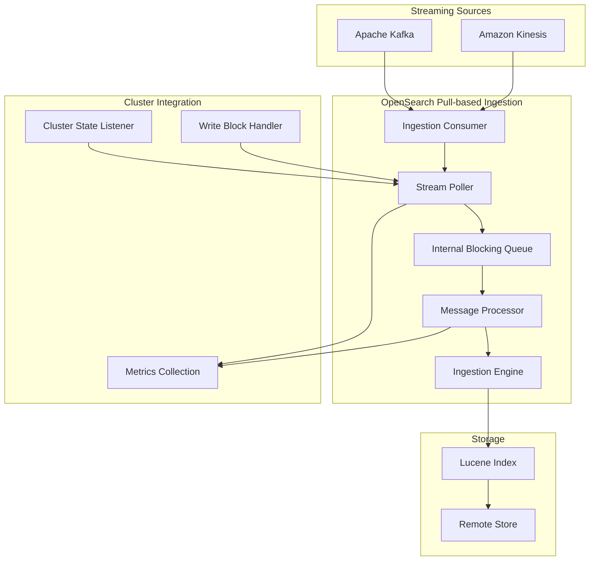
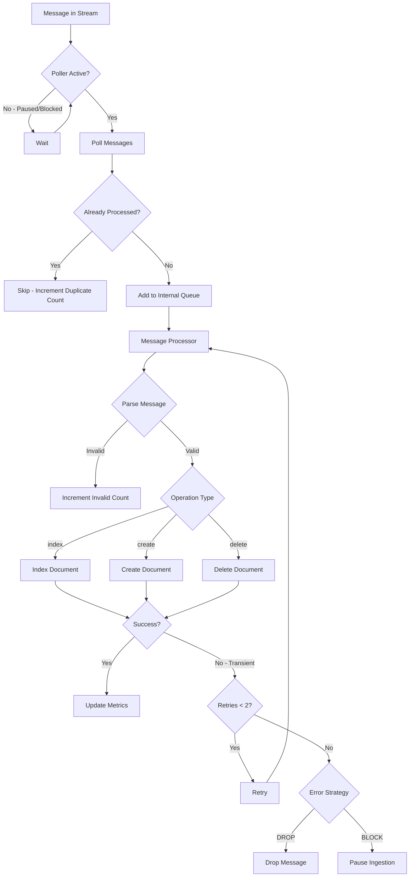

# Pull-based Ingestion

## Summary

Pull-based ingestion enables OpenSearch to ingest data from streaming sources such as Apache Kafka and Amazon Kinesis. Unlike traditional push-based ingestion where clients send data via REST APIs, pull-based ingestion allows OpenSearch to control data flow by retrieving data directly from streaming sources, providing exactly-once ingestion semantics and native backpressure handling.

## Details

### Architecture



### Data Flow



### Components

| Component | Description |
|-----------|-------------|
| `IngestionEngine` | Specialized engine for pull-based ingestion, manages stream poller lifecycle |
| `DefaultStreamPoller` | Polls messages from streaming source, handles pause/resume and write blocks |
| `MessageProcessorRunnable` | Processes messages from internal queue, handles retries and error strategies |
| `PartitionedBlockingQueueContainer` | Manages internal queues between poller and processor threads |
| `IngestionShardConsumer` | Interface for source-specific consumers (Kafka, Kinesis) |

### Configuration

| Setting | Description | Default |
|---------|-------------|---------|
| `ingestion_source.type` | Streaming source type (`kafka` or `kinesis`) | Required |
| `ingestion_source.pointer.init.reset` | Initial position (`earliest`, `latest`, `reset_by_offset`, `reset_by_timestamp`) | `earliest` |
| `ingestion_source.pointer.init.reset.value` | Value for offset/timestamp reset | Required for reset modes |
| `ingestion_source.error_strategy` | Error handling (`DROP` or `BLOCK`) | `DROP` |
| `ingestion_source.max_batch_size` | Maximum records per poll | 1000 |
| `ingestion_source.poll.timeout` | Poll timeout in milliseconds | 1000 |
| `ingestion_source.num_processor_threads` | Number of processor threads | 1 |
| `ingestion_source.internal_queue_size` | Internal queue size between poller and processor | 100 |
| `ingestion_source.param.*` | Source-specific parameters (topic, bootstrap_servers, etc.) | Varies |

### Usage Example

```json
PUT /my-index
{
  "settings": {
    "ingestion_source": {
      "type": "kafka",
      "pointer.init.reset": "earliest",
      "error_strategy": "drop",
      "internal_queue_size": 500,
      "param": {
        "topic": "my-topic",
        "bootstrap_servers": "localhost:9092"
      }
    },
    "index.number_of_shards": 3,
    "index.number_of_replicas": 1,
    "index.replication.type": "SEGMENT"
  }
}
```

### Message Format

```json
{
  "_id": "doc-1",
  "_version": "1",
  "_op_type": "index",
  "_source": {
    "field1": "value1",
    "field2": 123
  }
}
```

| Field | Required | Description |
|-------|----------|-------------|
| `_id` | No | Document ID (auto-generated if not provided) |
| `_version` | No | External version for conflict detection |
| `_op_type` | No | Operation type: `index`, `create`, or `delete` |
| `_source` | Yes | Document content |

### Management APIs

**Pause Ingestion**
```
POST /<index>/ingestion/_pause
```

**Resume Ingestion**
```
POST /<index>/ingestion/_resume
{
  "reset_settings": [
    {"shard": 0, "mode": "offset", "value": "100"}
  ]
}
```

**Get Ingestion State**
```
GET /<index>/ingestion/_state
```

### Metrics

| Metric | Description |
|--------|-------------|
| `total_polled_count` | Total messages polled from source |
| `total_processed_count` | Total messages successfully processed |
| `total_invalid_message_count` | Messages with invalid format |
| `total_version_conflicts_count` | Messages dropped due to version conflicts |
| `total_failed_count` | Total processing failures |
| `total_failures_dropped_count` | Failures dropped (with DROP strategy) |
| `total_consumer_error_count` | Consumer-level errors |
| `total_poller_message_failure_count` | Poller message failures |
| `total_poller_message_dropped_count` | Messages dropped by poller |
| `total_duplicate_message_skipped_count` | Duplicate messages skipped |
| `lag_in_millis` | Ingestion lag in milliseconds |

## Limitations

- Requires segment replication with remote-backed storage
- Cannot convert existing push-based indexes to pull-based
- Index shards must be >= stream partitions
- Traditional REST API ingestion disabled for pull-based indexes
- Consumer reset only works when ingestion is paused

## Related PRs

| Version | PR | Description |
|---------|-----|-------------|
| v3.3.0 | [#19316](https://github.com/opensearch-project/OpenSearch/pull/19316) | Support all-active mode in pull-based ingestion |
| v3.3.0 | [#19320](https://github.com/opensearch-project/OpenSearch/pull/19320) | Fix ingestion state XContent serialization and fail fast on parsing errors |
| v3.3.0 | [#19393](https://github.com/opensearch-project/OpenSearch/pull/19393) | Fix lag metric when streaming source is empty |
| v3.3.0 | [#19212](https://github.com/opensearch-project/OpenSearch/pull/19212) | Fix ingestion pause state initialization on replica promotion |
| v3.3.0 | [#19380](https://github.com/opensearch-project/OpenSearch/pull/19380) | Fix flaky test IngestFromKinesisIT.testAllActiveIngestion |
| v3.2.0 | [#18591](https://github.com/opensearch-project/OpenSearch/pull/18591) | File-based ingestion plugin (ingestion-fs) for local testing |
| v3.1.0 | [#17977](https://github.com/opensearch-project/OpenSearch/pull/17977) | Lag metrics for polling |
| v3.1.0 | [#18088](https://github.com/opensearch-project/OpenSearch/pull/18088) | Error metrics and configurable queue size |
| v3.1.0 | [#18250](https://github.com/opensearch-project/OpenSearch/pull/18250) | Transient failure retries and create mode |
| v3.1.0 | [#18280](https://github.com/opensearch-project/OpenSearch/pull/18280) | Cluster write block support |
| v3.1.0 | [#18332](https://github.com/opensearch-project/OpenSearch/pull/18332) | Consumer reset in Resume API |
| v3.0.0 | [#16927](https://github.com/opensearch-project/OpenSearch/issues/16927) | Initial pull-based ingestion implementation |

## References

- [Issue #19287](https://github.com/opensearch-project/OpenSearch/issues/19287): All-active mode feature request
- [Issue #19286](https://github.com/opensearch-project/OpenSearch/issues/19286): XContent serialization bug
- [Issue #17077](https://github.com/opensearch-project/OpenSearch/issues/17077): Metrics for pull-based ingestion
- [Issue #17442](https://github.com/opensearch-project/OpenSearch/issues/17442): Ingestion management APIs
- [Issue #18279](https://github.com/opensearch-project/OpenSearch/issues/18279): Cluster write block support
- [Issue #18590](https://github.com/opensearch-project/OpenSearch/issues/18590): File-based ingestion plugin request
- [Documentation](https://docs.opensearch.org/3.0/api-reference/document-apis/pull-based-ingestion/): Pull-based ingestion
- [Documentation](https://docs.opensearch.org/3.0/api-reference/document-apis/pull-based-ingestion-management/): Pull-based ingestion management

## Change History

- **v3.3.0**: Added all-active ingestion mode enabling replica shards to independently ingest from streaming sources. Fixed ingestion state XContent serialization for remote cluster state compatibility. Fixed lag metric calculation when streaming source is empty. Fixed pause state initialization during replica promotion. Added fail-fast behavior for mapper/parsing errors.
- **v3.2.0**: Added `ingestion-fs` plugin for file-based ingestion, enabling local testing without Kafka/Kinesis setup. Files follow `${base_directory}/${stream}/${shard_id}.ndjson` convention.
- **v3.1.0**: Added lag metrics, error metrics, configurable queue size, transient failure retries, create mode, cluster write block support, consumer reset in Resume API. Breaking change: renamed `REWIND_BY_OFFSET`/`REWIND_BY_TIMESTAMP` to `RESET_BY_OFFSET`/`RESET_BY_TIMESTAMP`.
- **v3.0.0**: Initial implementation with Kafka and Kinesis support, pause/resume APIs, basic metrics.
