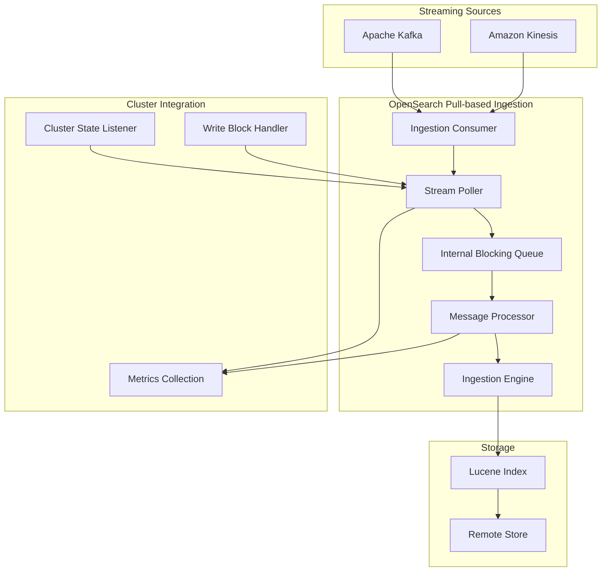
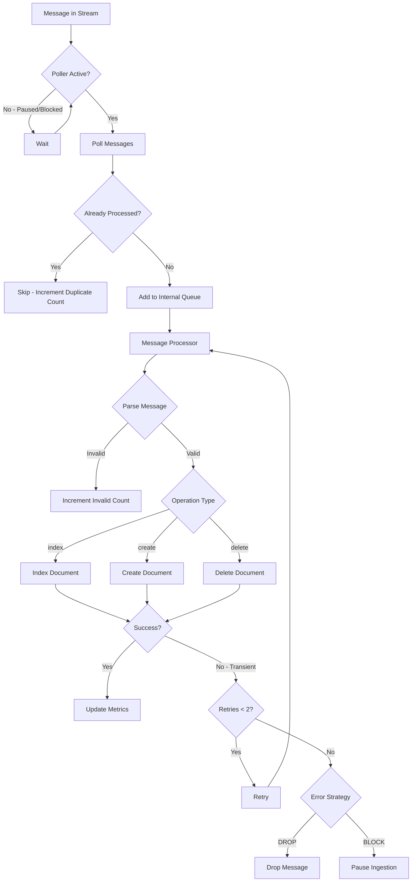

# Pull-based Ingestion

## Summary

Pull-based ingestion enables OpenSearch to ingest data from streaming sources such as Apache Kafka and Amazon Kinesis. Unlike traditional push-based ingestion where clients send data via REST APIs, pull-based ingestion allows OpenSearch to control data flow by retrieving data directly from streaming sources, providing exactly-once ingestion semantics and native backpressure handling.

## Details

### Architecture



### Data Flow



### Components

| Component | Description |
|-----------|-------------|
| `IngestionEngine` | Specialized engine for pull-based ingestion, manages stream poller lifecycle |
| `DefaultStreamPoller` | Polls messages from streaming source, handles pause/resume and write blocks |
| `MessageProcessorRunnable` | Processes messages from internal queue, handles retries and error strategies |
| `PartitionedBlockingQueueContainer` | Manages internal queues between poller and processor threads |
| `IngestionShardConsumer` | Interface for source-specific consumers (Kafka, Kinesis) |

### Configuration

| Setting | Description | Default | Dynamic |
|---------|-------------|---------|---------|
| `ingestion_source.type` | Streaming source type (`kafka` or `kinesis`) | Required | No |
| `ingestion_source.pointer.init.reset` | Initial position (`earliest`, `latest`, `reset_by_offset`, `reset_by_timestamp`) | `earliest` | No |
| `ingestion_source.pointer.init.reset.value` | Value for offset/timestamp reset | Required for reset modes | No |
| `ingestion_source.error_strategy` | Error handling (`DROP` or `BLOCK`) | `DROP` | No |
| `ingestion_source.max_batch_size` | Maximum records per poll | 1000 | No |
| `ingestion_source.poll.timeout` | Poll timeout in milliseconds | 1000 | No |
| `ingestion_source.num_processor_threads` | Number of processor threads | 1 | No |
| `ingestion_source.internal_queue_size` | Internal queue size between poller and processor | 100 | No |
| `ingestion_source.mapper_type` | Message mapper type (`default` or `raw_payload`) | `default` | No |
| `ingestion_source.pointer_based_lag_update_interval` | Interval for updating pointer-based lag metric | `10s` | No |
| `ingestion_source.param.*` | Source-specific parameters (topic, bootstrap_servers, etc.) | Varies | Yes |
| `index.periodic_flush_interval` | Interval for periodic flush | `10m` (pull-based) / `-1` (regular) | Yes |

### Usage Example

```json
PUT /my-index
{
  "settings": {
    "ingestion_source": {
      "type": "kafka",
      "pointer.init.reset": "earliest",
      "error_strategy": "drop",
      "internal_queue_size": 500,
      "mapper_type": "raw_payload",
      "pointer_based_lag_update_interval": "5s",
      "param": {
        "topic": "my-topic",
        "bootstrap_servers": "localhost:9092",
        "auto.offset.reset": "earliest"
      }
    },
    "index.periodic_flush_interval": "5m",
    "index.number_of_shards": 3,
    "index.number_of_replicas": 1,
    "index.replication.type": "SEGMENT"
  }
}
```

### Message Mappers

Pull-based ingestion supports pluggable message mappers that transform incoming messages to the internal format.

#### Default Mapper

Expects messages in the standard format with metadata fields:

```json
{
  "_id": "doc-1",
  "_version": "1",
  "_op_type": "index",
  "_source": {
    "field1": "value1",
    "field2": 123
  }
}
```

| Field | Required | Description |
|-------|----------|-------------|
| `_id` | No | Document ID (auto-generated if not provided) |
| `_version` | No | External version for conflict detection |
| `_op_type` | No | Operation type: `index`, `create`, or `delete` |
| `_source` | Yes | Document content |

#### Raw Payload Mapper

Uses the entire message payload as the document source. Document ID is generated from shard ID and stream pointer (e.g., `0-100` for shard 0, offset 100).

Input message:
```json
{"name": "alice", "age": 30}
```

Indexed document:
```json
{
  "_id": "0-100",
  "_source": {"name": "alice", "age": 30}
}
```

**Note**: Raw payload mapper does not support document versioning. Use for append-only workloads where eventual consistency is acceptable.

### Management APIs

**Pause Ingestion**
```
POST /<index>/ingestion/_pause
```

**Resume Ingestion**
```
POST /<index>/ingestion/_resume
{
  "reset_settings": [
    {"shard": 0, "mode": "offset", "value": "100"}
  ]
}
```

**Get Ingestion State**
```
GET /<index>/ingestion/_state
```

### Metrics

| Metric | Description |
|--------|-------------|
| `total_polled_count` | Total messages polled from source |
| `total_processed_count` | Total messages successfully processed |
| `total_invalid_message_count` | Messages with invalid format |
| `total_version_conflicts_count` | Messages dropped due to version conflicts |
| `total_failed_count` | Total processing failures |
| `total_failures_dropped_count` | Failures dropped (with DROP strategy) |
| `total_consumer_error_count` | Consumer-level errors |
| `total_poller_message_failure_count` | Poller message failures |
| `total_poller_message_dropped_count` | Messages dropped by poller |
| `total_duplicate_message_skipped_count` | Duplicate messages skipped (deprecated in v3.4.0) |
| `lag_in_millis` | Ingestion lag in milliseconds |
| `pointer_based_lag` | Offset difference between latest available and current position (Kafka only, v3.4.0+) |
| `periodic_flush_count` | Number of periodic flushes executed (v3.4.0+) |

### Dynamic Configuration Updates

Starting in v3.4.0, `ingestion_source.param.*` settings can be updated dynamically without recreating the index:

```json
PUT /my-index/_settings
{
  "ingestion_source.param.auto.offset.reset": "latest",
  "ingestion_source.param.max.poll.records": "200"
}
```

When settings are updated:
1. Consumer is marked for reinitialization
2. Blocking queues are cleared
3. New consumer is created with updated configuration
4. Consumer restarts from the latest committed `batchStartPointer`

**Note**: Consumer reinitialization may cause brief message reprocessing from the last committed offset.

## Limitations

- Requires segment replication with remote-backed storage
- Cannot convert existing push-based indexes to pull-based
- Index shards must be >= stream partitions
- Traditional REST API ingestion disabled for pull-based indexes
- Consumer reset only works when ingestion is paused
- Provides at-least-once processing guarantees (use versioning for exactly-once semantics)

## Change History

- **v3.4.0**: Added offset-based consumer lag metric for Kafka with configurable update interval (`pointer_based_lag_update_interval`). Added time-based periodic flush support with `index.periodic_flush_interval` setting (defaults to 10 minutes for pull-based indexes). Added message mapper framework with `raw_payload` mapper for ingesting raw JSON payloads using stream pointer as document ID. Made `ingestion_source.param.*` settings dynamic, enabling consumer configuration updates without index recreation. Fixed out-of-bounds offset handling by setting Kafka `auto.offset.reset` to `none` by default. Removed persisted pointers concept to fix correctness issues during consumer rewind. Deprecated `totalDuplicateMessageSkippedCount` metric.
- **v3.3.0**: Added all-active ingestion mode enabling replica shards to independently ingest from streaming sources. Fixed ingestion state XContent serialization for remote cluster state compatibility. Fixed lag metric calculation when streaming source is empty. Fixed pause state initialization during replica promotion. Added fail-fast behavior for mapper/parsing errors.
- **v3.2.0**: Added `ingestion-fs` plugin for file-based ingestion, enabling local testing without Kafka/Kinesis setup. Files follow `${base_directory}/${stream}/${shard_id}.ndjson` convention.
- **v3.1.0**: Added lag metrics, error metrics, configurable queue size, transient failure retries, create mode, cluster write block support, consumer reset in Resume API. Breaking change: renamed `REWIND_BY_OFFSET`/`REWIND_BY_TIMESTAMP` to `RESET_BY_OFFSET`/`RESET_BY_TIMESTAMP`.
- **v3.0.0**: Initial experimental implementation with core ingestion engine, Kafka plugin (`ingestion-kafka`), and Kinesis plugin (`ingestion-kinesis`). Added offset management with rewind by offset/timestamp support. Introduced error handling strategies (DROP and BLOCK). Added ingestion management APIs (pause, resume, get state). Implemented update and delete operations with auto-generated IDs for upserts. Added external versioning support for handling out-of-order updates from streaming sources. Introduced multi-threaded writer support with configurable `num_processor_threads`. Added configurable `maxPollSize` and `pollTimeout` settings. Disabled traditional REST API indexing for pull-based indexes.

## References

### Documentation
- [Documentation](https://docs.opensearch.org/3.0/api-reference/document-apis/pull-based-ingestion/): Pull-based ingestion
- [Documentation](https://docs.opensearch.org/3.0/api-reference/document-apis/pull-based-ingestion-management/): Pull-based ingestion management

### Pull Requests
| Version | PR | Description | Related Issue |
|---------|-----|-------------|---------------|
| v3.4.0 | [#19635](https://github.com/opensearch-project/OpenSearch/pull/19635) | Add Kafka offset based consumer lag |   |
| v3.4.0 | [#19878](https://github.com/opensearch-project/OpenSearch/pull/19878) | Add time based periodic flush support | [#19860](https://github.com/opensearch-project/OpenSearch/issues/19860) |
| v3.4.0 | [#19765](https://github.com/opensearch-project/OpenSearch/pull/19765) | Support message mappers and raw payloads | [#19548](https://github.com/opensearch-project/OpenSearch/issues/19548) |
| v3.4.0 | [#19963](https://github.com/opensearch-project/OpenSearch/pull/19963) | Update ingestion stream params to be dynamic |   |
| v3.4.0 | [#19607](https://github.com/opensearch-project/OpenSearch/pull/19607) | Fix out-of-bounds offset scenarios and remove persisted offsets | [#19591](https://github.com/opensearch-project/OpenSearch/issues/19591) |
| v3.4.0 | [#19757](https://github.com/opensearch-project/OpenSearch/pull/19757) | Fix file-based ingestion consumer start point handling | [#19723](https://github.com/opensearch-project/OpenSearch/issues/19723) |
| v3.3.0 | [#19316](https://github.com/opensearch-project/OpenSearch/pull/19316) | Support all-active mode in pull-based ingestion | [#19287](https://github.com/opensearch-project/OpenSearch/issues/19287) |
| v3.3.0 | [#19320](https://github.com/opensearch-project/OpenSearch/pull/19320) | Fix ingestion state XContent serialization and fail fast on parsing errors | [#19286](https://github.com/opensearch-project/OpenSearch/issues/19286) |
| v3.3.0 | [#19393](https://github.com/opensearch-project/OpenSearch/pull/19393) | Fix lag metric when streaming source is empty |   |
| v3.3.0 | [#19212](https://github.com/opensearch-project/OpenSearch/pull/19212) | Fix ingestion pause state initialization on replica promotion | [#17693](https://github.com/opensearch-project/OpenSearch/issues/17693) |
| v3.3.0 | [#19380](https://github.com/opensearch-project/OpenSearch/pull/19380) | Fix flaky test IngestFromKinesisIT.testAllActiveIngestion | [#17678](https://github.com/opensearch-project/OpenSearch/issues/17678) |
| v3.2.0 | [#18591](https://github.com/opensearch-project/OpenSearch/pull/18591) | File-based ingestion plugin (ingestion-fs) for local testing | [#18590](https://github.com/opensearch-project/OpenSearch/issues/18590) |
| v3.1.0 | [#17977](https://github.com/opensearch-project/OpenSearch/pull/17977) | Lag metrics for polling |   |
| v3.1.0 | [#18088](https://github.com/opensearch-project/OpenSearch/pull/18088) | Error metrics and configurable queue size |   |
| v3.1.0 | [#18250](https://github.com/opensearch-project/OpenSearch/pull/18250) | Transient failure retries and create mode |   |
| v3.1.0 | [#18280](https://github.com/opensearch-project/OpenSearch/pull/18280) | Cluster write block support | [#18279](https://github.com/opensearch-project/OpenSearch/issues/18279) |
| v3.1.0 | [#18332](https://github.com/opensearch-project/OpenSearch/pull/18332) | Consumer reset in Resume API | [#17442](https://github.com/opensearch-project/OpenSearch/issues/17442) |
| v3.0.0 | [#16958](https://github.com/opensearch-project/OpenSearch/pull/16958) | Core pull-based ingestion engine, APIs, and Kafka plugin | [#16927](https://github.com/opensearch-project/OpenSearch/issues/16927) |
| v3.0.0 | [#17354](https://github.com/opensearch-project/OpenSearch/pull/17354) | Offset management with rewind by offset/timestamp support | [#17318](https://github.com/opensearch-project/OpenSearch/issues/17318) |
| v3.0.0 | [#17427](https://github.com/opensearch-project/OpenSearch/pull/17427) | Error handling strategies (DROP and BLOCK) | [#17085](https://github.com/opensearch-project/OpenSearch/issues/17085) |
| v3.0.0 | [#17615](https://github.com/opensearch-project/OpenSearch/pull/17615) | Kinesis plugin support |   |
| v3.0.0 | [#17631](https://github.com/opensearch-project/OpenSearch/pull/17631) | Ingestion management APIs (pause, resume, get state) |   |
| v3.0.0 | [#17768](https://github.com/opensearch-project/OpenSearch/pull/17768) | Disable index API for ingestion engine |   |
| v3.0.0 | [#17822](https://github.com/opensearch-project/OpenSearch/pull/17822) | Update and delete support with auto-generated IDs |   |
| v3.0.0 | [#17863](https://github.com/opensearch-project/OpenSearch/pull/17863) | Configurable maxPollSize and pollTimeout |   |
| v3.0.0 | [#17918](https://github.com/opensearch-project/OpenSearch/pull/17918) | External versioning support for out-of-order updates | [#17913](https://github.com/opensearch-project/OpenSearch/issues/17913) |
| v3.0.0 | [#17912](https://github.com/opensearch-project/OpenSearch/pull/17912) | Multi-threaded writer support with configurable processor threads | [#17875](https://github.com/opensearch-project/OpenSearch/issues/17875) |

### Issues (Design / RFC)
- [Issue #16495](https://github.com/opensearch-project/OpenSearch/issues/16495): RFC - Streaming ingestion (pull based)
- [Issue #16929](https://github.com/opensearch-project/OpenSearch/issues/16929): Pull-based ingestion tracking issue
- [Issue #19591](https://github.com/opensearch-project/OpenSearch/issues/19591): Duplicate/old message skipping bug
- [Issue #19723](https://github.com/opensearch-project/OpenSearch/issues/19723): File-based ingestion flaky test
- [Issue #19287](https://github.com/opensearch-project/OpenSearch/issues/19287): All-active mode feature request
- [Issue #19286](https://github.com/opensearch-project/OpenSearch/issues/19286): XContent serialization bug
- [Issue #17077](https://github.com/opensearch-project/OpenSearch/issues/17077): Metrics for pull-based ingestion
- [Issue #17442](https://github.com/opensearch-project/OpenSearch/issues/17442): Ingestion management APIs
- [Issue #18279](https://github.com/opensearch-project/OpenSearch/issues/18279): Cluster write block support
- [Issue #18590](https://github.com/opensearch-project/OpenSearch/issues/18590): File-based ingestion plugin request
