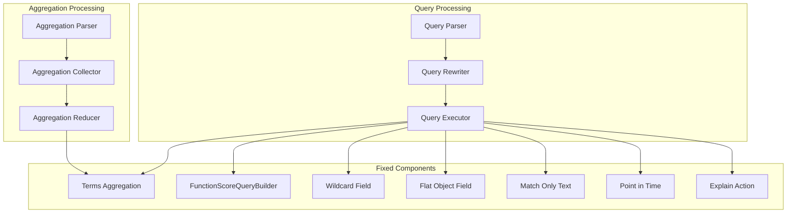

# Query & Aggregation Fixes

## Summary

This document tracks bug fixes related to OpenSearch query and aggregation functionality. These fixes address various issues including terms aggregation missing buckets, explain action failures, FunctionScoreQueryBuilder inner query processing, wildcard field queries, flat_object exists queries, match_only_text highlighting, and PIT creation exceptions.

## Details

### Architecture



### Components

| Component | Description | Fix Version |
|-----------|-------------|-------------|
| Terms Aggregation | Bucket aggregation for unique field values | v3.0.0 |
| FunctionScoreQueryBuilder | Query wrapper for custom scoring | v3.0.0 |
| Wildcard Field Type | Field type for efficient wildcard queries | v3.0.0 |
| Flat Object Field | Field type for JSON objects | v3.0.0 |
| Match Only Text | Space-efficient text field type | v3.0.0 |
| Point in Time (PIT) | Search context preservation | v3.0.0 |
| Explain Action | Query explanation API | v3.0.0 |

### Fixed Issues

#### Terms Aggregation Missing Bucket

The `missing` parameter in terms aggregation now correctly creates a bucket for documents without the specified field.

```json
{
  "aggs": {
    "field_values": {
      "terms": {
        "field": "nickname",
        "missing": "no_value"
      }
    }
  }
}
```

#### FunctionScoreQueryBuilder Inner Query Visit

The `visit` method is now implemented to properly process subqueries, enabling features like `default_model_id` in neural query enricher pipelines.

#### Wildcard Field Query Fixes

- Case insensitive regexp queries return expected results
- Escaped characters handled correctly
- Null pointer exception on plain text regex resolved
- Term queries with special characters perform exact match

#### Flat Object Exists Query

Exists queries on parent objects containing flat_object subfields no longer throw `string_index_out_of_bounds_exception`.

#### Match Only Text Highlighting

Highlighting is now supported for `match_only_text` field type using the plain highlighter.

#### PIT Creation Exception

`SearchRequestStats` now gracefully handles search phases not tracked by the stats system, preventing `IllegalArgumentException` during PIT creation.

#### Explain Action Query Rewrite

Query rewrite is now performed on the coordinator in `TransportExplainAction`, resolving async action conflicts.

### Usage Examples

**Terms aggregation with missing value:**
```json
POST /index/_search
{
  "size": 0,
  "aggs": {
    "field_values": {
      "terms": {
        "field": "nickname",
        "missing": "no_nickname",
        "size": 10
      }
    }
  }
}
```

**Wildcard field with case insensitive regexp:**
```json
POST /index/_search
{
  "query": {
    "regexp": {
      "wildcard_field": {
        "value": "pattern.*",
        "case_insensitive": true
      }
    }
  }
}
```

**Exists query on flat_object parent:**
```json
POST /index/_search
{
  "query": {
    "exists": {
      "field": "parent_object"
    }
  }
}
```

**Match only text with highlighting:**
```json
POST /index/_search
{
  "query": {
    "match": {
      "content": "search term"
    }
  },
  "highlight": {
    "fields": {
      "content": {}
    }
  }
}
```

## Limitations

- Wildcard field type has different performance characteristics than keyword for exact match queries
- Match_only_text highlighting uses plain highlighter since positions are not stored
- Some edge cases in wildcard field regexp queries may still have issues (see Issue #16755)

## Related PRs

| Version | PR | Description |
|---------|-----|-------------|
| v3.0.0 | [#17418](https://github.com/opensearch-project/OpenSearch/pull/17418) | Fix missing bucket in terms aggregation with missing value |
| v3.0.0 | [#17286](https://github.com/opensearch-project/OpenSearch/pull/17286) | Fix explain action on query rewrite |
| v3.0.0 | [#16776](https://github.com/opensearch-project/OpenSearch/pull/16776) | Fix visit of inner query for FunctionScoreQueryBuilder |
| v3.0.0 | [#16827](https://github.com/opensearch-project/OpenSearch/pull/16827) | Fix case insensitive and escaped query on wildcard |
| v3.0.0 | [#16803](https://github.com/opensearch-project/OpenSearch/pull/16803) | Fix exists queries on nested flat_object fields |
| v3.0.0 | [#17101](https://github.com/opensearch-project/OpenSearch/pull/17101) | Add highlighting for match_only_text field |
| v3.0.0 | [#16781](https://github.com/opensearch-project/OpenSearch/pull/16781) | Fix illegal argument exception when creating a PIT |

## References

- [Issue #17391](https://github.com/opensearch-project/OpenSearch/issues/17391): Missing bucket in terms aggregation
- [Issue #16795](https://github.com/opensearch-project/OpenSearch/issues/16795): Exists queries on nested flat_object fields
- [Issue #16754](https://github.com/opensearch-project/OpenSearch/issues/16754): Term query on wildcard field
- [Issue #16755](https://github.com/opensearch-project/OpenSearch/issues/16755): Case insensitive regexp on wildcard field
- [Issue #16750](https://github.com/opensearch-project/OpenSearch/issues/16750): PIT creation exception
- [Issue #15403](https://github.com/opensearch-project/OpenSearch/issues/15403): FunctionScoreQueryBuilder default_model_id
- [Terms Aggregation Documentation](https://docs.opensearch.org/3.0/aggregations/bucket/terms/)
- [Wildcard Field Type Documentation](https://docs.opensearch.org/3.0/field-types/supported-field-types/wildcard/)

## Change History

- **v3.0.0** (2025): Fixed terms aggregation missing bucket, explain action query rewrite, FunctionScoreQueryBuilder inner query visit, wildcard field queries, flat_object exists queries, match_only_text highlighting, and PIT creation exception
