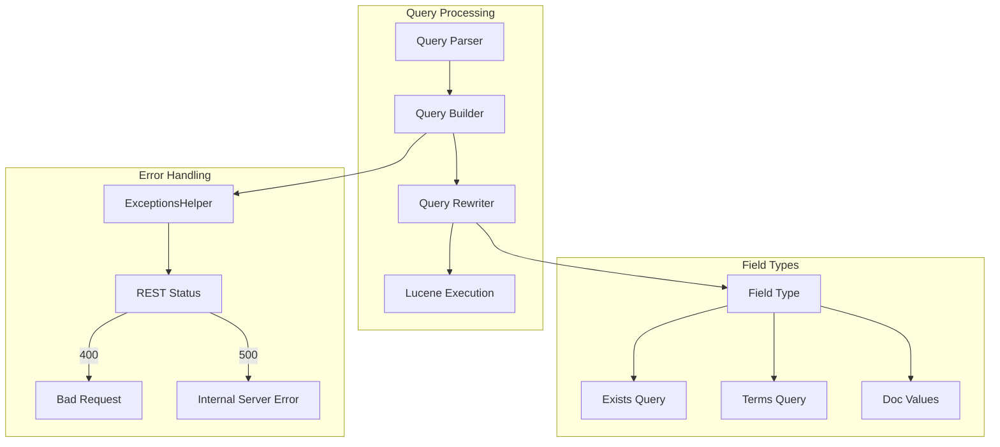

# Query Bug Fixes

## Summary

This feature tracks bug fixes and improvements to OpenSearch query handling, including exists queries, error responses, field validation, and field type support. These fixes improve query reliability, provide better error messages, and extend functionality for specific field types.

## Details

### Architecture



### Components

| Component | Description |
|-----------|-------------|
| ExistsQueryBuilder | Builds exists queries for fields, handles object fields with subfields |
| QueryStringQueryBuilder | Parses query string syntax with field validation |
| IpFieldMapper | Handles IP field indexing and querying including CIDR notation |
| ExceptionsHelper | Maps exceptions to appropriate HTTP status codes |
| MatrixStatsAggregator | Computes matrix statistics across multiple fields |

### Configuration

No specific configuration required. These are core query processing improvements.

### Usage Example

```json
// Exists query on object field with derived subfields
PUT test
{
  "mappings": {
    "properties": {
      "log": {
        "properties": {
          "request": { "type": "text" }
        }
      }
    },
    "derived": {
      "log.timestamp": {
        "type": "date",
        "script": { "source": "emit(params._source.log.request)" }
      }
    }
  }
}

POST test/_search
{
  "query": {
    "exists": { "field": "log" }
  }
}

// IP terms query with many CIDR ranges
POST test/_search
{
  "query": {
    "terms": {
      "client_ip": [
        "192.168.0.0/16",
        "10.0.0.0/8",
        "172.16.0.0/12"
      ]
    }
  }
}
```

## Limitations

- Derived fields do not support exists queries; they are silently skipped when querying parent object fields
- The IP field enhancement requires Lucene 10.2+ for `DocValuesMultiRangeQuery` support

## Related PRs

| Version | PR | Description |
|---------|-----|-------------|
| v3.1.0 | [#17843](https://github.com/opensearch-project/OpenSearch/pull/17843) | Fix object field exists query |
| v3.1.0 | [#18161](https://github.com/opensearch-project/OpenSearch/pull/18161) | Use Bad Request status for InputCoercionException |
| v3.1.0 | [#18194](https://github.com/opensearch-project/OpenSearch/pull/18194) | Null check field names in QueryStringQueryBuilder |
| v3.1.0 | [#18357](https://github.com/opensearch-project/OpenSearch/pull/18357) | DocValues-only IP field supports terms_query with >1025 IP masks |
| v3.1.0 | [#18242](https://github.com/opensearch-project/OpenSearch/pull/18242) | Fix MatrixStatsAggregator reuse when mode parameter changes |

## References

- [Issue #17808](https://github.com/opensearch-project/OpenSearch/issues/17808): Object Field exists query returns wrong result
- [Issue #18131](https://github.com/opensearch-project/OpenSearch/issues/18131): XContent parsing exceptions return 500 status
- [Issue #17394](https://github.com/opensearch-project/OpenSearch/issues/17394): Unlimit IP/masks terms query for doc_values only fields
- [Query string documentation](https://docs.opensearch.org/3.0/query-dsl/full-text/query-string/)

## Change History

- **v3.1.0** (2026-01-10): Initial implementation with five bug fixes for query handling
