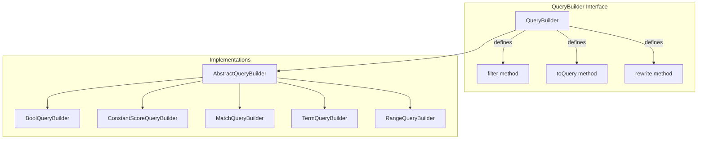
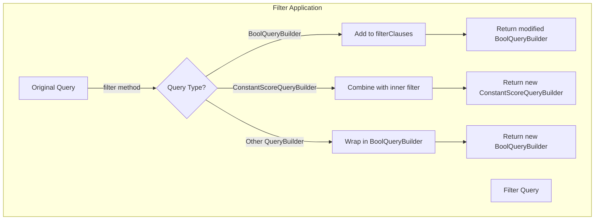

---
tags:
  - search
---

# Query Builders

## Summary

The Query Builders feature provides a fluent Java API for constructing OpenSearch queries programmatically. In OpenSearch 3.0.0, a new `filter()` method was added to the `QueryBuilder` interface, enabling developers to combine filters with any query builder in a chainable manner without manually wrapping queries in `BoolQueryBuilder`.

## Details

### Architecture



### Data Flow



### Components

| Component | Description |
|-----------|-------------|
| `QueryBuilder` | Interface defining the contract for all query builders |
| `AbstractQueryBuilder` | Base class providing common functionality including default `filter()` implementation |
| `BoolQueryBuilder` | Compound query builder with `must`, `should`, `must_not`, and `filter` clauses |
| `ConstantScoreQueryBuilder` | Wraps a filter query and assigns a constant score |

### API Methods

| Method | Class | Description |
|--------|-------|-------------|
| `filter(QueryBuilder filter)` | `QueryBuilder` | Combines a filter with the query builder |
| `validateFilterParams(QueryBuilder filter)` | `AbstractQueryBuilder` | Static method to validate filter parameters |
| `must(QueryBuilder query)` | `BoolQueryBuilder` | Adds a must clause |
| `should(QueryBuilder query)` | `BoolQueryBuilder` | Adds a should clause |
| `mustNot(QueryBuilder query)` | `BoolQueryBuilder` | Adds a must_not clause |

### Usage Examples

#### Basic Filter Application

```java
// Apply a filter to any query builder
QueryBuilder query = QueryBuilders.matchQuery("content", "opensearch")
    .filter(QueryBuilders.termQuery("status", "active"));

// Result: BoolQueryBuilder with must(matchQuery) + filter(termQuery)
```

#### Chaining Multiple Filters with BoolQueryBuilder

```java
BoolQueryBuilder query = new BoolQueryBuilder()
    .must(QueryBuilders.matchQuery("title", "search"))
    .filter(QueryBuilders.termQuery("category", "tech"))
    .filter(QueryBuilders.rangeQuery("date").gte("2024-01-01"))
    .filter(QueryBuilders.termQuery("published", true));
```

#### ConstantScoreQueryBuilder with Filter

```java
ConstantScoreQueryBuilder query = new ConstantScoreQueryBuilder(
    QueryBuilders.termQuery("type", "article")
).filter(QueryBuilders.termQuery("featured", true));
```

#### Null Filter Handling

```java
// Null filters are safely ignored
QueryBuilder query = QueryBuilders.matchQuery("field", "value")
    .filter(null);  // Returns original query unchanged
```

## Limitations

- `SpanGapQueryBuilder` does not support the `filter()` method and throws `UnsupportedOperationException`
- When `filter()` is called on non-Bool query builders, a new `BoolQueryBuilder` is created, which may affect object identity comparisons
- Filter context queries do not contribute to relevance scoring

## Change History

- **v3.0.0** (2025-03-03): Added `filter()` method to `QueryBuilder` interface with implementations in `AbstractQueryBuilder`, `BoolQueryBuilder`, and `ConstantScoreQueryBuilder`

## Related Features
- [OpenSearch Dashboards](../opensearch-dashboards/ai-chat.md)

## References

### Documentation
- [Query and filter context](https://docs.opensearch.org/3.0/query-dsl/query-filter-context/): Understanding query vs filter context
- [Boolean query](https://docs.opensearch.org/3.0/query-dsl/compound/bool/): Boolean query documentation
- [Constant score query](https://docs.opensearch.org/3.0/query-dsl/compound/constant-score/): Constant score query documentation

### Pull Requests
| Version | PR | Description | Related Issue |
|---------|-----|-------------|---------------|
| v3.0.0 | [#17409](https://github.com/opensearch-project/OpenSearch/pull/17409) | Add filter function for AbstractQueryBuilder, BoolQueryBuilder, ConstantScoreQueryBuilder | [#17409](https://github.com/opensearch-project/OpenSearch/issues/17409) |
