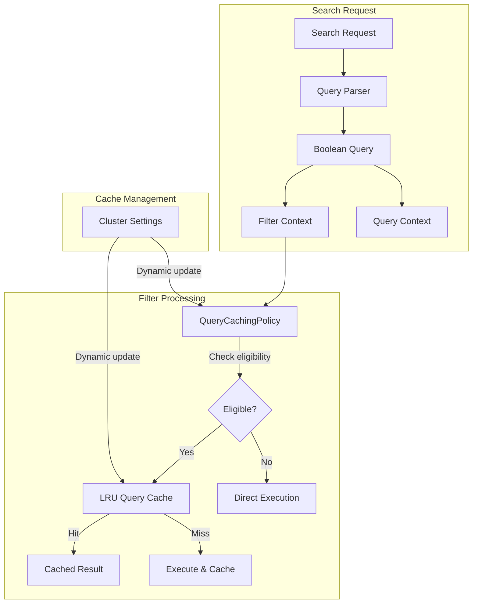
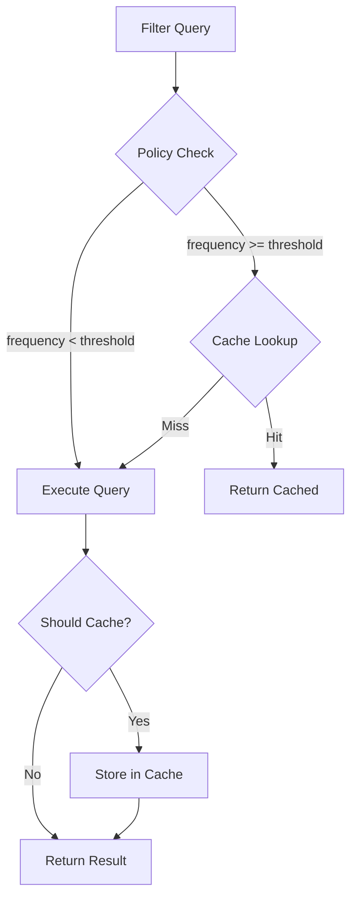

# Query Cache

## Summary

The Query Cache (also known as the filter cache) is a node-level cache that stores the results of filter queries to improve search performance. When a filter query is executed multiple times, OpenSearch can return cached results instead of re-evaluating the filter, significantly reducing query latency for repeated searches.

## Details

### Architecture



### Data Flow



### Components

| Component | Description |
|-----------|-------------|
| `IndicesQueryCache` | Node-level LRU cache implementation that stores query results |
| `OpenseachUsageTrackingQueryCachingPolicy` | Custom caching policy with configurable frequency thresholds |
| `LRUQueryCache` | Lucene's underlying cache implementation with configurable skip factor |

### Configuration

| Setting | Description | Default | Dynamic |
|---------|-------------|---------|---------|
| `indices.queries.cache.size` | Cache size as percentage of heap | `10%` | No |
| `indices.queries.cache.count` | Maximum number of cached queries | `10000` | No |
| `indices.queries.cache.all_segments` | Cache all segments regardless of size | `false` | No |
| `indices.queries.cache.skip_cache_factor` | Skip cache factor for segment size ratio | `10` | Yes |
| `indices.queries.cache.min_frequency` | Minimum query frequency before caching | `5` | Yes |
| `indices.queries.cache.costly_min_frequency` | Minimum frequency for costly queries | `2` | Yes |

### Usage Example

```json
// Check query cache statistics
GET _nodes/stats/indices/query_cache

// Clear query cache
POST _cache/clear?query=true

// Configure dynamic settings
PUT _cluster/settings
{
  "persistent": {
    "indices.queries.cache.skip_cache_factor": 15,
    "indices.queries.cache.min_frequency": 3,
    "indices.queries.cache.costly_min_frequency": 1
  }
}
```

### Query Eligibility

Queries are eligible for caching when:
1. They are in filter context (not query context)
2. The segment has at least 10,000 documents
3. The query has been seen at least `min_frequency` times (or `costly_min_frequency` for costly queries)
4. The segment size ratio passes the skip cache factor check

Costly queries include:
- `MultiTermQuery` (wildcard, prefix, regexp)
- Point queries (range queries on numeric fields)
- `MultiTermQueryConstantScoreWrapper` variants

## Limitations

- Only filter context queries are cached; query context queries are not cached
- Segments with fewer than 10,000 documents are never cached
- Cache is invalidated on index refresh (document updates/deletes)
- Node-level cache; not shared across nodes in a cluster
- Dynamic settings are cluster-wide; per-index configuration not supported

## Change History

- **v3.3.0** (2025-08-21): Added dynamic cluster settings for `skip_cache_factor`, `min_frequency`, and `costly_min_frequency`

## References

### Documentation
- [Query and filter context](https://docs.opensearch.org/3.0/query-dsl/query-filter-context/): OpenSearch documentation
- [Lucene PR #14412](https://github.com/apache/lucene/pull/14412): Upstream Lucene change for dynamic skip cache factor

### Pull Requests
| Version | PR | Description |
|---------|-----|-------------|
| v3.3.0 | [#18351](https://github.com/opensearch-project/OpenSearch/pull/18351) | Add dynamic settings for skip_cache_factor and min_frequency |

### Issues (Design / RFC)
- [Issue #17736](https://github.com/opensearch-project/OpenSearch/issues/17736): Feature request for dynamic query cache settings
