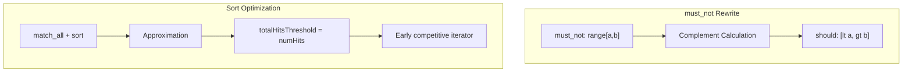

---
tags:
  - performance
  - search
---

# Query Optimization

## Summary

Query Optimization in OpenSearch provides automatic query rewrites that improve search performance without requiring user intervention. These optimizations transform slow query patterns into equivalent but faster alternatives, particularly for Boolean queries with `must_not` clauses and sorted queries using approximation.

## Details

### Architecture

```mermaid
flowchart TB
    subgraph "Query Processing Pipeline"
        A[User Query] --> B[QueryBuilder]
        B --> C{Query Rewrite Phase}
        C --> D[BoolQueryBuilder.doRewrite]
        D --> E{Has must_not Range?}
        E -->|Yes| F[rewriteMustNotRangeClausesToShould]
        E -->|No| G[Continue]
        F --> H[RangeQueryBuilder.getComplement]
        H --> I[Create nested should clauses]
        I --> G
        G --> J[Lucene Query]
        J --> K[Query Execution]
    end
    
    subgraph "Sort Optimization"
        L[match_all + sort] --> M[ApproximateScoreQuery]
        M --> N[TopDocsCollectorContext]
        N --> O{shortcutTotalHitCount}
        O --> P[Extract original query]
        P --> Q[Use optimal threshold]
    end
```



### Data Flow



### Components

| Component | Description |
|-----------|-------------|
| `BoolQueryBuilder` | Extended with `rewriteMustNotRangeClausesToShould()` method for automatic query transformation |
| `RangeQueryBuilder` | Added `getComplement()` method to generate complement range queries |
| `ApproximateScoreQuery` | Enhanced with `createWeight()` for proper weight delegation |
| `ApproximatePointRangeQuery` | Modified size calculation for optimal threshold handling |
| `TopDocsCollectorContext` | Updated `shortcutTotalHitCount()` to handle `ApproximateScoreQuery` |

### Configuration

No configuration is required. These optimizations are applied automatically during query processing.

### Usage Example

**Automatic must_not Range Optimization:**

```json
// User sends this query
POST /my-index/_search
{
  "query": {
    "bool": {
      "must_not": [
        {
          "range": {
            "timestamp": {
              "gte": "2024-01-01",
              "lte": "2024-06-30"
            }
          }
        }
      ]
    }
  }
}

// OpenSearch internally rewrites to:
{
  "query": {
    "bool": {
      "must": {
        "bool": {
          "should": [
            {"range": {"timestamp": {"lt": "2024-01-01"}}},
            {"range": {"timestamp": {"gt": "2024-06-30"}}}
          ],
          "minimum_should_match": 1
        }
      }
    }
  }
}
```

**Sort Query Optimization:**

```json
// Sorted match_all query benefits from optimization
POST /my-index/_search
{
  "query": {
    "match_all": {}
  },
  "sort": [
    {"timestamp": "desc"}
  ],
  "size": 10
}
```

## Limitations

- **must_not Range Rewrite:**
  - Only applies when all documents have exactly one value for the field
  - Only one range query per field in `must_not` clause is supported
  - Does not apply to non-INTERSECTS shape relations
  - Requires access to LeafReaderContexts during rewrite phase

- **Sort Optimization:**
  - Only applies to approximated `match_all` queries
  - Requires sorting on indexed numeric fields

## Change History

- **v3.1.0** (2025): Initial implementation with must_not range rewrite and sort-query optimization

## References

### Documentation
- [Boolean Query Documentation](https://docs.opensearch.org/3.0/query-dsl/compound/bool/): Official Boolean query documentation
- [Range Query Documentation](https://docs.opensearch.org/3.0/query-dsl/term/range/): Official Range query documentation

### Pull Requests
| Version | PR | Description | Related Issue |
|---------|-----|-------------|---------------|
| v3.1.0 | [#18189](https://github.com/opensearch-project/OpenSearch/pull/18189) | Improve sort-query performance for approximated match_all queries | [#18206](https://github.com/opensearch-project/OpenSearch/issues/18206) |
| v3.1.0 | [#17655](https://github.com/opensearch-project/OpenSearch/pull/17655) | Add BooleanQuery rewrite for must_not RangeQuery clauses | [#17586](https://github.com/opensearch-project/OpenSearch/issues/17586) |

### Issues (Design / RFC)
- [Issue #18206](https://github.com/opensearch-project/OpenSearch/issues/18206): Improve performance for approximated `match_all` sort queries
- [Issue #17586](https://github.com/opensearch-project/OpenSearch/issues/17586): Feature Request - Rewrites for BooleanQuery
