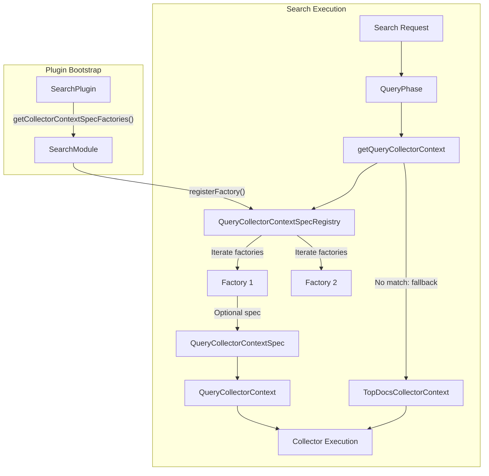
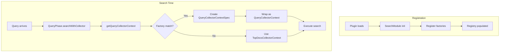

# Query Phase Plugin Extension

## Summary

The Query Phase Plugin Extension provides an extensibility mechanism for OpenSearch plugins to inject custom `QueryCollectorContext` implementations during the Query Phase of search execution. This enables plugins to provide optimized collector implementations for custom query types, improving search performance by allowing collectors to be injected at the optimal point in the search lifecycle rather than through workarounds.

## Details

### Architecture



### Data Flow



### Components

| Component | Description |
|-----------|-------------|
| `QueryCollectorContextSpec` | Interface for defining custom collector behavior: creation, manager creation, and post-processing |
| `QueryCollectorContextSpecFactory` | Factory interface that creates specs based on search context, query, and arguments |
| `QueryCollectorContextSpecRegistry` | Static registry holding all registered factories, resolves specs at search time |
| `QueryCollectorArguments` | Immutable arguments passed to factory (e.g., `hasFilterCollector` flag) |
| `SearchPlugin.getCollectorContextSpecFactories()` | Extension point for plugins to register their factories |

### Configuration

This feature does not require any configuration. Plugins automatically register their factories during cluster bootstrap through the `SearchPlugin` interface.

### Usage Example

#### Implementing a Custom Collector Context Spec

```java
// Step 1: Implement QueryCollectorContextSpec
public class CustomQueryCollectorContextSpec implements QueryCollectorContextSpec {
    
    private final SearchContext searchContext;
    
    public CustomQueryCollectorContextSpec(SearchContext searchContext) {
        this.searchContext = searchContext;
    }
    
    @Override
    public String getContextName() {
        return "custom_query_collector";
    }
    
    @Override
    public Collector create(Collector in) throws IOException {
        // Wrap or replace the incoming collector
        return new CustomCollector(in, searchContext);
    }
    
    @Override
    public CollectorManager<?, ReduceableSearchResult> createManager(
            CollectorManager<?, ReduceableSearchResult> in) throws IOException {
        // Create custom collector manager for concurrent search
        return new CustomCollectorManager(in, searchContext);
    }
    
    @Override
    public void postProcess(QuerySearchResult result) throws IOException {
        // Perform any post-processing on query results
        // e.g., score normalization, result merging
    }
}
```

#### Implementing a Factory

```java
// Step 2: Implement QueryCollectorContextSpecFactory
public class CustomQueryCollectorContextSpecFactory 
        implements QueryCollectorContextSpecFactory {
    
    @Override
    public Optional<QueryCollectorContextSpec> createQueryCollectorContextSpec(
            SearchContext searchContext,
            Query query,
            QueryCollectorArguments queryCollectorArguments) throws IOException {
        
        // Check if this factory should handle the query
        if (query instanceof CustomQuery) {
            return Optional.of(new CustomQueryCollectorContextSpec(searchContext));
        }
        
        // Return empty to let other factories or default handle it
        return Optional.empty();
    }
}
```

#### Registering in Plugin

```java
// Step 3: Register factory in SearchPlugin
public class CustomSearchPlugin extends Plugin implements SearchPlugin {
    
    @Override
    public List<QueryCollectorContextSpecFactory> getCollectorContextSpecFactories() {
        return List.of(new CustomQueryCollectorContextSpecFactory());
    }
}
```

### API Reference

#### QueryCollectorContextSpec Interface

| Method | Return Type | Description |
|--------|-------------|-------------|
| `getContextName()` | `String` | Returns the name identifier for this collector context |
| `create(Collector in)` | `Collector` | Creates a collector, optionally wrapping the input collector |
| `createManager(CollectorManager in)` | `CollectorManager` | Creates a collector manager for concurrent search |
| `postProcess(QuerySearchResult result)` | `void` | Post-processes the query search result |

#### QueryCollectorArguments

| Method | Return Type | Description |
|--------|-------------|-------------|
| `hasFilterCollector()` | `boolean` | Whether the query has a filter collector |

Built using the Builder pattern:
```java
QueryCollectorArguments args = new QueryCollectorArguments.Builder()
    .hasFilterCollector(true)
    .build();
```

## Limitations

- **Experimental API**: Marked with `@ExperimentalApi`, subject to change in future versions
- **Single spec per request**: Only one `QueryCollectorContextSpec` can be active per search request; the first matching factory wins
- **Registration order matters**: Factories are evaluated in the order they were registered
- **Static registry**: The registry is static, meaning all factories are shared across the cluster

## Related PRs

| Version | PR | Description |
|---------|-----|-------------|
| v3.2.0 | [#18637](https://github.com/opensearch-project/OpenSearch/pull/18637) | Initial implementation |

## References

- [Issue #18278](https://github.com/opensearch-project/OpenSearch/issues/18278): Original feature request
- [PR #18007](https://github.com/opensearch-project/OpenSearch/pull/18007): POC for Hybrid Search in core (motivation and benchmarks)

## Change History

- **v3.2.0** (2025-07-01): Initial implementation - Added `QueryCollectorContextSpec`, `QueryCollectorContextSpecFactory`, `QueryCollectorContextSpecRegistry`, and `QueryCollectorArguments` classes. Extended `SearchPlugin` interface with `getCollectorContextSpecFactories()` method.
