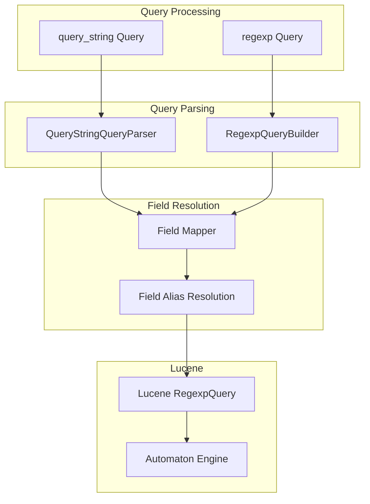

# Query String & Regex Queries

## Summary

OpenSearch provides powerful regular expression (regex) support through two query types: `regexp` and `query_string`. These queries allow pattern matching against indexed terms using Lucene's regex engine. The `query_string` query supports regex patterns within a broader query syntax, while `regexp` provides dedicated regex matching on specific fields.

## Details

### Architecture



### Components

| Component | Description |
|-----------|-------------|
| `QueryStringQueryParser` | Parses query string syntax including regex patterns enclosed in `/pattern/` |
| `RegexpQueryBuilder` | Builds regexp queries with configurable flags and options |
| `RegexpFlag` | Enum defining optional regex operators (COMPLEMENT, INTERSECTION, INTERVAL, ANYSTRING) |
| Field Mapper | Resolves field names including aliases to actual index fields |

### Configuration

| Setting | Description | Default |
|---------|-------------|---------|
| `max_determinized_states` | Maximum automaton states for regex complexity | 10000 |
| `flags` | Optional regex operators to enable | ALL |
| `case_insensitive` | Enable case-insensitive matching | false |
| `lenient` | Ignore data type mismatches (query_string only) | false |

### Query Types Comparison

| Feature | `regexp` query | `query_string` query |
|---------|---------------|---------------------|
| Pattern matching | Must match entire field value | Can match any part of field |
| `flags` support | Yes | No |
| Query type | Term-level (not scored) | Full-text (scored) |
| Best use case | Strict pattern matching on keyword fields | Flexible search with regex patterns |

### Regex Operators

**Standard Operators** (always available):
- `.` - Match any single character
- `?` - Match zero or one of preceding
- `+` - Match one or more of preceding
- `*` - Match zero or more of preceding
- `|` - Logical OR
- `()` - Grouping
- `[]` - Character class
- `{}` - Repetition range

**Optional Operators** (enabled via `flags`):
- `~` (COMPLEMENT) - Negates following expression (deprecated)
- `&` (INTERSECTION) - Logical AND
- `<min-max>` (INTERVAL) - Numeric range matching
- `@` (ANYSTRING) - Match any string

### Usage Example

#### Basic Regex Query

```json
GET /logs/_search
{
  "query": {
    "regexp": {
      "message": {
        "value": "error[0-9]+",
        "flags": "ALL"
      }
    }
  }
}
```

#### Query String with Regex

```json
GET /test_index/_search
{
  "query": {
    "query_string": {
      "query": "title: /w[a-z]nd/"
    }
  }
}
```

#### Field Alias Support

```json
PUT /test_index
{
  "mappings": {
    "properties": {
      "original_field": { "type": "text" },
      "field_alias": { "type": "alias", "path": "original_field" }
    }
  }
}

GET /test_index/_search
{
  "query": {
    "query_string": {
      "query": "field_alias: /pattern.*/"
    }
  }
}
```

## Limitations

- Lucene regex engine does not support `^` (start) and `$` (end) anchors - patterns must match entire terms
- The COMPLEMENT operator (`~`) is deprecated and will be removed in OpenSearch 4.0 (Lucene 11)
- Complex regex patterns may exceed `max_determinized_states` limit, causing `TooComplexToDeterminizeException`
- Regex queries can be resource-intensive; consider using `search.allow_expensive_queries` setting

## Change History

- **v3.2.0** (2025): Fixed field alias support for regex in query_string, restored COMPLEMENT flag backward compatibility, fixed TooComplexToDeterminizeException propagation

## References

### Documentation
- [Query String Documentation](https://docs.opensearch.org/3.0/query-dsl/full-text/query-string/): Official query_string docs
- [Regular Expression Syntax](https://docs.opensearch.org/3.0/query-dsl/regex-syntax/): Regex syntax reference
- [Regexp Query Documentation](https://docs.opensearch.org/3.0/query-dsl/term/regexp/): Official regexp query docs

### Pull Requests
| Version | PR | Description | Related Issue |
|---------|-----|-------------|---------------|
| v3.2.0 | [#18215](https://github.com/opensearch-project/OpenSearch/pull/18215) | Fix regex query from query string query to work with field alias | [#18214](https://github.com/opensearch-project/OpenSearch/issues/18214) |
| v3.2.0 | [#18640](https://github.com/opensearch-project/OpenSearch/pull/18640) | Fix backward compatibility regression with COMPLEMENT for Regexp queries |   |
| v3.2.0 | [#18883](https://github.com/opensearch-project/OpenSearch/pull/18883) | Propagate TooComplexToDeterminizeException in query_string regex queries | [#18733](https://github.com/opensearch-project/OpenSearch/issues/18733) |

### Issues (Design / RFC)
- [Issue #18214](https://github.com/opensearch-project/OpenSearch/issues/18214): Regex query doesn't support field alias
- [Issue #18397](https://github.com/opensearch-project/OpenSearch/issues/18397): COMPLEMENT does not work in Regexp queries
- [Issue #18733](https://github.com/opensearch-project/OpenSearch/issues/18733): query_string behavior using regex when shard failures occur
