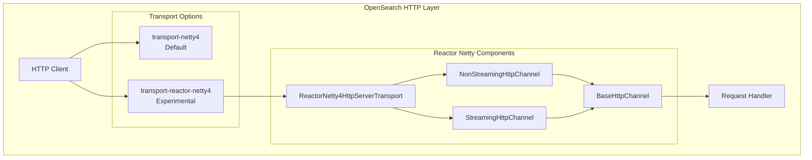
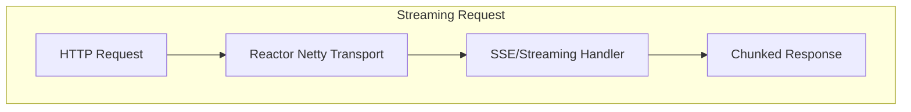

---
tags:
  - security
---

# Reactor Netty Transport

## Summary

The Reactor Netty Transport (`transport-reactor-netty4`) is an experimental HTTP transport plugin for OpenSearch based on [Project Reactor](https://github.com/reactor/reactor-netty) and Netty 4. It provides reactive, non-blocking HTTP communication with support for streaming APIs, HTTP/2, and Server-Sent Events (SSE), enabling features like the built-in MCP server and streaming bulk operations.

## Details

### Architecture



### Data Flow



### Components

| Component | Description |
|-----------|-------------|
| `ReactorNetty4HttpServerTransport` | Main HTTP server transport implementation |
| `ReactorNetty4NonStreamingHttpChannel` | Channel for standard request/response |
| `ReactorNetty4StreamingHttpChannel` | Channel for streaming responses (SSE) |
| `ReactorNetty4BaseHttpChannel` | Shared utility for SSL handler retrieval |

### Configuration

| Setting | Description | Default |
|---------|-------------|---------|
| `http.type` | Transport type (`reactor-netty4` or `reactor-netty4-secure`) | `netty4` |

### Usage Example

```yaml
# opensearch.yml

# Enable reactor-netty4 transport (without security plugin managing TLS)
http.type: reactor-netty4

# Enable reactor-netty4 transport with built-in TLS (for use with security plugin)
http.type: reactor-netty4-secure
```

Installation:

```bash
# Install the plugin
./bin/opensearch-plugin install transport-reactor-netty4

# Start OpenSearch
./bin/opensearch
```

### Use Cases

The Reactor Netty transport enables several advanced features:

1. **MCP Server**: The built-in Model Context Protocol server requires streaming support
2. **Streaming Bulk API**: Enables streaming bulk indexing operations
3. **HTTP/2 Support**: Native HTTP/2 protocol support
4. **Server-Sent Events**: Real-time streaming responses for AI/ML operations

## Limitations

- Experimental feature - not recommended for production without thorough testing
- Requires explicit plugin installation
- Some features may have different behavior compared to the default Netty4 transport

## Change History

- **v3.4.0** (2026-01-14): Fixed HTTP channel tracking and release during node shutdown, resolving flaky test failures
- **v3.3.0** (2025-09-29): Fixed SslHandler retrieval logic for Security plugin compatibility, added clientAuth support
- **v3.2.0** (2025-07-15): Added `SecureHttpTransportParameters` interface for cleaner SSL configuration
- **v2.17.0** (2024-09-17): Initial streaming support with reactor-netty4 transport

## Related Features
- [OpenSearch Dashboards](../opensearch-dashboards/ai-chat.md)

## References

### Documentation
- [Network Settings Documentation](https://docs.opensearch.org/3.0/install-and-configure/configuring-opensearch/network-settings/): Official configuration guide
- [Streaming Bulk API](https://docs.opensearch.org/3.0/api-reference/document-apis/bulk-streaming/): Streaming bulk documentation
- [Forum Discussion](https://forum.opensearch.org/t/pods-not-coming-up-after-using-transport-reactor-netty4-plugin-for-mcp-server/26990): Security plugin compatibility issue
- [Project Reactor](https://github.com/reactor/reactor-netty): Underlying reactive framework

### Pull Requests
| Version | PR | Description | Related Issue |
|---------|-----|-------------|---------------|
| v3.4.0 | [#20106](https://github.com/opensearch-project/OpenSearch/pull/20106) | Keep track and release accepted Http Channels during Node shutdown | [#20034](https://github.com/opensearch-project/OpenSearch/issues/20034) |
| v3.3.0 | [#19458](https://github.com/opensearch-project/OpenSearch/pull/19458) | Fix SslHandler retrieval for Security plugin compatibility |   |
| v3.2.0 | - | Added `SecureHttpTransportParameters` interface |   |
| v2.17.0 | - | Initial streaming support |   |
